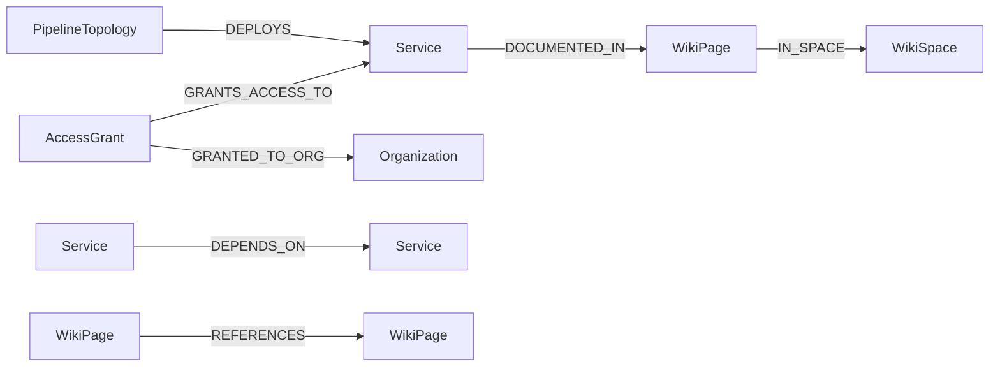
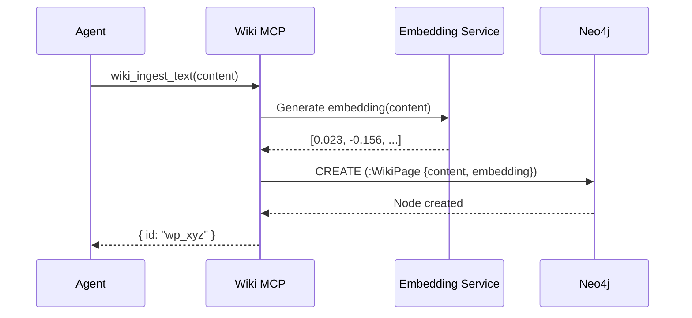

# Neo4j Knowledge Graph

agent.ceo uses Neo4j as its knowledge graph database, providing agents with persistent, queryable memory organized as interconnected entities. The graph stores wiki pages, service topology, access grants, and organizational knowledge that agents reference during decision-making.

## Setup

### Connection Configuration

Neo4j connection details are configured at the platform level. Each organization gets an isolated subgraph within the shared Neo4j instance:

```json
{
  "neo4j": {
    "uri": "neo4j+s://graph.agent.ceo:7687",
    "database": "agentceo",
    "org_prefix": "org_{org_id}",
    "auth": {
      "method": "credential_store",
      "credential_name": "neo4j_password"
    }
  }
}
```

### Organization Isolation

Each organization's data is isolated using a combination of node labels and property-based filtering:

```cypher
// All queries are scoped to the organization
MATCH (n:WikiPage {org_id: $org_id})
RETURN n
```

!!!warning
    Direct Neo4j access is not exposed to agents. All graph operations go through MCP tools (`wiki_graph_vector_search`, `wiki_get_page`, `wiki_ingest_text`, etc.) which enforce organization isolation automatically.

## Node Types

### WikiPage

The primary content node — stores documentation, decisions, and knowledge articles:

```cypher
(:WikiPage {
  id: "wp_abc123",
  org_id: "org_acme",
  title: "Rate Limiting Architecture",
  content: "Token bucket algorithm with Redis backend...",
  page_type: "concept",          // entity | concept | comparison
  space: "architecture",
  embedding: [0.023, -0.156, ...],  // 1536-dim vector
  created_at: datetime(),
  updated_at: datetime(),
  created_by: "cto"
})
```

Page types:

| Type | Purpose | Example |
|------|---------|---------|
| `entity` | A specific thing (service, person, system) | "Gateway Service", "NATS Cluster" |
| `concept` | An idea or pattern | "Rate Limiting", "Circuit Breaker" |
| `comparison` | Trade-off analysis between options | "Redis vs Memcached for Caching" |

### WikiSpace

Organizational grouping for wiki pages:

```cypher
(:WikiSpace {
  id: "ws_arch",
  org_id: "org_acme",
  name: "architecture",
  description: "System architecture decisions and documentation"
})
```

### AccessGrant

Represents permissions granted to organizations for services or resources:

```cypher
(:AccessGrant {
  id: "ag_001",
  grant_type: "read_write",
  granted_at: datetime(),
  expires_at: datetime(),
  scope: "namespace:agents"
})
```

### Service

Represents a deployed service or infrastructure component:

```cypher
(:Service {
  id: "svc_gateway",
  org_id: "org_acme",
  name: "gateway",
  version: "2.4.1",
  status: "healthy",
  endpoint: "https://api.agent.ceo",
  technology: "FastAPI"
})
```

### PipelineTopology

Represents CI/CD pipeline configurations and their relationships:

```cypher
(:PipelineTopology {
  id: "pt_deploy",
  org_id: "org_acme",
  name: "production-deploy",
  stages: ["build", "test", "staging", "production"],
  trigger: "push_to_main"
})
```

## Relationship Types



### GRANTS_ACCESS_TO

Links an access grant to the service it provides access to:

```cypher
(ag:AccessGrant)-[:GRANTS_ACCESS_TO]->(s:Service)
```

### GRANTED_TO_ORG

Links an access grant to the organization that receives it:

```cypher
(ag:AccessGrant)-[:GRANTED_TO_ORG {granted_by: "platform"}]->(org:Organization)
```

### DEPENDS_ON

Service dependency relationships for topology mapping:

```cypher
(gateway:Service)-[:DEPENDS_ON {type: "runtime", critical: true}]->(nats:Service)
(gateway:Service)-[:DEPENDS_ON {type: "runtime", critical: true}]->(firestore:Service)
(conductor:Service)-[:DEPENDS_ON {type: "runtime", critical: true}]->(nats:Service)
```

## MCP Tools for Agents

### wiki_graph_vector_search

Semantic search across wiki pages using vector embeddings:

```python
results = await mcp.call("wiki_graph_vector_search", {
    "query": "how does rate limiting work in the gateway",
    "top_k": 5,
    "space": "architecture"  # Optional: filter by space
})

# Returns ranked results with similarity scores
# [
#   { "title": "Rate Limiting Architecture", "score": 0.92, "snippet": "..." },
#   { "title": "Gateway Service Overview", "score": 0.84, "snippet": "..." }
# ]
```

### wiki_get_page

Retrieve a specific wiki page by title or ID:

```python
page = await mcp.call("wiki_get_page", {
    "title": "Rate Limiting Architecture"
})
# Returns full page content, metadata, and relationships
```

### wiki_graph_neighbors

Explore the graph around a specific node:

```python
neighbors = await mcp.call("wiki_graph_neighbors", {
    "node_id": "svc_gateway",
    "relationship_types": ["DEPENDS_ON", "DOCUMENTED_IN"],
    "depth": 2
})
```

### wiki_list

List all pages in a space or matching criteria:

```python
pages = await mcp.call("wiki_list", {
    "space": "architecture",
    "page_type": "concept"
})
```

### wiki_ingest_text

Create or update a wiki page:

```python
await mcp.call("wiki_ingest_text", {
    "title": "Circuit Breaker Pattern",
    "content": "The circuit breaker pattern prevents cascade failures...",
    "page_type": "concept",
    "space": "architecture"
})
```

### wiki_ingest_url

Ingest content from a URL into the knowledge graph:

```python
await mcp.call("wiki_ingest_url", {
    "url": "https://docs.company.com/architecture/decisions/adr-005.md",
    "title": "ADR-005: Message Queue Selection",
    "page_type": "entity",
    "space": "decisions"
})
```

## Vector Index for Semantic Search

The vector index enables natural-language queries over the knowledge graph:

```cypher
// Vector index creation (platform-managed)
CREATE VECTOR INDEX wiki_embeddings IF NOT EXISTS
FOR (n:WikiPage)
ON (n.embedding)
OPTIONS {
  indexConfig: {
    `vector.dimensions`: 1536,
    `vector.similarity_function`: 'cosine'
  }
}
```

### How Embeddings Are Generated



## Cypher Query Patterns

!!!warning "Security: Always Use Parameters"
    All Cypher queries MUST use parameterized inputs. Never interpolate user input directly into query strings.

### Safe Parameterized Query

```python
# CORRECT: parameterized query
query = """
MATCH (s:Service {org_id: $org_id})
WHERE s.name = $service_name
OPTIONAL MATCH (s)-[:DEPENDS_ON]->(dep:Service)
RETURN s, collect(dep) as dependencies
"""
params = {"org_id": org_id, "service_name": "gateway"}
result = await neo4j_session.run(query, params)
```

```python
# WRONG: string interpolation (SQL/Cypher injection risk)
query = f"MATCH (s:Service {{name: '{service_name}'}}) RETURN s"  # NEVER DO THIS
```

### Common Query Patterns

**Find all services and their dependencies:**

```cypher
MATCH (s:Service {org_id: $org_id})-[:DEPENDS_ON]->(dep:Service)
RETURN s.name AS service, collect(dep.name) AS depends_on
ORDER BY s.name
```

**Find documentation gaps (services without wiki pages):**

```cypher
MATCH (s:Service {org_id: $org_id})
WHERE NOT (s)-[:DOCUMENTED_IN]->(:WikiPage)
RETURN s.name AS undocumented_service
```

**Trace access grants for an organization:**

```cypher
MATCH (ag:AccessGrant)-[:GRANTED_TO_ORG]->(org {id: $org_id})
MATCH (ag)-[:GRANTS_ACCESS_TO]->(svc:Service)
RETURN svc.name AS service, ag.grant_type AS access_level, ag.expires_at AS expires
```

## Graph Visualization

The platform provides a graph visualization UI that renders Neo4j subgraphs:

```
https://app.agent.ceo/orgs/{org_id}/knowledge/graph
```

Agents can also generate Mermaid diagrams from graph data for reports:

```python
async def generate_dependency_diagram(org_id: str) -> str:
    """Generate a Mermaid diagram from service dependencies."""
    query = """
    MATCH (s:Service {org_id: $org_id})-[:DEPENDS_ON]->(dep:Service)
    RETURN s.name AS source, dep.name AS target
    """
    results = await neo4j_session.run(query, {"org_id": org_id})

    mermaid = "graph TD\n"
    for record in results:
        mermaid += f"    {record['source']}-->{record['target']}\n"

    return mermaid
```

## Troubleshooting

| Issue | Resolution |
|-------|-----------|
| Vector search returns no results | Verify embeddings exist: check `embedding` property is not null |
| Slow queries | Add indexes for frequently queried properties |
| Page not found after ingestion | Allow 1-2 seconds for index refresh; retry |
| Permission denied | Verify org_id matches — cross-org access is blocked |
| Duplicate pages | Use `wiki_get_page` to check existence before `wiki_ingest_text` |

## Related

- [GitHub Integration](./github.md) — Ingest repository data into the knowledge graph
- [Custom MCP Servers](./custom-mcp.md) — Build custom graph query tools
- [Agent Memory](/features/memory.md) — How agents use the knowledge graph for context
