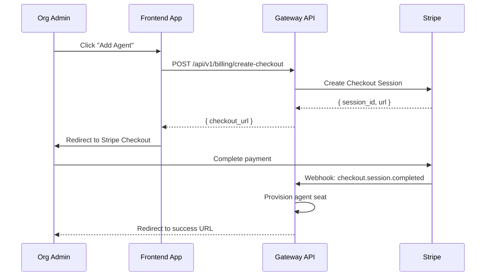
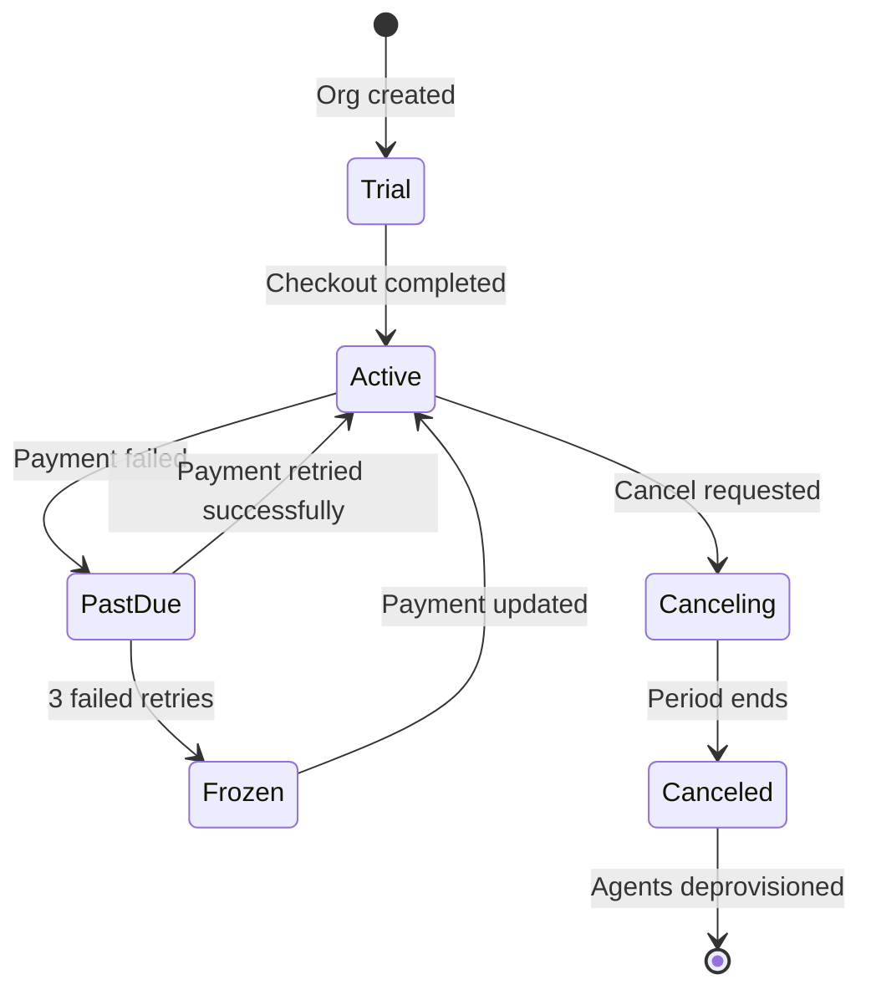

# Stripe Billing Integration

agent.ceo uses Stripe for all billing operations — subscription management, metered usage tracking (agent-hours), checkout flows, and payment processing. The integration handles the full lifecycle from initial checkout to monthly invoicing.

## Setup

### Platform Configuration

Stripe credentials are managed at the platform level (not per-organization):

```json
{
  "stripe": {
    "publishable_key": "pk_live_...",
    "secret_key_credential": "stripe_secret_key",
    "webhook_secret_credential": "stripe_webhook_secret",
    "billing_meter_id": "mbil_agent_hours",
    "products": {
      "standard": "prod_standard_abc",
      "volume": "prod_volume_xyz"
    }
  }
}
```

!!!warning
    Stripe secret keys are stored in the platform's credential vault and never exposed to agents or client-side code. Only the Gateway service has access.

### Webhook Endpoint Registration

Register the webhook endpoint in the Stripe Dashboard:

```
Endpoint URL: https://api.agent.ceo/api/v1/webhooks/stripe
Events to listen for:
  - checkout.session.completed
  - invoice.paid
  - invoice.payment_failed
  - customer.subscription.updated
  - customer.subscription.deleted
```

## Products and Pricing

### Subscription Tiers

| Plan | Price | Includes | Billing |
|------|-------|----------|---------|
| **Standard** | $200/agent/month | 1 agent seat, unlimited tasks | Monthly recurring |
| **Volume** | $160/agent/month | 5+ agent seats, priority support | Monthly recurring |

### Metered Billing

Agent compute time is tracked via Stripe's billing meter:

```python
# Report usage to Stripe billing meter
import stripe

stripe.billing.MeterEvent.create(
    event_name="agent_hours",
    payload={
        "value": "1",  # 1 agent-hour
        "stripe_customer_id": customer_id
    },
    timestamp=int(time.time())
)
```

Usage is aggregated and added to the monthly invoice automatically.

## Checkout Flow

### Creating a Checkout Session



### API Endpoint

```bash
curl -X POST https://api.agent.ceo/api/v1/billing/create-checkout \
  -H "Authorization: Bearer $TOKEN" \
  -H "Content-Type: application/json" \
  -d '{
    "plan": "standard",
    "quantity": 1,
    "success_url": "https://app.agent.ceo/billing/success?session_id={CHECKOUT_SESSION_ID}",
    "cancel_url": "https://app.agent.ceo/billing/cancel"
  }'
```

Response:

```json
{
  "checkout_url": "https://checkout.stripe.com/c/pay/cs_live_...",
  "session_id": "cs_live_abc123"
}
```

### Gateway Implementation

```python
from fastapi import APIRouter, Depends
import stripe

router = APIRouter(prefix="/api/v1/billing")

@router.post("/create-checkout")
async def create_checkout(
    request: CheckoutRequest,
    org: Organization = Depends(get_current_org)
):
    """Create a Stripe Checkout session for agent subscription."""
    # Get or create Stripe customer
    customer_id = await get_or_create_stripe_customer(org)

    # Select the correct price based on plan
    price_id = PLAN_PRICES[request.plan]

    session = stripe.checkout.Session.create(
        customer=customer_id,
        payment_method_types=["card"],
        line_items=[{
            "price": price_id,
            "quantity": request.quantity
        }],
        mode="subscription",
        success_url=request.success_url,
        cancel_url=request.cancel_url,
        metadata={
            "org_id": org.id,
            "plan": request.plan
        }
    )

    return {"checkout_url": session.url, "session_id": session.id}
```

## Webhook Handling

### Webhook Verification

All incoming webhooks are verified using the Stripe signature:

```python
from fastapi import Request, HTTPException
import stripe

@router.post("/webhooks/stripe")
async def stripe_webhook(request: Request):
    """Handle incoming Stripe webhook events."""
    payload = await request.body()
    sig_header = request.headers.get("stripe-signature")

    try:
        event = stripe.Webhook.construct_event(
            payload, sig_header, WEBHOOK_SECRET
        )
    except stripe.error.SignatureVerificationError:
        raise HTTPException(status_code=400, detail="Invalid signature")

    # Route to handler based on event type
    handler = WEBHOOK_HANDLERS.get(event["type"])
    if handler:
        await handler(event["data"]["object"])

    return {"status": "ok"}
```

### Event Handlers

#### checkout.session.completed

Triggered when a customer completes checkout:

```python
async def handle_checkout_completed(session: dict):
    """Provision agent seats after successful checkout."""
    org_id = session["metadata"]["org_id"]
    plan = session["metadata"]["plan"]
    subscription_id = session["subscription"]

    # Update organization billing record
    await update_org_billing(org_id, {
        "stripe_subscription_id": subscription_id,
        "plan": plan,
        "status": "active"
    })

    # Provision the agent seat(s)
    line_items = stripe.checkout.Session.list_line_items(session["id"])
    quantity = line_items["data"][0]["quantity"]

    await provision_agent_seats(org_id, quantity)

    # Notify the organization
    await notify_org(org_id, f"Subscription active: {quantity} agent seat(s) on {plan} plan")
```

#### invoice.paid

Triggered when a recurring invoice is successfully paid:

```python
async def handle_invoice_paid(invoice: dict):
    """Confirm continued service after payment."""
    customer_id = invoice["customer"]
    org = await get_org_by_stripe_customer(customer_id)

    # Update billing status
    await update_org_billing(org.id, {
        "last_payment_at": datetime.utcnow(),
        "status": "active",
        "current_period_end": datetime.fromtimestamp(
            invoice["lines"]["data"][0]["period"]["end"]
        )
    })

    # Log for audit
    await audit_log(org.id, "billing.invoice_paid", {
        "invoice_id": invoice["id"],
        "amount": invoice["amount_paid"],
        "currency": invoice["currency"]
    })
```

#### customer.subscription.updated

Triggered when a subscription changes (upgrade, downgrade, or cancellation scheduled):

```python
async def handle_subscription_updated(subscription: dict):
    """Handle subscription changes — scale agents up/down."""
    customer_id = subscription["customer"]
    org = await get_org_by_stripe_customer(customer_id)

    new_quantity = subscription["items"]["data"][0]["quantity"]
    current_seats = await get_current_agent_seats(org.id)

    if new_quantity > current_seats:
        # Upscale: provision additional seats
        await provision_agent_seats(org.id, new_quantity - current_seats)
    elif new_quantity < current_seats:
        # Downscale: mark excess seats for deprovisioning at period end
        await schedule_seat_reduction(org.id, current_seats - new_quantity)

    if subscription["cancel_at_period_end"]:
        await notify_org(org.id, "Subscription will cancel at period end. Agents will be frozen.")
```

## Usage Reporting

### Agent-Hours Tracking

The Conductor service reports agent compute time to Stripe:

```python
async def report_agent_usage(org_id: str, agent_id: str, hours: float):
    """Report agent compute hours to Stripe billing meter."""
    org = await get_org(org_id)

    stripe.billing.MeterEvent.create(
        event_name="agent_hours",
        payload={
            "value": str(int(hours * 100)),  # Report in centihours for precision
            "stripe_customer_id": org.stripe_customer_id
        },
        timestamp=int(time.time())
    )
```

### Usage Dashboard Data

```python
@router.get("/api/v1/billing/usage")
async def get_usage(org: Organization = Depends(get_current_org)):
    """Get current billing period usage summary."""
    meter_summary = stripe.billing.Meter.list_event_summaries(
        BILLING_METER_ID,
        customer=org.stripe_customer_id,
        start_time=int(org.current_period_start.timestamp()),
        end_time=int(time.time())
    )

    return {
        "current_period": {
            "start": org.current_period_start.isoformat(),
            "end": org.current_period_end.isoformat()
        },
        "agent_hours_used": meter_summary["data"][0]["aggregated_value"] / 100,
        "active_agents": await count_active_agents(org.id),
        "plan": org.billing_plan,
        "monthly_base": org.seat_count * PLAN_PRICES[org.billing_plan]
    }
```

## Billing States



| State | Agent Behavior |
|-------|---------------|
| `trial` | Agents active, limited to 1 agent |
| `active` | Full access, all seats available |
| `past_due` | Agents active, payment reminders sent |
| `frozen` | Agents paused, no new tasks accepted |
| `canceling` | Agents active until period end |
| `canceled` | Agents stopped and deprovisioned |

## Troubleshooting

| Issue | Resolution |
|-------|-----------|
| Checkout session expires | Sessions expire after 24h — create a new one |
| Webhook signature invalid | Verify webhook secret matches Stripe Dashboard config |
| Usage not appearing on invoice | Check meter event timestamps fall within billing period |
| Subscription shows wrong quantity | Verify `quantity` in subscription item matches expected seats |
| Double charge | Check for duplicate webhook delivery — implement idempotency keys |

## Related

- [Platform Configuration](/platform/configuration.md) — Billing configuration options
- [Organizations](/concepts/organizations.md) — How billing maps to org structure
- [API Reference](/api-reference/gateway.md) — Full billing endpoint documentation
