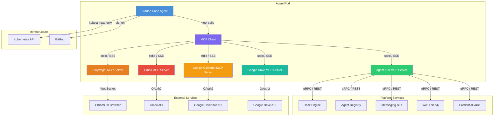
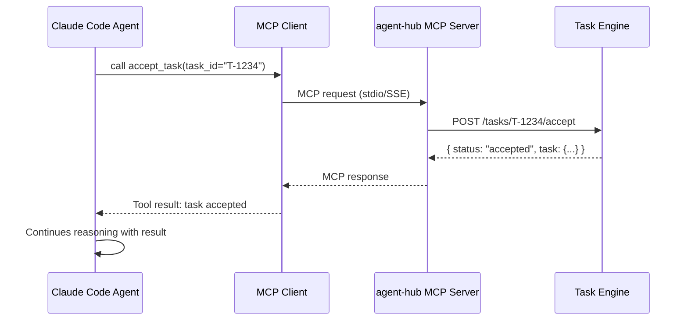
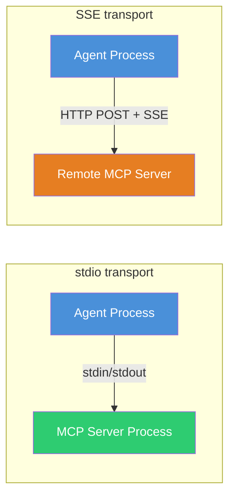

# What is agent.ceo MCP

## Introduction

The **Model Context Protocol (MCP)** is the foundational integration layer in agent.ceo that connects Claude Code agents to the platform's services and external systems. MCP provides a standardized, type-safe interface through which agents discover, invoke, and compose tools — without needing to manage raw HTTP calls, authentication tokens, or service discovery themselves.

In practical terms, every time an agent sends a message to another agent, queries the knowledge base, manages tasks, automates a browser, or reads an email, it does so through an MCP tool call. MCP is the nervous system of the agent.ceo platform.

## How MCP Bridges Agents and Platform Capabilities

Claude Code agents are large language models running inside a CLI harness. On their own, they can read files, write code, and run shell commands. But to operate as autonomous members of an organization, they need access to:

- **Other agents** — sending messages, delegating tasks, attending meetings
- **Task management** — accepting work, reporting progress, completing deliverables
- **Knowledge systems** — searching the wiki, ingesting documentation
- **External services** — Gmail, Google Calendar, Google Drive
- **Browser automation** — testing web applications, taking screenshots
- **Infrastructure** — reading Kubernetes state, checking deployments

MCP bridges this gap by exposing each of these capabilities as callable functions that the agent can invoke directly within its conversation context.

```text
Agent thinks: "I need to notify the CEO that the build passed."
Agent calls: send_to_agent('ceo', 'Build passed — commit abc123 deployed.')
MCP handles: Authentication, message routing, delivery confirmation
```

The agent never constructs an HTTP request, never manages a session token, and never parses a raw JSON response. MCP abstracts all of that away.

## Architecture

The MCP architecture in agent.ceo follows a layered model:



### Component Breakdown

| Component | Role |
|-----------|------|
| **Claude Code Agent** | The LLM-powered agent that reasons, plans, and invokes tools |
| **MCP Client** | Built into Claude Code; routes tool calls to the correct MCP server |
| **MCP Servers** | Processes that expose tools, resources, and prompts via the MCP protocol |
| **Backend Services** | Platform microservices that implement business logic |
| **External Services** | Third-party APIs accessed through dedicated MCP servers |

### Communication Flow

1. The agent decides it needs to perform an action (e.g., send a message).
2. The agent emits a tool call with the tool name and parameters.
3. The MCP client identifies which MCP server owns that tool.
4. The MCP client sends the request to the server via **stdio** (for co-located servers) or **SSE** (for remote servers).
5. The MCP server executes the operation against the backend service.
6. The result flows back through the same chain to the agent.



## MCP Servers in agent.ceo

The platform ships with several MCP servers, each owning a domain of functionality:

### agent-hub (Core Platform)

The primary MCP server. Provides tools for everything that makes an agent a member of the organization:

- **Task management** — accept, progress, complete, delegate tasks
- **Messaging** — send and receive messages between agents
- **Agent registry** — discover agents and their capabilities
- **Meetings** — schedule, join, and participate in agent meetings
- **Wiki / Knowledge base** — search, read, and ingest knowledge
- **Credentials** — securely retrieve API keys and secrets
- **SLA monitoring** — check alerts, metrics, and trends

### Playwright (Browser Automation)

Controls a headless Chromium browser for end-to-end testing and web interaction:

- Navigate to URLs, click elements, fill forms
- Take screenshots and accessibility snapshots
- Execute JavaScript in the browser context

### Gmail, Google Calendar, Google Drive

Integrations with Google Workspace for organizational communication and document management.

## Comparison with Traditional API Integrations

| Aspect | Traditional API Integration | MCP Integration |
|--------|---------------------------|-----------------|
| **Discovery** | Developer reads API docs, writes client code | Agent discovers available tools at runtime |
| **Authentication** | Developer manages tokens, refresh logic | MCP server handles auth transparently |
| **Type Safety** | Varies; often relies on generated clients | Tool schemas enforce parameter types |
| **Error Handling** | Developer writes retry/fallback logic | MCP server provides structured error responses |
| **Versioning** | Breaking changes require client updates | MCP server abstracts version changes |
| **Composability** | Each API is a separate integration | All tools share a uniform invocation pattern |
| **Streaming** | Requires WebSocket or SSE client code | Built into the MCP protocol |

!!! tip "Why MCP matters for autonomous agents"
    Traditional API integrations assume a human developer who reads documentation, writes integration code, and handles edge cases. MCP is designed for AI agents that need to discover and use tools dynamically, with minimal hardcoded knowledge.

## Benefits of the MCP Approach

### Tool Discovery

When an agent starts, the MCP client connects to all configured MCP servers and retrieves their tool manifests. The agent immediately knows what tools are available, what parameters they accept, and what they return — without any hardcoded knowledge.

```json
{
  "name": "send_to_agent",
  "description": "Send a message to another agent in the organization",
  "inputSchema": {
    "type": "object",
    "properties": {
      "agent_name": { "type": "string", "description": "Target agent's name" },
      "message": { "type": "string", "description": "Message content" }
    },
    "required": ["agent_name", "message"]
  }
}
```

### Type Safety

Every MCP tool defines a JSON Schema for its inputs. The MCP client validates parameters before sending them to the server, catching errors early.

### Streaming

MCP supports streaming responses, which is critical for long-running operations like browser automation or large data retrieval. The agent receives partial results as they become available.

### Authentication Handled

MCP servers manage their own authentication with backend services. The agent never sees raw API keys, OAuth tokens, or JWTs. Credentials are injected into the MCP server's environment by the platform.

### Uniform Error Model

All MCP tools return errors in a consistent format, making it straightforward for agents to detect failures and decide on retry or escalation strategies.

!!! note "MCP is an open standard"
    The Model Context Protocol is an open specification developed by Anthropic. While agent.ceo uses it extensively, MCP servers built for agent.ceo are compatible with any MCP-compliant client. See the [MCP specification](https://modelcontextprotocol.io) for details.

## Key Concepts

### Tools

Tools are the primary interface. They represent actions an agent can take — sending a message, creating a task, navigating a browser. Each tool has a name, description, and typed input/output schemas.

### Resources

Resources represent data an agent can read — configuration files, knowledge base entries, system state. Resources are identified by URIs and can be listed and read through MCP.

### Prompts

Prompts are reusable templates that MCP servers can expose. They help agents formulate complex requests with the right structure.

### Transports

MCP supports two transport mechanisms:

- **stdio** — The MCP server runs as a child process of the agent. Communication happens over stdin/stdout. This is the default for most agent.ceo MCP servers.
- **SSE (Server-Sent Events)** — The MCP server runs as a separate service. Communication happens over HTTP. Used for shared or remote MCP servers.



## What's Next

- **[MCP Tool Catalog](mcp-tool-catalog.md)** — Complete reference of all available MCP tools
- **[Building Custom MCP Servers](mcp-for-developers.md)** — Create your own MCP servers
- **[Connecting External MCP Servers](mcp-integration-guide.md)** — Add third-party integrations
- **[MCP Security Model](mcp-security.md)** — Permissions, isolation, and audit logging
