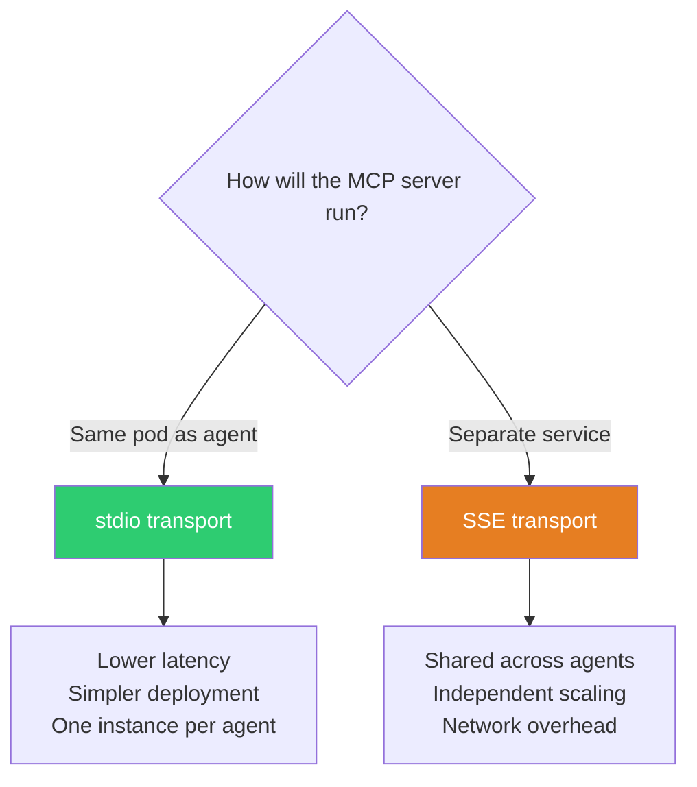
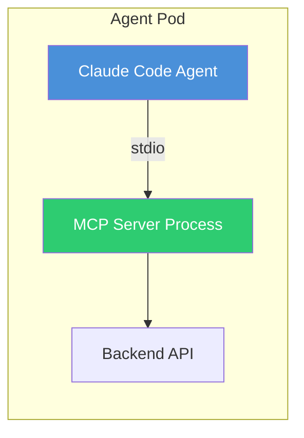
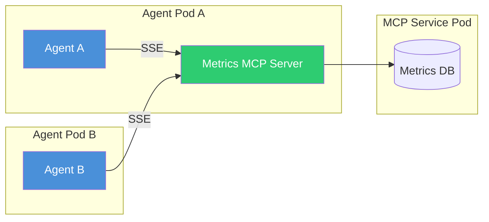

# Building Custom MCP Servers

This guide walks you through creating a custom MCP server for the agent.ceo platform. By building your own MCP server, you can give agents access to any internal system, third-party API, or custom business logic.

## Prerequisites

Before you begin, ensure you have:

- **Node.js 18+** or **Python 3.10+** installed
- Familiarity with the MCP architecture (see [MCP Overview](agent-ceo-mcp-overview.md))
- Access to an agent.ceo development environment
- The `@modelcontextprotocol/sdk` npm package (for TypeScript) or `mcp` Python package

## MCP Server Specification

An MCP server exposes three types of capabilities to agents:

### Tools

Tools are the most common capability. They represent actions the agent can invoke. Each tool has:

- **`name`** — Unique identifier (snake_case)
- **`description`** — Human-readable description of what the tool does
- **`inputSchema`** — JSON Schema defining accepted parameters
- **Return value** — Structured result returned to the agent

### Resources

Resources represent readable data, identified by URIs. Agents can list available resources and read their contents. Resources are ideal for configuration data, documentation, or system state.

### Prompts

Prompts are reusable templates that help agents construct well-formed requests. They are less commonly used but valuable for complex multi-step interactions.

## Architecture Decision: stdio vs. SSE

Before building, choose your transport:



| Transport | Best For |
|-----------|----------|
| **stdio** | Agent-specific tools, low-latency needs, simple deployment |
| **SSE** | Shared services, tools that multiple agents use simultaneously |

!!! tip "Start with stdio"
    For most custom MCP servers in agent.ceo, stdio transport is the right choice. It is simpler to set up, has lower latency, and does not require network configuration. Switch to SSE only if you need shared state across agents.

## Example: Building a Simple MCP Server in TypeScript

Let's build a complete MCP server that provides agents with access to a hypothetical internal metrics system.

### Step 1: Initialize the Project

```bash
mkdir mcp-server-metrics
cd mcp-server-metrics
npm init -y
npm install @modelcontextprotocol/sdk zod
npm install -D typescript @types/node
npx tsc --init
```

Update `tsconfig.json`:

```json
{
  "compilerOptions": {
    "target": "ES2022",
    "module": "Node16",
    "moduleResolution": "Node16",
    "outDir": "./dist",
    "rootDir": "./src",
    "strict": true,
    "esModuleInterop": true,
    "declaration": true
  },
  "include": ["src/**/*"]
}
```

### Step 2: Implement the Server

Create `src/index.ts`:

```typescript
import { McpServer } from "@modelcontextprotocol/sdk/server/mcp.js";
import { StdioServerTransport } from "@modelcontextprotocol/sdk/server/stdio.js";
import { z } from "zod";

// Create the MCP server instance
const server = new McpServer({
  name: "metrics-server",
  version: "1.0.0",
  description: "Provides access to internal application metrics",
});

// ─── Tool: get_metric ────────────────────────────────────────────
// Retrieves the current value of a named metric
server.tool(
  "get_metric",
  "Retrieve the current value of a named application metric",
  {
    metric_name: z.string().describe("Name of the metric to retrieve (e.g., 'cpu_usage', 'request_count')"),
    time_range: z.enum(["1h", "6h", "24h", "7d", "30d"]).optional()
      .describe("Time range for the metric. Defaults to '1h'"),
  },
  async ({ metric_name, time_range }) => {
    const range = time_range ?? "1h";

    // In a real implementation, fetch from your metrics backend
    const value = await fetchMetric(metric_name, range);

    return {
      content: [
        {
          type: "text",
          text: JSON.stringify({
            metric: metric_name,
            value: value,
            unit: getMetricUnit(metric_name),
            time_range: range,
            timestamp: new Date().toISOString(),
          }, null, 2),
        },
      ],
    };
  }
);

// ─── Tool: list_metrics ──────────────────────────────────────────
// Lists all available metrics
server.tool(
  "list_metrics",
  "List all available application metrics with their descriptions",
  {},
  async () => {
    const metrics = [
      { name: "cpu_usage", description: "CPU utilization percentage", unit: "%" },
      { name: "memory_usage", description: "Memory utilization percentage", unit: "%" },
      { name: "request_count", description: "Total HTTP requests", unit: "count" },
      { name: "error_rate", description: "Percentage of failed requests", unit: "%" },
      { name: "p99_latency", description: "99th percentile response time", unit: "ms" },
      { name: "active_users", description: "Currently active users", unit: "count" },
    ];

    return {
      content: [
        {
          type: "text",
          text: JSON.stringify(metrics, null, 2),
        },
      ],
    };
  }
);

// ─── Tool: create_alert ──────────────────────────────────────────
// Creates a metric alert
server.tool(
  "create_alert",
  "Create an alert rule that triggers when a metric crosses a threshold",
  {
    metric_name: z.string().describe("Metric to monitor"),
    operator: z.enum(["gt", "lt", "eq", "gte", "lte"]).describe("Comparison operator"),
    threshold: z.number().describe("Threshold value"),
    notify_channel: z.string().optional().describe("Notification channel (default: agent inbox)"),
  },
  async ({ metric_name, operator, threshold, notify_channel }) => {
    // In a real implementation, create the alert in your monitoring system
    const alertId = `ALERT-${Date.now()}`;

    return {
      content: [
        {
          type: "text",
          text: JSON.stringify({
            alert_id: alertId,
            status: "created",
            metric_name,
            condition: `${metric_name} ${operator} ${threshold}`,
            notify: notify_channel ?? "agent_inbox",
          }, null, 2),
        },
      ],
    };
  }
);

// ─── Resource: system_status ─────────────────────────────────────
// Expose system status as a readable resource
server.resource(
  "system-status",
  "metrics://system/status",
  { description: "Current system health status" },
  async () => ({
    contents: [
      {
        uri: "metrics://system/status",
        mimeType: "application/json",
        text: JSON.stringify({
          status: "healthy",
          uptime_hours: 742,
          last_deploy: "2024-01-15T10:30:00Z",
          active_alerts: 0,
        }),
      },
    ],
  })
);

// ─── Helper functions ────────────────────────────────────────────

async function fetchMetric(name: string, range: string): Promise<number> {
  // Replace with actual metrics backend call
  const mockValues: Record<string, number> = {
    cpu_usage: 42.5,
    memory_usage: 68.2,
    request_count: 15420,
    error_rate: 0.3,
    p99_latency: 245,
    active_users: 1847,
  };
  return mockValues[name] ?? 0;
}

function getMetricUnit(name: string): string {
  const units: Record<string, string> = {
    cpu_usage: "%",
    memory_usage: "%",
    request_count: "count",
    error_rate: "%",
    p99_latency: "ms",
    active_users: "count",
  };
  return units[name] ?? "unknown";
}

// ─── Start the server ────────────────────────────────────────────

async function main() {
  const transport = new StdioServerTransport();
  await server.connect(transport);
  console.error("Metrics MCP Server running on stdio");
}

main().catch((error) => {
  console.error("Fatal error:", error);
  process.exit(1);
});
```

### Step 3: Build and Test

```bash
# Build the TypeScript
npx tsc

# Test locally with the MCP inspector
npx @modelcontextprotocol/inspector node dist/index.js
```

The MCP inspector opens a web UI where you can browse your tools, invoke them, and verify the responses.

!!! note "Use `console.error` for logging"
    Since stdio transport uses stdout for MCP protocol messages, all logging must go to stderr. Use `console.error()` instead of `console.log()` for any debug output.

## Registration with the Platform

To make your MCP server available to agent.ceo agents, register it in the agent's configuration.

### For stdio Transport

Add to the agent's Claude Code settings (`.claude/settings.json` or equivalent):

```json
{
  "mcpServers": {
    "metrics": {
      "command": "node",
      "args": ["/path/to/mcp-server-metrics/dist/index.js"],
      "env": {
        "METRICS_API_URL": "https://metrics.internal.example.com",
        "METRICS_API_KEY": "${METRICS_API_KEY}"
      }
    }
  }
}
```

### For SSE Transport

```json
{
  "mcpServers": {
    "metrics": {
      "url": "http://metrics-mcp-server.default.svc.cluster.local:3001/sse",
      "headers": {
        "Authorization": "Bearer ${MCP_AUTH_TOKEN}"
      }
    }
  }
}
```

## Testing Your MCP Server

### Unit Testing

Test your tool handlers independently:

```typescript
import { describe, it, expect } from "vitest";
import { fetchMetric, getMetricUnit } from "./helpers";

describe("Metrics MCP Server", () => {
  it("should return a valid metric value", async () => {
    const value = await fetchMetric("cpu_usage", "1h");
    expect(typeof value).toBe("number");
    expect(value).toBeGreaterThanOrEqual(0);
    expect(value).toBeLessThanOrEqual(100);
  });

  it("should return correct unit for known metrics", () => {
    expect(getMetricUnit("cpu_usage")).toBe("%");
    expect(getMetricUnit("request_count")).toBe("count");
    expect(getMetricUnit("p99_latency")).toBe("ms");
  });

  it("should handle unknown metrics gracefully", async () => {
    const value = await fetchMetric("nonexistent_metric", "1h");
    expect(value).toBe(0);
  });
});
```

### Integration Testing with MCP Inspector

```bash
# Run the inspector for interactive testing
npx @modelcontextprotocol/inspector node dist/index.js

# Or test programmatically with the SDK client
npx ts-node test/integration.ts
```

### Integration Test Script

```typescript
import { Client } from "@modelcontextprotocol/sdk/client/index.js";
import { StdioClientTransport } from "@modelcontextprotocol/sdk/client/stdio.js";

async function testServer() {
  const transport = new StdioClientTransport({
    command: "node",
    args: ["dist/index.js"],
  });

  const client = new Client({ name: "test-client", version: "1.0.0" });
  await client.connect(transport);

  // List tools
  const tools = await client.listTools();
  console.log("Available tools:", tools.tools.map((t) => t.name));

  // Call a tool
  const result = await client.callTool("get_metric", {
    metric_name: "cpu_usage",
    time_range: "1h",
  });
  console.log("Result:", result);

  // List resources
  const resources = await client.listResources();
  console.log("Resources:", resources.resources.map((r) => r.uri));

  await client.close();
}

testServer().catch(console.error);
```

## Deployment Options

### Sidecar Deployment (stdio)

The MCP server runs as a sidecar process alongside the agent. This is the simplest deployment model.



**Dockerfile addition:**

```dockerfile
# Add MCP server to agent image
COPY mcp-server-metrics/dist /opt/mcp-servers/metrics/
```

### Standalone Service Deployment (SSE)

The MCP server runs as an independent Kubernetes service, accessible by multiple agents.



**Kubernetes manifest:**

```yaml
apiVersion: apps/v1
kind: Deployment
metadata:
  name: mcp-server-metrics
  namespace: agent-ceo
spec:
  replicas: 2
  selector:
    matchLabels:
      app: mcp-server-metrics
  template:
    metadata:
      labels:
        app: mcp-server-metrics
    spec:
      containers:
        - name: mcp-server
          image: registry.example.com/mcp-server-metrics:latest
          ports:
            - containerPort: 3001
          env:
            - name: METRICS_API_URL
              valueFrom:
                secretKeyRef:
                  name: metrics-secrets
                  key: api-url
---
apiVersion: v1
kind: Service
metadata:
  name: metrics-mcp-server
  namespace: agent-ceo
spec:
  selector:
    app: mcp-server-metrics
  ports:
    - port: 3001
      targetPort: 3001
```

## Best Practices

### Tool Design

1. **Use descriptive names** — `get_user_by_email` is better than `query_user`
2. **Provide detailed descriptions** — The LLM reads these to decide when to use the tool
3. **Validate inputs with Zod** — Catch errors before they reach your backend
4. **Return structured JSON** — Agents parse structured data more reliably than free text
5. **Include context in responses** — Return metadata (timestamps, IDs) that the agent may need later

### Error Handling

```typescript
server.tool("risky_operation", "An operation that might fail", {
  target: z.string(),
}, async ({ target }) => {
  try {
    const result = await performOperation(target);
    return {
      content: [{ type: "text", text: JSON.stringify(result) }],
    };
  } catch (error) {
    // Return structured error — do NOT throw
    return {
      content: [
        {
          type: "text",
          text: JSON.stringify({
            error: true,
            message: error instanceof Error ? error.message : "Unknown error",
            suggestion: "Check that the target exists and you have permission",
          }),
        },
      ],
      isError: true,
    };
  }
});
```

!!! warning "Return errors, don't throw them"
    MCP tools should return errors as structured responses with `isError: true`, not throw exceptions. This gives the agent context to understand what went wrong and decide on next steps.

### Security

- Never expose credentials in tool responses
- Validate all input parameters
- Apply the principle of least privilege — only expose the operations agents truly need
- Log all tool invocations for audit purposes
- See [MCP Security Model](mcp-security.md) for comprehensive guidance

## See Also

- **[MCP Tool Catalog](mcp-tool-catalog.md)** — Reference for built-in tools
- **[Connecting External MCP Servers](mcp-integration-guide.md)** — Integration patterns
- **[MCP Security Model](mcp-security.md)** — Security best practices
- **[MCP Specification](https://modelcontextprotocol.io)** — Official protocol documentation
