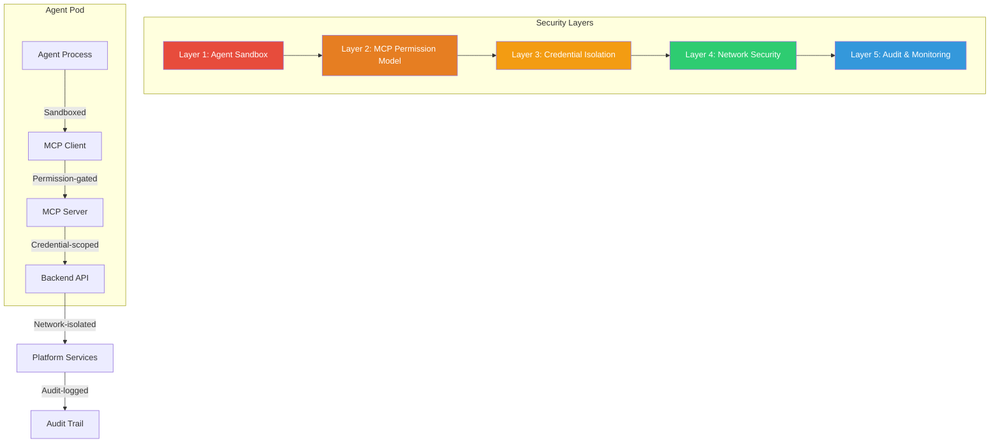
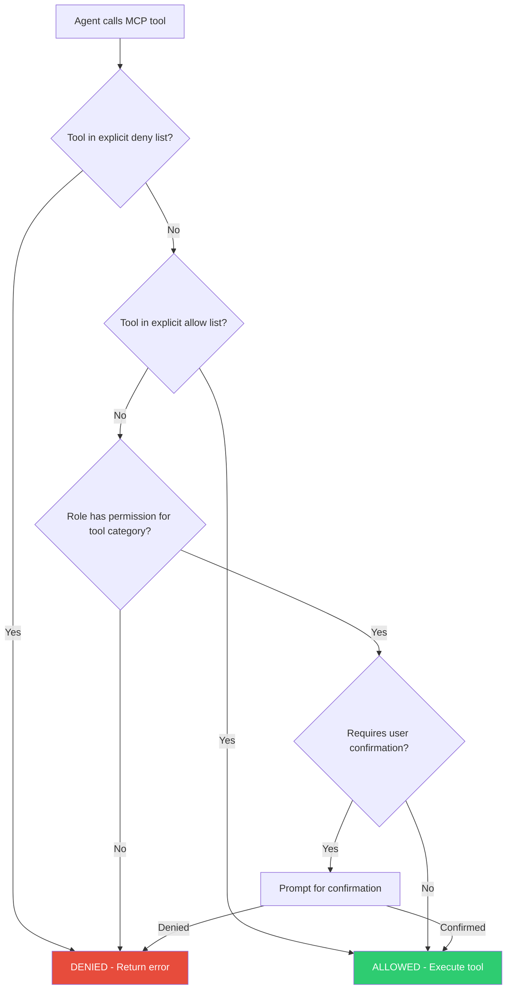
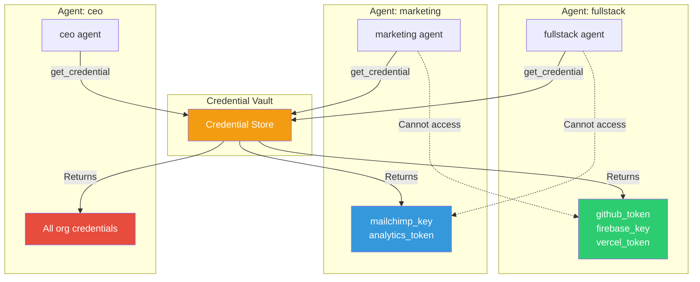
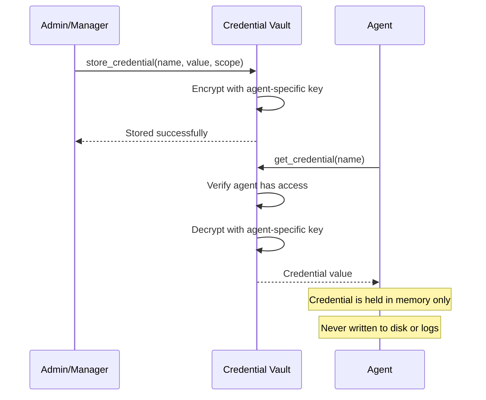
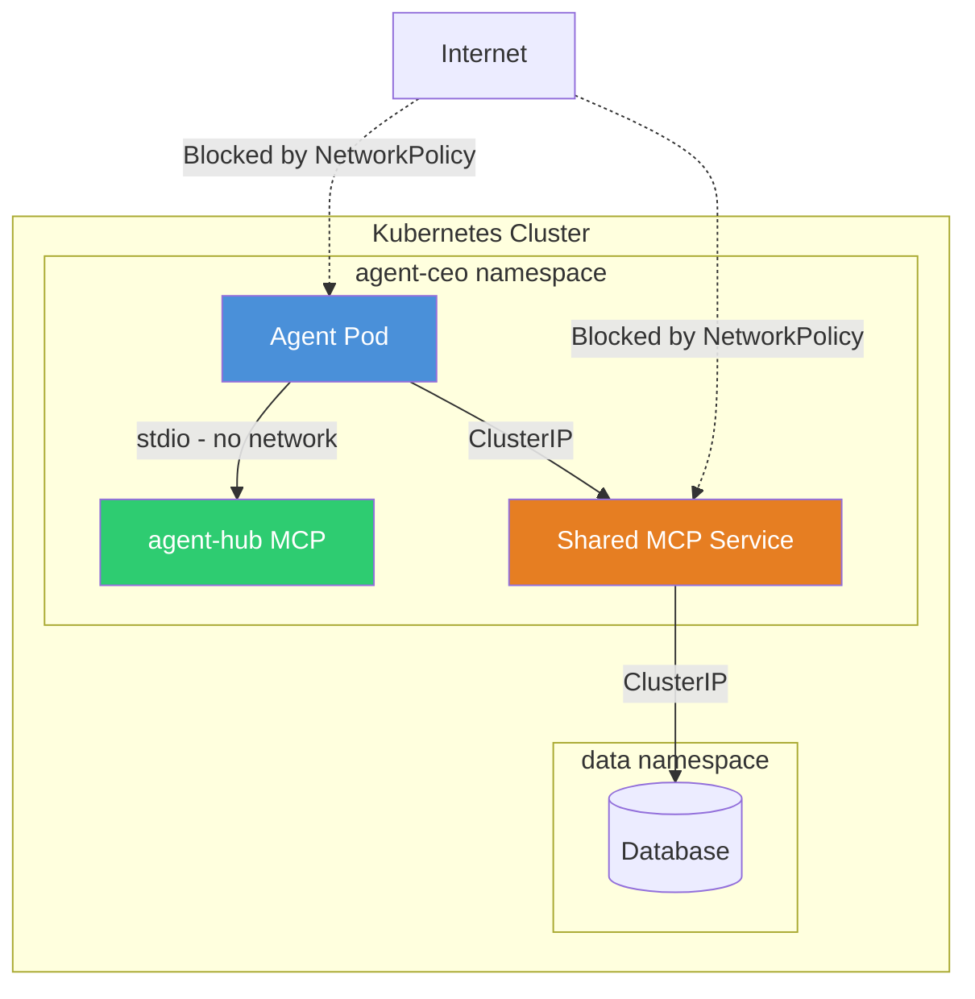
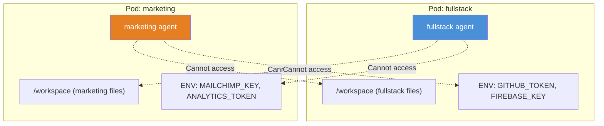

# MCP Security Model

Security is a first-class concern in the agent.ceo MCP architecture. This document covers the permission model, credential isolation, network security, audit logging, rate limiting, sandboxing, and best practices for designing secure MCP tools.

## Security Architecture Overview

The agent.ceo MCP security model operates across multiple layers, from the agent process boundary through to the backend services.



## Permission Model

### Tool-Level Permissions

Every MCP tool call is subject to a permission check. Permissions are configured at two levels:

1. **Agent role permissions** — Which tools an agent's role is allowed to use
2. **Explicit allow/deny lists** — Fine-grained overrides in the agent's settings

#### Role-Based Access

Each agent role in the organization has a set of permitted MCP tool categories:

| Role | agent-hub | Playwright | Gmail | Calendar | Drive | kubectl |
|------|-----------|-----------|-------|----------|-------|---------|
| CEO | Full | Read-only | Full | Full | Full | Read-only |
| CTO | Full | Full | Read-only | Read-only | Read-only | Read-only |
| Developer | Task + Messaging | Full | None | None | None | Read-only |
| Marketing | Task + Messaging | Read-only | Full | Full | Full | None |

!!! note "Role permissions are defaults"
    These are baseline permissions. Individual agents can have additional permissions granted or restricted through explicit configuration.

#### Explicit Permission Configuration

In the agent's settings, you can explicitly allow or deny specific tools:

```json
{
  "permissions": {
    "allow": [
      "mcp__agent-hub__send_to_agent",
      "mcp__agent-hub__accept_task",
      "mcp__agent-hub__complete_task_unverified",
      "mcp__playwright__browser_navigate",
      "mcp__playwright__browser_click",
      "mcp__playwright__browser_screenshot"
    ],
    "deny": [
      "mcp__agent-hub__delete_credential",
      "mcp__agent-hub__store_credential"
    ]
  }
}
```

### Permission Evaluation Flow



### Interactive Permission Prompts

For tools not explicitly allowed but within the agent's role permissions, the Claude Code harness may prompt for user confirmation:

```
Agent wants to use: mcp__agent-hub__store_credential
Allow this tool call? [y/N]
```

To eliminate permission prompts for frequently used tools, add them to the explicit allow list.

!!! tip "Reducing permission prompts"
    Use the `/fewer-permission-prompts` skill to analyze your agent's transcripts and automatically generate an optimized allow list based on actual tool usage patterns.

## Credential Isolation

### Principle: Agents Only See Their Own Credentials

Each agent has its own credential scope. When an agent calls `get_credential`, it can only access credentials that have been explicitly assigned to that agent or its role.



### Credential Scoping Rules

| Scope | Description | Who Can Access |
|-------|-------------|----------------|
| **Agent-specific** | Assigned to a single agent | Only that agent |
| **Role-scoped** | Assigned to a role (e.g., "developer") | All agents with that role |
| **Organization-wide** | Available to all agents | All agents |
| **Manager-only** | Restricted to manager roles | CEO, CTO, team leads |

### Credential Lifecycle



### Environment Variable Injection

For MCP servers that need credentials, the platform injects them as environment variables at process startup. The credential values are never written to configuration files on disk.

```json
{
  "mcpServers": {
    "slack": {
      "command": "node",
      "args": ["server.js"],
      "env": {
        "SLACK_TOKEN": "${SLACK_BOT_TOKEN}"
      }
    }
  }
}
```

The `${SLACK_BOT_TOKEN}` reference is resolved at startup from the credential vault, not from a plaintext file.

!!! danger "Never log credential values"
    MCP servers must never log credential values, even at debug level. If you need to verify that a credential is present, log its length or a hash, not the value itself.
    ```typescript
    // WRONG
    console.error("Using token:", process.env.API_KEY);
    
    // RIGHT
    console.error("API key present:", !!process.env.API_KEY);
    console.error("API key length:", process.env.API_KEY?.length);
    ```

## Network Security

### MCP Communication Within the Kubernetes Cluster

All agent-to-MCP-server communication occurs within the Kubernetes cluster network. For stdio transport, communication happens over process pipes with no network exposure whatsoever. For SSE transport, traffic stays within the cluster's internal network.



### Network Policies

agent.ceo enforces Kubernetes NetworkPolicies that restrict which pods can communicate:

```yaml
apiVersion: networking.k8s.io/v1
kind: NetworkPolicy
metadata:
  name: agent-mcp-policy
  namespace: agent-ceo
spec:
  podSelector:
    matchLabels:
      component: agent
  policyTypes:
    - Egress
  egress:
    # Allow communication with MCP services in the same namespace
    - to:
        - podSelector:
            matchLabels:
              component: mcp-server
      ports:
        - port: 3001
          protocol: TCP
    # Allow DNS resolution
    - to:
        - namespaceSelector: {}
      ports:
        - port: 53
          protocol: UDP
    # Allow access to platform services
    - to:
        - podSelector:
            matchLabels:
              component: platform-service
```

### TLS for SSE Transport

For SSE-based MCP servers, all communication should use TLS. Within the cluster, you can use a service mesh (like Istio) for automatic mTLS, or terminate TLS at the MCP server:

```yaml
env:
  - name: MCP_TLS_CERT
    valueFrom:
      secretKeyRef:
        name: mcp-tls
        key: cert.pem
  - name: MCP_TLS_KEY
    valueFrom:
      secretKeyRef:
        name: mcp-tls
        key: key.pem
```

## Audit Logging

### What Gets Logged

Every MCP tool invocation is logged to the platform's audit trail. The audit log captures:

| Field | Description | Example |
|-------|-------------|---------|
| `timestamp` | When the call was made | `2024-01-15T10:30:42.123Z` |
| `agent_name` | Which agent made the call | `fullstack` |
| `mcp_server` | Which MCP server handled it | `agent-hub` |
| `tool_name` | Which tool was invoked | `send_to_agent` |
| `parameters` | Input parameters (sensitive values redacted) | `{ agent_name: "ceo", message: "..." }` |
| `result_status` | Success or failure | `success` |
| `duration_ms` | How long the call took | `142` |
| `session_id` | Agent's current session | `sess-abc123` |
| `task_id` | Associated task (if any) | `TASK-2024-0142` |

### Sensitive Data Redaction

The audit system automatically redacts sensitive data:

- **Credential values** — Replaced with `[REDACTED]`
- **Authentication tokens** — Replaced with `[REDACTED]`
- **Long message bodies** — Truncated to 500 characters
- **File contents** — Replaced with `[FILE: filename, size bytes]`

```json
{
  "timestamp": "2024-01-15T10:30:42.123Z",
  "agent_name": "fullstack",
  "tool_name": "get_credential",
  "parameters": { "name": "github_token" },
  "result": "[REDACTED - credential value]",
  "result_status": "success",
  "duration_ms": 23
}
```

### Audit Log Access

Audit logs can be queried by managers and administrators:

```python
# Only CEO and CTO have access to audit logs
# Query recent tool usage for an agent
audit_entries = query_audit_log(
    agent_name="fullstack",
    time_range="24h",
    tool_filter="*credential*"
)
```

!!! warning "Audit logs are immutable"
    Audit log entries cannot be modified or deleted by any agent, including the CEO agent. They are stored in an append-only log managed by the platform infrastructure.

## Rate Limiting

### Per-Agent Rate Limits

To prevent runaway agents from overwhelming backend services, MCP tools have per-agent rate limits:

| Tool Category | Rate Limit | Window |
|--------------|------------|--------|
| Messaging (`send_to_agent`, etc.) | 60 calls | per minute |
| Task management | 120 calls | per minute |
| Wiki operations | 30 calls | per minute |
| Credential operations | 10 calls | per minute |
| Browser operations | No limit | N/A |
| Gmail operations | 30 calls | per minute |

### Rate Limit Response

When an agent exceeds its rate limit, the MCP server returns a structured error:

```json
{
  "error": true,
  "code": "RATE_LIMITED",
  "message": "Rate limit exceeded for send_to_agent: 60 calls per minute",
  "retry_after_seconds": 32
}
```

The agent should respect the `retry_after_seconds` value and wait before retrying.

### Burst Handling

Rate limits use a sliding window algorithm with burst allowance. An agent can briefly exceed the per-minute limit by up to 2x, but sustained overuse triggers throttling.

## Sandboxing

### Process Isolation

Each agent runs in its own Kubernetes pod with resource limits, seccomp profiles, and read-only root filesystems (except designated writable directories).

```yaml
securityContext:
  runAsNonRoot: true
  runAsUser: 1000
  readOnlyRootFilesystem: true
  allowPrivilegeEscalation: false
  capabilities:
    drop:
      - ALL
resources:
  limits:
    cpu: "2"
    memory: "4Gi"
  requests:
    cpu: "500m"
    memory: "1Gi"
```

### Data Isolation

Agents cannot access other agents' data:

- **File system** — Each agent has its own working directory; no shared mounts between agents
- **Environment variables** — Each pod has its own env vars with only that agent's credentials
- **MCP tool results** — An agent's tool calls only return data scoped to that agent
- **Inbox messages** — `get_agent_inbox` only returns messages addressed to the calling agent
- **Task data** — `list_assigned_tasks` only returns tasks assigned to the calling agent



### Infrastructure Safety Controls

Certain operations are hardcoded as forbidden, regardless of permissions:

| Forbidden Action | Reason |
|-----------------|--------|
| `kubectl set image` | Could deploy untested code |
| `kubectl rollout restart` | Could cause service disruption |
| `kubectl delete` | Could destroy infrastructure |
| `gh workflow run` | Could trigger unreviewed CI/CD |
| `git push --force` | Could overwrite history |
| Push to `main` or `develop` | Could bypass review process |

!!! danger "Infrastructure safety is non-negotiable"
    These restrictions are enforced at the harness level and cannot be overridden by any configuration. They exist to prevent autonomous agents from accidentally (or through prompt injection) causing infrastructure damage. Violations are logged and trigger alerts.

## Best Practices for Secure MCP Tool Design

When building custom MCP servers for agent.ceo, follow these security guidelines:

### 1. Input Validation

Always validate and sanitize all inputs using a schema validation library:

```typescript
import { z } from "zod";

const UserIdSchema = z.string()
  .regex(/^[a-zA-Z0-9-]+$/, "User ID must be alphanumeric")
  .max(64, "User ID too long");

server.tool("get_user", "Retrieve user data", {
  user_id: UserIdSchema,
}, async ({ user_id }) => {
  // user_id is guaranteed to be safe at this point
});
```

### 2. Principle of Least Privilege

Only expose the minimum set of operations needed. If agents only need to read data, do not include write tools:

```typescript
// GOOD: Separate read and write into different MCP servers
// mcp-server-metrics-reader — deployed to all agents
// mcp-server-metrics-writer — deployed only to admin agents
```

### 3. Prevent Injection Attacks

If your MCP tool constructs database queries, API calls, or shell commands from agent input, always use parameterized queries or validated inputs:

```typescript
// WRONG — SQL injection risk
const result = await db.query(`SELECT * FROM users WHERE id = '${user_id}'`);

// RIGHT — Parameterized query
const result = await db.query("SELECT * FROM users WHERE id = $1", [user_id]);
```

### 4. Redact Sensitive Data in Responses

Never return raw secrets, tokens, or passwords in tool responses:

```typescript
// WRONG
return { content: [{ type: "text", text: JSON.stringify(user) }] };
// user object might contain { password_hash: "...", api_key: "..." }

// RIGHT
const safeUser = { id: user.id, name: user.name, role: user.role };
return { content: [{ type: "text", text: JSON.stringify(safeUser) }] };
```

### 5. Implement Timeout and Circuit Breakers

Protect against slow or failing backends:

```typescript
const controller = new AbortController();
const timeout = setTimeout(() => controller.abort(), 5000);

try {
  const response = await fetch(url, { signal: controller.signal });
  // process response
} catch (error) {
  if (error.name === "AbortError") {
    return { content: [{ type: "text", text: "Request timed out" }], isError: true };
  }
  throw error;
} finally {
  clearTimeout(timeout);
}
```

### 6. Log Tool Usage (Without Secrets)

Implement structured logging for all tool invocations:

```typescript
server.tool("sensitive_operation", "...", schema, async (params) => {
  console.error(JSON.stringify({
    tool: "sensitive_operation",
    timestamp: new Date().toISOString(),
    params_keys: Object.keys(params),  // Log keys, not values
    // Never log: params.api_key, params.password, etc.
  }));
  
  // ... implementation
});
```

## Security Checklist

Use this checklist when deploying a new MCP server:

- [ ] All inputs validated with schema (Zod or JSON Schema)
- [ ] No credentials hardcoded in source code or configuration
- [ ] Credentials injected via environment variables from Kubernetes secrets
- [ ] Tool responses do not leak sensitive data
- [ ] Database access uses parameterized queries
- [ ] Read-only database credentials used where write access is unnecessary
- [ ] Rate limiting configured for resource-intensive tools
- [ ] Audit logging enabled for all tool invocations
- [ ] NetworkPolicy allows only required network connections
- [ ] TLS enabled for SSE transport
- [ ] Container runs as non-root with minimal capabilities
- [ ] Error messages do not expose internal details (stack traces, file paths)
- [ ] Graceful shutdown handles SIGTERM correctly
- [ ] Tool descriptions do not reveal security-sensitive implementation details

## See Also

- **[MCP Overview](agent-ceo-mcp-overview.md)** — Architecture and concepts
- **[Building Custom MCP Servers](mcp-for-developers.md)** — Development guide
- **[Connecting External MCP Servers](mcp-integration-guide.md)** — Integration patterns
- **[MCP Tool Catalog](mcp-tool-catalog.md)** — Built-in tool reference
