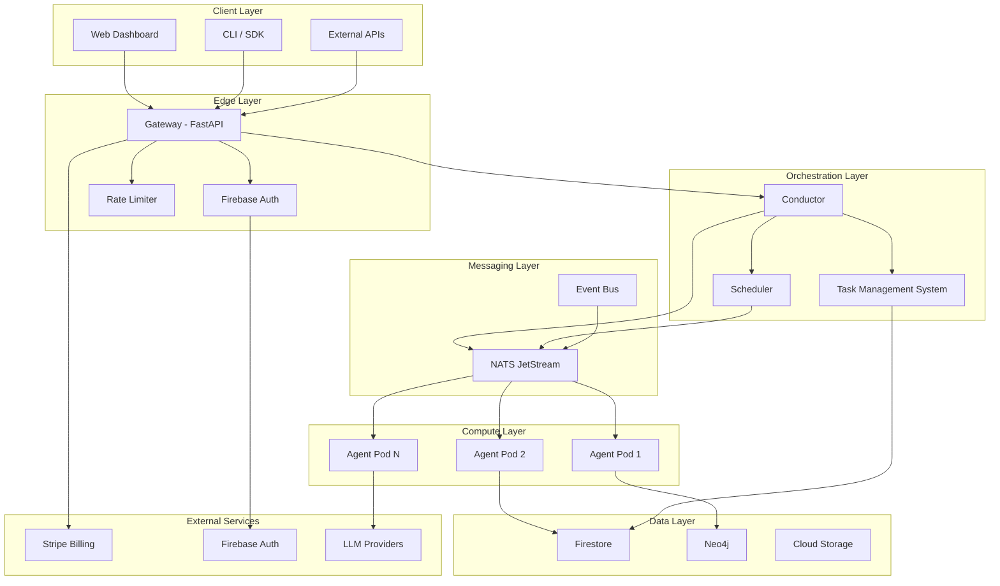
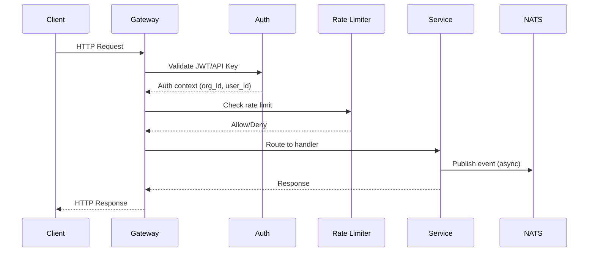

# System Architecture

agent.ceo is an AI agent orchestration platform that enables organizations to deploy, manage, and coordinate autonomous AI agents at scale. The platform follows a microservices architecture deployed on Google Kubernetes Engine (GKE).

## Core Components

| Component | Technology | Purpose |
|-----------|-----------|---------|
| **Gateway** | FastAPI (Python) | REST API, auth, rate limiting, billing |
| **Conductor** | Python | Agent lifecycle, task orchestration, loop control |
| **NATS** | JetStream | Inter-agent messaging, event streaming |
| **Firestore** | Google Cloud | Organization state, usage tracking, config |
| **Neo4j** | Graph DB | Knowledge graph, wiki, entity relationships |
| **GKE** | Kubernetes | Agent compute, autoscaling, isolation |

## Architecture Diagram



## Component Details

### Gateway (FastAPI)

The Gateway is the single entry point for all external requests. It handles:

- **Authentication**: Validates Firebase JWT tokens and API keys
- **Rate limiting**: TokenBucket algorithm per organization tier
- **Request routing**: 58+ REST endpoints across 8 resource groups
- **Billing integration**: Stripe checkout, subscriptions, usage metering
- **Multi-tenancy**: Organization-scoped request isolation

```
packages/gateway/src/gateway/app.py
```

### Conductor (Agent Logic)

The Conductor manages agent lifecycles and task orchestration:

- Agent provisioning and teardown
- Task assignment and verification workflow
- Loop control (autonomous, task-only, paused modes)
- Subagent coordination and delegation
- SLA monitoring and alerting

```
conductor/src/
```

### NATS JetStream (Messaging)

NATS provides the real-time messaging backbone:

- **Subject pattern**: `genbrain.{org_id}.agents.{agent_id}.{type}`
- **Streams**: Durable message storage with replay capability
- **Consumer groups**: Load-balanced message delivery to agent pools
- **At-least-once delivery**: JetStream acknowledgment protocol

See [NATS Protocol](./nats-protocol.md) for message format details.

### Firestore (State)

Firestore stores all mutable platform state:

- Organization configuration and membership
- Agent deployment records and status
- Usage tracking and billing counters
- Task state machines and history
- Rate limit token buckets

### Neo4j (Knowledge Graph)

Neo4j powers the organizational knowledge system:

- Entity and concept storage (wiki pages)
- Vector similarity search for semantic retrieval
- Graph traversal for relationship discovery
- Architecture decision records (ADRs)
- Post-mortem and incident documentation

### GKE (Compute)

Google Kubernetes Engine hosts all agent workloads:

- **Namespace isolation**: Each organization gets a dedicated namespace
- **Resource quotas**: CPU/memory limits per agent tier
- **Autoscaling**: Horizontal pod autoscaler per agent role
- **Persistent volumes**: Agent state and workspace storage

## Data Flow

### Request Lifecycle



### Agent Communication

Agents communicate exclusively through NATS subjects:

1. **Direct messaging**: Agent-to-agent via inbox subjects
2. **Task notifications**: Task state changes broadcast to subscribers
3. **Event streaming**: Platform events for observability

## Deployment Models

agent.ceo supports two deployment models with identical functionality:

### SaaS (Hosted)

The hosted platform runs on Google Cloud managed by GenBrain AI:

| Node Pool | Purpose | Machine Type | Autoscaling |
|-----------|---------|--------------|-------------|
| `system` | Gateway, Conductor, NATS | e2-standard-4 | 2-4 nodes |
| `agents` | Agent workloads | e2-standard-8 | 0-20 nodes |
| `data` | Neo4j, caches | n2-highmem-4 | 1-2 nodes |

- API endpoint: `https://api.agent.ceo`
- Dashboard: `https://app.agent.ceo`
- Auth: Firebase Auth (managed)
- Billing: Stripe (managed)

### Enterprise (Self-Hosted)

Enterprise customers deploy the full platform in their own cloud account (AWS, GCP, or Azure):

- **Dedicated Gateway** — Each enterprise org gets its own Gateway instance at a custom domain (e.g., `api.agents.yourcompany.com`)
- **Private networking** — All components run inside your VPC with no public internet exposure required
- **Bring-Your-Own-LLM** — Connect agents to your own Anthropic, OpenAI, or Azure OpenAI endpoints
- **Custom storage** — Use your own Firestore/DynamoDB, Neo4j, and object storage
- **Air-gapped mode** — Fully operational without internet access (LLM endpoints must be reachable)

```
Enterprise Topology:

┌─────────────────────────────────────────────────────┐
│  Your Cloud Account (AWS/GCP/Azure)                 │
│                                                     │
│  ┌──────────┐  ┌───────────┐  ┌──────────────────┐ │
│  │ Gateway  │──│ Conductor │──│ NATS JetStream   │ │
│  │ (Custom  │  │           │  │                  │ │
│  │  Domain) │  └───────────┘  └──────────────────┘ │
│  └──────────┘                                       │
│       │         ┌───────────┐  ┌──────────────────┐ │
│       └─────────│ Firestore │  │ Neo4j            │ │
│                 │ /DynamoDB │  │ (dedicated)      │ │
│                 └───────────┘  └──────────────────┘ │
│                                                     │
│  ┌──────────┐ ┌──────────┐ ┌──────────────────────┐│
│  │Agent Pod │ │Agent Pod │ │  Your LLM Endpoint   ││
│  │    1     │ │    N     │ │  (Anthropic/OpenAI)  ││
│  └──────────┘ └──────────┘ └──────────────────────┘│
└─────────────────────────────────────────────────────┘
```

See the [Enterprise Deployment Guide](../deployment/enterprise.md) for installation steps.

## Security Model

- All inter-service communication uses mTLS via Istio service mesh
- Agent pods run with minimal RBAC (read-only kubectl)
- Secrets managed via Google Secret Manager (SaaS) or your secrets manager (Enterprise)
- Network policies enforce namespace isolation
- All mutation endpoints require authenticated requests

## Related Documentation

- [Gateway API](./gateway-api.md) - REST endpoint reference
- [Authentication](./authentication.md) - Auth flows and token format
- [NATS Protocol](./nats-protocol.md) - Messaging details
- [Rate Limits](./rate-limits.md) - Throttling configuration
- [Enterprise Deployment](../deployment/enterprise.md) - Self-hosted installation
