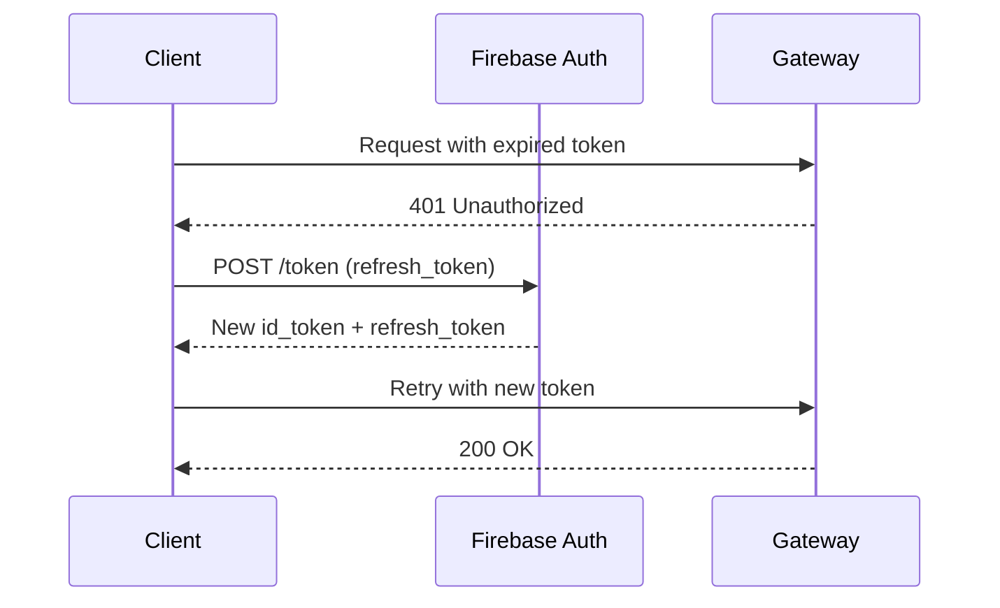
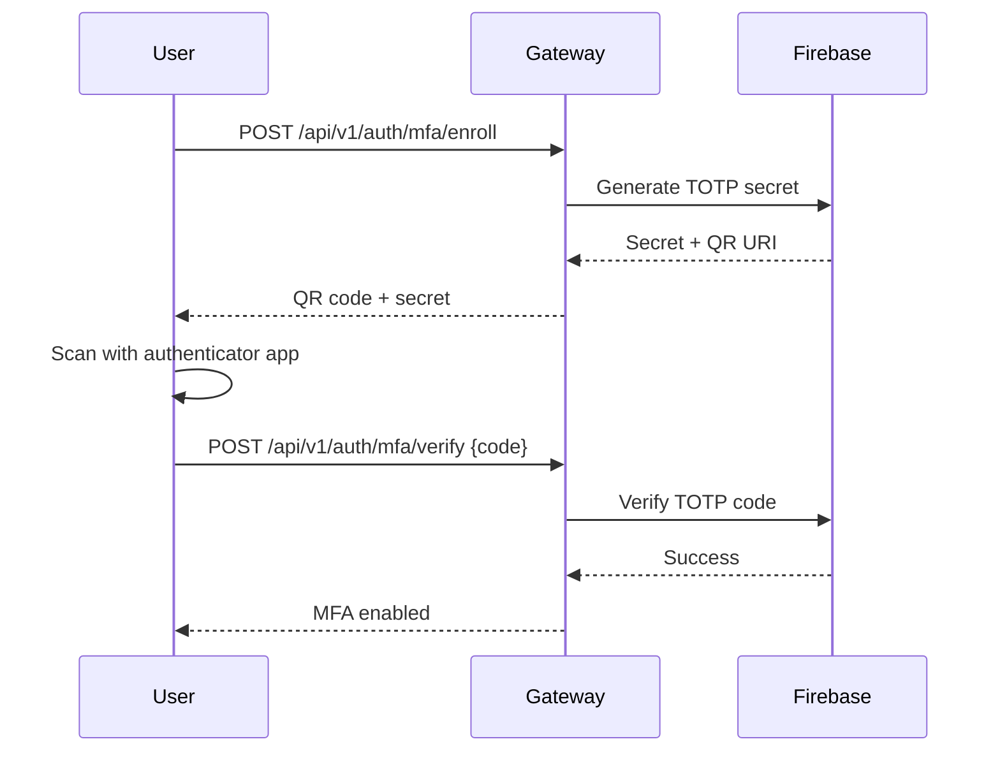

# Authentication

agent.ceo uses a layered authentication model combining Firebase Auth for user sessions and API keys for service-to-service communication. All mutation endpoints require authenticated requests.

## Authentication Methods

| Method | Use Case | Header |
|--------|----------|--------|
| Firebase JWT | User sessions (dashboard, CLI) | `Authorization: Bearer <token>` |
| API Key | Service-to-service, automation | `X-Admin-API-Key: <key>` |

## Firebase Auth (JWT Tokens)

### Token Format

Firebase JWTs are RS256-signed tokens containing:

```json
{
  "iss": "https://securetoken.google.com/agent-ceo-prod",
  "aud": "agent-ceo-prod",
  "auth_time": 1705312200,
  "user_id": "uid_abc123",
  "sub": "uid_abc123",
  "iat": 1705312200,
  "exp": 1705315800,
  "email": "user@company.com",
  "email_verified": true,
  "firebase": {
    "sign_in_provider": "password",
    "identities": {
      "email": ["user@company.com"]
    }
  }
}
```

### Custom Claims

agent.ceo adds custom claims to Firebase tokens for authorization:

```json
{
  "org_id": "org_abc123",
  "role": "admin",
  "tier": "standard",
  "mfa_verified": true
}
```

| Claim | Type | Description |
|-------|------|-------------|
| `org_id` | string | Primary organization ID |
| `role` | string | `admin`, `member`, or `viewer` |
| `tier` | string | Organization billing tier |
| `mfa_verified` | boolean | Whether MFA was completed this session |

### Obtaining a Token

```bash
# Sign in with email/password
curl -X POST https://identitytoolkit.googleapis.com/v1/accounts:signInWithPassword?key=$FIREBASE_API_KEY \
  -H "Content-Type: application/json" \
  -d '{
    "email": "user@company.com",
    "password": "secure_password",
    "returnSecureToken": true
  }'
```

**Response**:

```json
{
  "idToken": "eyJhbGciOiJSUzI1NiIs...",
  "refreshToken": "AMf-vBx...",
  "expiresIn": "3600",
  "localId": "uid_abc123"
}
```

### Token Refresh Flow

Firebase ID tokens expire after 1 hour. Use the refresh token to obtain a new ID token:



```bash
curl -X POST "https://securetoken.googleapis.com/v1/token?key=$FIREBASE_API_KEY" \
  -H "Content-Type: application/x-www-form-urlencoded" \
  -d "grant_type=refresh_token&refresh_token=$REFRESH_TOKEN"
```

**Response**:

```json
{
  "access_token": "eyJhbGciOiJSUzI1NiIs...",
  "expires_in": "3600",
  "token_type": "Bearer",
  "refresh_token": "AMf-vBx_new..."
}
```

## API Keys

API keys are used for service-to-service authentication and automation scripts.

### Key Format

API keys are 64-character hex strings prefixed with the environment:

```
prod_ak_7f3e2a1b9c4d8e6f0a1b2c3d4e5f6a7b8c9d0e1f2a3b4c5d6e7f8a9b0c1d2e3f
```

### Using API Keys

```bash
curl https://api.agent.ceo/api/v1/agents \
  -H "X-Admin-API-Key: prod_ak_7f3e2a1b9c4d8e6f..."
```

### Key Scopes

API keys can be scoped to specific permissions:

| Scope | Access |
|-------|--------|
| `agents:read` | List and get agent details |
| `agents:write` | Create, update, delete agents |
| `tasks:read` | List and get tasks |
| `tasks:write` | Create, assign, complete tasks |
| `billing:read` | View subscription and usage |
| `admin` | Full access (all scopes) |

## Multi-Factor Authentication (MFA)

### TOTP (Phase 1 - Implemented)

agent.ceo supports Time-based One-Time Password (TOTP) as a second authentication factor.

### Enrollment Flow



### MFA Endpoints

| Method | Path | Description |
|--------|------|-------------|
| POST | `/api/v1/auth/mfa/enroll` | Start TOTP enrollment |
| POST | `/api/v1/auth/mfa/verify` | Verify TOTP code |
| DELETE | `/api/v1/auth/mfa/disable` | Disable MFA (requires code) |

### Enrollment Example

```bash
# Step 1: Start enrollment
curl -X POST https://api.agent.ceo/api/v1/auth/mfa/enroll \
  -H "Authorization: Bearer $TOKEN"
```

**Response**:

```json
{
  "secret": "JBSWY3DPEHPK3PXP",
  "qr_uri": "otpauth://totp/agent.ceo:user@company.com?secret=JBSWY3DPEHPK3PXP&issuer=agent.ceo",
  "backup_codes": [
    "a1b2c3d4",
    "e5f6g7h8",
    "i9j0k1l2"
  ]
}
```

```bash
# Step 2: Verify enrollment with code from authenticator
curl -X POST https://api.agent.ceo/api/v1/auth/mfa/verify \
  -H "Authorization: Bearer $TOKEN" \
  -H "Content-Type: application/json" \
  -d '{"code": "123456"}'
```

## Auth Middleware

The Gateway applies authentication middleware to all routes. The middleware:

1. Extracts the token from `Authorization` header or `X-Admin-API-Key` header
2. Validates the token signature and expiration
3. Resolves organization context from claims or key metadata
4. Attaches auth context to the request state

### Middleware Pipeline

```python
# Simplified middleware flow
async def auth_middleware(request: Request):
    # 1. Check for API key
    api_key = request.headers.get("X-Admin-API-Key")
    if api_key:
        return await validate_api_key(api_key)

    # 2. Check for Bearer token
    auth_header = request.headers.get("Authorization")
    if not auth_header or not auth_header.startswith("Bearer "):
        raise HTTPException(401, "Missing authentication")

    token = auth_header.split(" ")[1]
    claims = await verify_firebase_token(token)

    # 3. Attach context
    request.state.user_id = claims["user_id"]
    request.state.org_id = claims.get("org_id")
    request.state.role = claims.get("role", "member")
```

### Unauthenticated Endpoints

The following endpoints are excluded from auth middleware:

| Endpoint | Reason |
|----------|--------|
| `GET /api/v1/templates` | Public catalog |
| `GET /api/v1/templates/{id}` | Public catalog |
| `POST /api/v1/billing/webhook` | Stripe signature verification |
| `GET /health` | Health checks |

## Security Best Practices

!!! warning "Critical Security Requirements"
    - Store tokens securely (never in localStorage for web apps)
    - Always use HTTPS in production
    - Rotate API keys every 90 days
    - Enable MFA for all admin accounts
    - All mutation endpoints MUST have auth middleware (P1 if missing)

### Token Storage Recommendations

| Platform | Recommended Storage |
|----------|-------------------|
| Web (SPA) | HttpOnly cookie or memory |
| Mobile | Secure keychain/keystore |
| Server | Environment variable or secret manager |
| CLI | OS keyring (`~/.config/agent-ceo/credentials`) |

## Related Documentation

- [Gateway API](./gateway-api.md) - Endpoint reference
- [Rate Limits](./rate-limits.md) - Per-tier throttling
- [Billing API](./billing-api.md) - Subscription management
