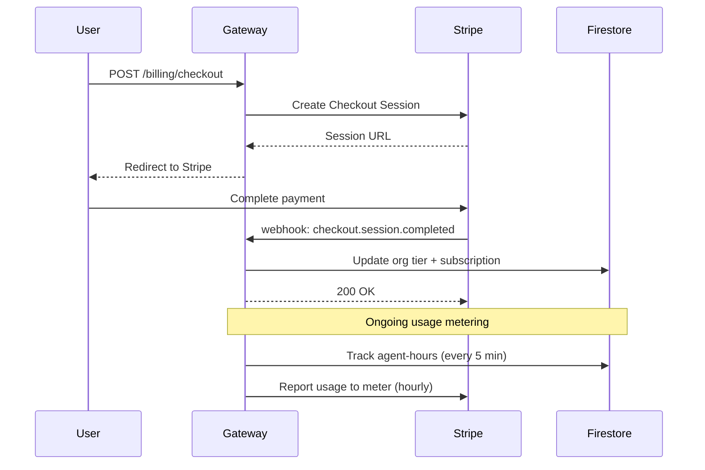

# Billing API

agent.ceo uses Stripe for subscription management and metered billing. Organizations are billed based on their tier and actual agent-hour consumption.

## Subscription Tiers

| Tier | Price | Agent-Hours/Month | Rate Limit | Features |
|------|-------|-------------------|------------|----------|
| **Free** | $0 | 168 (1 agent 24/7) | 100 rpm | 1 agent, community support |
| **Standard** | $200/agent/month | Unlimited | 500 rpm | Up to 10 agents, priority support |
| **Volume** | $160/agent/month | Unlimited | 1000 rpm | 10+ agents, dedicated support, SLA |

!!! note "Pay-As-You-Go (PAYG)"
    Organizations that exceed the free tier without a subscription are billed at $0.50/agent-hour with a 300 rpm rate limit.

## Stripe Integration

### Meter Configuration

agent.ceo uses Stripe's metered billing with a dedicated meter for agent-hours:

| Resource | Stripe Meter ID | Unit |
|----------|----------------|------|
| Agent Hours | `mtr_61ULkqdYGUVipMZDz41BjewIQRBg3OpU` | hours (rounded to 0.01) |

### Billing Flow



## Endpoints

### Create Checkout Session

Creates a Stripe Checkout session for subscription signup or upgrade.

```bash
curl -X POST https://api.agent.ceo/api/v1/billing/checkout \
  -H "Authorization: Bearer $TOKEN" \
  -H "Content-Type: application/json" \
  -d '{
    "org_id": "org_abc123",
    "tier": "standard",
    "agent_count": 5,
    "success_url": "https://app.agent.ceo/billing/success",
    "cancel_url": "https://app.agent.ceo/billing/cancel"
  }'
```

**Response** (200):

```json
{
  "checkout_url": "https://checkout.stripe.com/c/pay/cs_live_abc123...",
  "session_id": "cs_live_abc123"
}
```

### Get Subscription

Retrieve the active subscription for an organization.

```bash
curl https://api.agent.ceo/api/v1/billing/subscription \
  -H "Authorization: Bearer $TOKEN" \
  -H "X-Org-Id: org_abc123"
```

**Response** (200):

```json
{
  "subscription_id": "sub_1abc2def3ghi",
  "status": "active",
  "tier": "standard",
  "agent_count": 5,
  "current_period_start": "2026-01-01T00:00:00Z",
  "current_period_end": "2026-01-31T23:59:59Z",
  "monthly_amount": 100000,
  "currency": "usd",
  "next_invoice_date": "2026-02-01T00:00:00Z"
}
```

### Get Billing Usage

Retrieve metered usage for the current billing period.

```bash
curl https://api.agent.ceo/api/v1/billing/usage \
  -H "Authorization: Bearer $TOKEN" \
  -H "X-Org-Id: org_abc123"
```

**Response** (200):

```json
{
  "period_start": "2026-01-01T00:00:00Z",
  "period_end": "2026-01-31T23:59:59Z",
  "agent_hours": {
    "total": 412.5,
    "by_agent": {
      "agent_cto": 168.0,
      "agent_fullstack": 144.5,
      "agent_devops": 100.0
    }
  },
  "estimated_cost": {
    "subscription_base": 100000,
    "overage": 0,
    "total_cents": 100000
  }
}
```

### Create Billing Portal Session

Redirect users to Stripe's billing portal for self-service management.

```bash
curl -X POST https://api.agent.ceo/api/v1/billing/portal \
  -H "Authorization: Bearer $TOKEN" \
  -H "Content-Type: application/json" \
  -d '{
    "org_id": "org_abc123",
    "return_url": "https://app.agent.ceo/settings/billing"
  }'
```

**Response** (200):

```json
{
  "portal_url": "https://billing.stripe.com/p/session/bps_abc123..."
}
```

## Usage Tracking

### How Agent-Hours Are Calculated

Agent-hours are tracked continuously while an agent is in a running state:

```python
# Usage calculation (simplified)
def calculate_agent_hours(agent_id: str, period_start: datetime) -> float:
    """Calculate billable agent-hours since period_start."""
    sessions = get_agent_sessions(agent_id, since=period_start)
    total_seconds = sum(
        (session.end_time or now()) - session.start_time
        for session in sessions
        if session.status in ("running", "active")
    ).total_seconds()
    return round(total_seconds / 3600, 2)
```

### Usage Reporting to Stripe

Usage is reported to the Stripe meter hourly:

```bash
# Internal: Report usage to Stripe meter
curl -X POST https://api.stripe.com/v1/billing/meter_events \
  -u "$STRIPE_SECRET_KEY:" \
  -d "event_name=agent_hours" \
  -d "payload[stripe_customer_id]=cus_abc123" \
  -d "payload[value]=5.25" \
  -d "timestamp=1705312200"
```

### Firestore Usage Document

Usage state is persisted in Firestore for fast lookups:

```json
{
  "org_id": "org_abc123",
  "period": "2026-01",
  "total_agent_hours": 412.5,
  "agents": {
    "agent_cto": {
      "hours": 168.0,
      "last_reported": "2026-01-15T10:00:00Z"
    }
  },
  "stripe_reported_hours": 410.0,
  "pending_report_hours": 2.5
}
```

## Tier Limits and Overage

### Free Tier

| Limit | Value |
|-------|-------|
| Agent-hours per month | 168 (equivalent to 1 agent running 24/7) |
| Maximum agents | 1 |
| Rate limit | 100 rpm |

When the free tier limit is reached, the agent is paused until:
- The next billing period begins, or
- The organization upgrades to a paid tier

### Paid Tier Overage

Standard and Volume tiers include unlimited agent-hours for the subscribed agent count. Additional agents beyond the subscription are billed at the per-agent rate.

## Webhook Events

Stripe sends webhook events to `POST /api/v1/billing/webhook`. See [Webhooks](./webhooks.md) for details.

Key billing webhook events:

| Event | Action |
|-------|--------|
| `checkout.session.completed` | Activate subscription, update tier |
| `customer.subscription.updated` | Sync tier/agent count changes |
| `customer.subscription.deleted` | Downgrade to free tier |
| `invoice.paid` | Record payment, reset usage |
| `invoice.payment_failed` | Send warning, grace period |

## Error Handling

| Error | Status | Resolution |
|-------|--------|------------|
| No active subscription | 402 | Redirect to checkout |
| Payment method declined | 402 | Update payment in portal |
| Usage limit reached (free) | 429 | Upgrade tier or wait |
| Invalid checkout params | 400 | Check tier and agent_count |

```json
{
  "detail": {
    "code": "subscription_required",
    "message": "This action requires an active subscription. Current tier: free",
    "upgrade_url": "https://app.agent.ceo/billing/upgrade"
  }
}
```

## Related Documentation

- [Gateway API](./gateway-api.md) - All API endpoints
- [Webhooks](./webhooks.md) - Event delivery
- [Rate Limits](./rate-limits.md) - Per-tier throttling
- [Architecture](./architecture.md) - System overview
