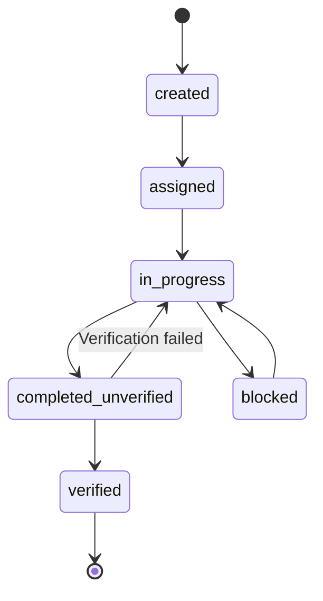

# Gateway API

The agent.ceo Gateway exposes 58+ REST endpoints via a FastAPI application. All endpoints require authentication unless explicitly noted.

**Base URL**: `https://api.agent.ceo/api/v1`

## Authentication

All requests must include one of:

- **Bearer token**: `Authorization: Bearer <firebase_jwt>`
- **API key**: `X-Admin-API-Key: <key>`

See [Authentication](./authentication.md) for details on obtaining tokens.

## Endpoint Groups

| Group | Prefix | Purpose |
|-------|--------|---------|
| Organizations | `/api/v1/organizations` | Org provisioning and management |
| Agents | `/api/v1/agents` | Agent lifecycle management |
| Tasks | `/api/v1/tasks` | Task Management System (TMS) |
| Usage | `/api/v1/usage` | Metering and usage data |
| Costs | `/api/v1/costs` | Cost tracking and analysis |
| Billing | `/api/v1/billing` | Stripe subscriptions and checkout |
| Customers | `/api/v1/customers` | Multi-tenant customer management |
| Templates | `/api/v1/templates` | Agent templates (public, no auth) |

## Organizations

Manage multi-tenant organizations, membership, and configuration.

### Endpoints

| Method | Path | Description |
|--------|------|-------------|
| POST | `/organizations` | Create a new organization |
| GET | `/organizations/{org_id}` | Get organization details |
| PATCH | `/organizations/{org_id}` | Update organization settings |
| DELETE | `/organizations/{org_id}` | Delete organization |
| GET | `/organizations/{org_id}/members` | List org members |
| POST | `/organizations/{org_id}/members` | Invite member |
| DELETE | `/organizations/{org_id}/members/{user_id}` | Remove member |

### Example: Create Organization

```bash
curl -X POST https://api.agent.ceo/api/v1/organizations \
  -H "Authorization: Bearer $TOKEN" \
  -H "Content-Type: application/json" \
  -d '{
    "name": "Acme Corp",
    "tier": "standard",
    "billing_email": "billing@acme.com"
  }'
```

**Response** (201):

```json
{
  "id": "org_abc123",
  "name": "Acme Corp",
  "tier": "standard",
  "created_at": "2026-01-15T10:30:00Z",
  "status": "active"
}
```

## Agents

Manage agent deployment, configuration, and lifecycle.

### Endpoints

| Method | Path | Description |
|--------|------|-------------|
| POST | `/agents` | Deploy a new agent |
| GET | `/agents` | List agents for organization |
| GET | `/agents/{agent_id}` | Get agent details |
| PATCH | `/agents/{agent_id}` | Update agent config |
| DELETE | `/agents/{agent_id}` | Stop and remove agent |
| POST | `/agents/{agent_id}/start` | Start a stopped agent |
| POST | `/agents/{agent_id}/stop` | Stop a running agent |
| GET | `/agents/{agent_id}/logs` | Stream agent logs |
| POST | `/agents/{agent_id}/snapshot` | Create agent snapshot |

### Example: Deploy Agent

```bash
curl -X POST https://api.agent.ceo/api/v1/agents \
  -H "Authorization: Bearer $TOKEN" \
  -H "Content-Type: application/json" \
  -d '{
    "name": "backend-dev",
    "role": "developer",
    "template_id": "tmpl_fullstack",
    "org_id": "org_abc123",
    "config": {
      "loop_mode": "autonomous",
      "model": "claude-sonnet-4-20250514"
    }
  }'
```

**Response** (201):

```json
{
  "id": "agent_xyz789",
  "name": "backend-dev",
  "status": "provisioning",
  "org_id": "org_abc123",
  "created_at": "2026-01-15T10:35:00Z"
}
```

## Tasks

The Task Management System (TMS) handles task creation, assignment, tracking, and verification.

### Endpoints

| Method | Path | Description |
|--------|------|-------------|
| POST | `/tasks` | Create a new task |
| GET | `/tasks` | List tasks (with filters) |
| GET | `/tasks/{task_id}` | Get task details |
| PATCH | `/tasks/{task_id}` | Update task |
| POST | `/tasks/{task_id}/assign` | Assign to agent |
| POST | `/tasks/{task_id}/complete` | Mark complete (unverified) |
| POST | `/tasks/{task_id}/verify` | Verify completion |
| GET | `/tasks/{task_id}/tree` | Get task tree (subtasks) |

### Task States



### Example: Create Task

```bash
curl -X POST https://api.agent.ceo/api/v1/tasks \
  -H "Authorization: Bearer $TOKEN" \
  -H "Content-Type: application/json" \
  -d '{
    "title": "Implement user search endpoint",
    "description": "Add GET /api/v1/users/search with query params",
    "org_id": "org_abc123",
    "priority": "high",
    "assignee_agent_id": "agent_xyz789",
    "verification_steps": [
      "Endpoint returns 200 with valid results",
      "Query parameter filtering works",
      "Auth middleware is applied"
    ]
  }'
```

## Usage

Track agent-hours, API calls, and resource consumption.

### Endpoints

| Method | Path | Description |
|--------|------|-------------|
| GET | `/usage` | Get usage summary for org |
| GET | `/usage/agents/{agent_id}` | Per-agent usage breakdown |
| GET | `/usage/history` | Historical usage data |
| GET | `/usage/current-period` | Current billing period stats |

### Example: Get Current Usage

```bash
curl https://api.agent.ceo/api/v1/usage/current-period \
  -H "Authorization: Bearer $TOKEN" \
  -H "X-Org-Id: org_abc123"
```

**Response** (200):

```json
{
  "period_start": "2026-01-01T00:00:00Z",
  "period_end": "2026-01-31T23:59:59Z",
  "agent_hours_used": 412.5,
  "agent_hours_limit": 840,
  "api_calls": 15230,
  "active_agents": 5
}
```

## Costs

Cost analysis and breakdown by agent, task, and time period.

### Endpoints

| Method | Path | Description |
|--------|------|-------------|
| GET | `/costs` | Total cost summary |
| GET | `/costs/breakdown` | Cost breakdown by category |
| GET | `/costs/agents/{agent_id}` | Per-agent cost tracking |
| GET | `/costs/forecast` | Projected costs for period |

## Billing

Stripe-powered subscription management and checkout.

### Endpoints

| Method | Path | Description |
|--------|------|-------------|
| POST | `/billing/checkout` | Create Stripe checkout session |
| GET | `/billing/subscription` | Get active subscription |
| POST | `/billing/portal` | Create billing portal session |
| GET | `/billing/usage` | Get metered usage for billing |
| POST | `/billing/webhook` | Stripe webhook receiver |

See [Billing API](./billing-api.md) for detailed billing integration docs.

## Customers

Multi-tenant customer management for platform operators.

### Endpoints

| Method | Path | Description |
|--------|------|-------------|
| GET | `/customers` | List all customers |
| GET | `/customers/{customer_id}` | Get customer details |
| PATCH | `/customers/{customer_id}` | Update customer |
| GET | `/customers/{customer_id}/orgs` | List customer orgs |

## Templates (Public)

!!! note "No Authentication Required"
    Template listing endpoints are publicly accessible.

| Method | Path | Description |
|--------|------|-------------|
| GET | `/templates` | List available agent templates |
| GET | `/templates/{template_id}` | Get template details |

### Example: List Templates

```bash
curl https://api.agent.ceo/api/v1/templates
```

**Response** (200):

```json
{
  "templates": [
    {
      "id": "tmpl_fullstack",
      "name": "Fullstack Developer",
      "description": "Full-stack web development agent",
      "capabilities": ["python", "typescript", "react", "postgres"]
    },
    {
      "id": "tmpl_devops",
      "name": "DevOps Engineer",
      "description": "Infrastructure and deployment agent",
      "capabilities": ["kubernetes", "terraform", "ci-cd"]
    }
  ]
}
```

## Error Responses

All errors follow a consistent format:

```json
{
  "detail": {
    "code": "rate_limit_exceeded",
    "message": "Rate limit exceeded. Retry after 12 seconds.",
    "retry_after": 12
  }
}
```

| Status Code | Meaning |
|-------------|---------|
| 400 | Bad request / validation error |
| 401 | Missing or invalid authentication |
| 403 | Insufficient permissions |
| 404 | Resource not found |
| 429 | Rate limit exceeded |
| 500 | Internal server error |

## Related Documentation

- [Authentication](./authentication.md) - Token and API key details
- [Rate Limits](./rate-limits.md) - Per-tier throttling
- [Billing API](./billing-api.md) - Subscription and checkout
- [Webhooks](./webhooks.md) - Event notifications
