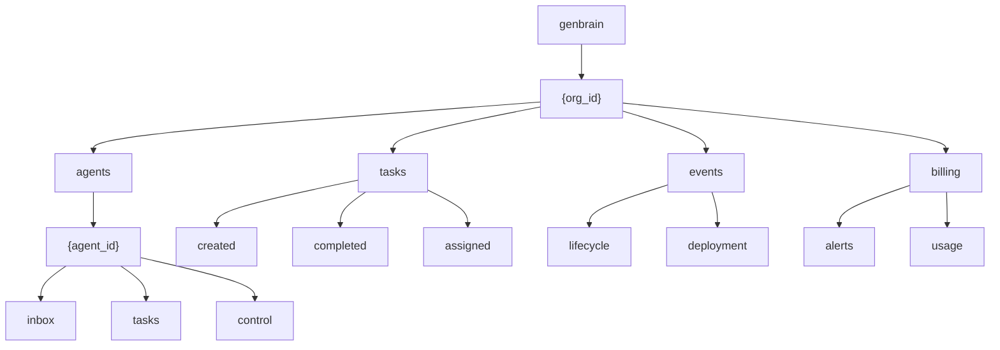
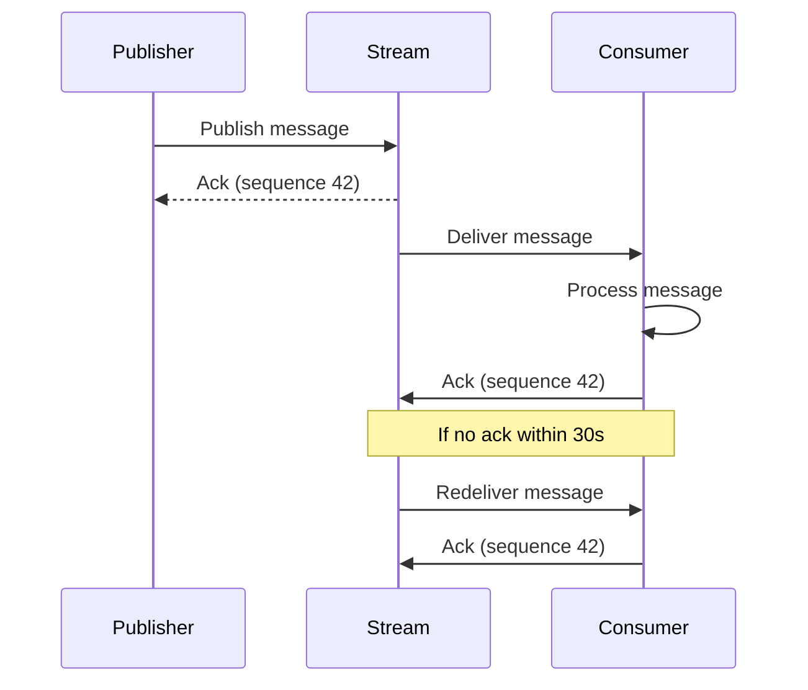

# NATS Protocol

agent.ceo uses NATS JetStream as the messaging backbone for all inter-agent communication, event streaming, and task notifications. NATS provides low-latency, durable messaging with at-least-once delivery guarantees.

## Subject Hierarchy

All NATS subjects follow a hierarchical naming pattern:

```
genbrain.{org_id}.agents.{agent_id}.{type}
```

### Subject Map

| Subject Pattern | Purpose | Publishers | Subscribers |
|----------------|---------|-----------|-------------|
| `genbrain.{org}.agents.{id}.inbox` | Direct messages to agent | Any agent | Target agent |
| `genbrain.{org}.agents.{id}.tasks` | Task assignments/updates | Conductor, TMS | Target agent |
| `genbrain.{org}.agents.{id}.control` | Lifecycle commands | Conductor | Target agent |
| `genbrain.{org}.tasks.created` | New task notifications | TMS | All agents |
| `genbrain.{org}.tasks.completed` | Task completion events | Agents | Conductor, TMS |
| `genbrain.{org}.events.{type}` | Platform events | Any service | Event consumers |
| `genbrain.{org}.billing.alerts` | Billing notifications | Gateway | Billing handler |

### Subject Diagram



## Message Envelope Format

All messages use a standard JSON envelope:

```json
{
  "id": "msg_20260115_103000_abc123",
  "from_agent": "cto",
  "to_agent": "fullstack",
  "message_type": "task_assignment",
  "payload": {
    "task_id": "task_xyz789",
    "title": "Implement search endpoint",
    "priority": "high"
  },
  "timestamp": "2026-01-15T10:30:00.000Z",
  "org_id": "org_abc123",
  "correlation_id": "corr_req_456",
  "version": "1.0"
}
```

### Envelope Fields

| Field | Type | Required | Description |
|-------|------|----------|-------------|
| `id` | string | Yes | Unique message ID (used for dedup) |
| `from_agent` | string | Yes | Sender agent identifier |
| `to_agent` | string | No | Target agent (null for broadcasts) |
| `message_type` | string | Yes | Message classification |
| `payload` | object | Yes | Message-specific data |
| `timestamp` | string | Yes | ISO 8601 UTC timestamp |
| `org_id` | string | Yes | Organization scope |
| `correlation_id` | string | No | Request tracing ID |
| `version` | string | Yes | Envelope schema version |

### Message Types

| Type | Direction | Purpose |
|------|-----------|---------|
| `task_assignment` | Manager to Agent | New task assigned |
| `task_completion` | Agent to Manager | Task completed with evidence |
| `task_verification` | Manager to Agent | Verification result |
| `status_update` | Agent to Manager | Progress report |
| `question` | Agent to Agent | Request for information |
| `directive` | CEO to Agent | High-priority instruction |
| `announcement` | Any to Broadcast | Org-wide notification |
| `control.start` | Conductor to Agent | Start agent loop |
| `control.stop` | Conductor to Agent | Stop agent loop |
| `control.snapshot` | Conductor to Agent | Take state snapshot |

## JetStream Configuration

### Streams

| Stream | Subjects | Retention | Max Age | Replicas |
|--------|----------|-----------|---------|----------|
| `AGENT_INBOX` | `genbrain.*.agents.*.inbox` | WorkQueue | 7 days | 3 |
| `AGENT_TASKS` | `genbrain.*.agents.*.tasks` | WorkQueue | 30 days | 3 |
| `AGENT_CONTROL` | `genbrain.*.agents.*.control` | Interest | 1 hour | 1 |
| `PLATFORM_TASKS` | `genbrain.*.tasks.*` | Limits | 30 days | 3 |
| `PLATFORM_EVENTS` | `genbrain.*.events.*` | Limits | 90 days | 3 |
| `BILLING` | `genbrain.*.billing.*` | Limits | 365 days | 3 |

### Stream Creation

```bash
# Create the agent inbox stream
nats stream add AGENT_INBOX \
  --subjects "genbrain.*.agents.*.inbox" \
  --retention work \
  --max-age 7d \
  --max-msgs-per-subject 1000 \
  --replicas 3 \
  --discard old \
  --dupe-window 2m
```

## Consumer Groups

Consumers define how messages are delivered to subscribers.

### Consumer Configuration

```json
{
  "durable_name": "agent-cto-inbox",
  "filter_subject": "genbrain.org_abc123.agents.cto.inbox",
  "ack_policy": "explicit",
  "ack_wait": "30s",
  "max_deliver": 5,
  "deliver_policy": "all",
  "replay_policy": "instant",
  "max_ack_pending": 100
}
```

### Consumer Types

| Type | Use Case | Example |
|------|----------|---------|
| **Push** | Real-time delivery to running agent | Agent inbox |
| **Pull** | Batch processing, rate control | Event archiver |
| **Queue Group** | Load-balanced across instances | Multi-replica services |

### Queue Groups

When multiple instances of a service run, queue groups ensure each message is processed exactly once:

```python
# All instances with same queue group share the workload
sub = await js.subscribe(
    "genbrain.*.tasks.completed",
    queue="task-verifier-group",
    durable="task-verifier"
)
```

## Delivery Semantics

### At-Least-Once Delivery

NATS JetStream guarantees at-least-once delivery:

1. Message is published and stored in the stream
2. Message is delivered to consumer
3. Consumer must acknowledge within `ack_wait`
4. If no ack, message is redelivered (up to `max_deliver` times)



### Acknowledgment Types

| Ack Type | Method | Effect |
|----------|--------|--------|
| `Ack` | `msg.ack()` | Message processed successfully |
| `Nak` | `msg.nak(delay=5s)` | Redelivery requested after delay |
| `InProgress` | `msg.in_progress()` | Reset ack timer (still processing) |
| `Term` | `msg.term()` | Do not redeliver (permanent failure) |

### Message Deduplication

Messages are deduplicated using the `Nats-Msg-Id` header within the stream's duplicate window (default: 2 minutes):

```python
await js.publish(
    subject,
    data,
    headers={"Nats-Msg-Id": message_id}
)
```

## Code Examples

### Publishing a Message (Python)

```python
import nats
import json
from datetime import datetime, timezone
import uuid

async def send_to_agent(nc, org_id: str, to_agent: str, message: str, msg_type: str = "direct"):
    """Send a message to an agent's inbox."""
    js = nc.jetstream()

    envelope = {
        "id": f"msg_{uuid.uuid4().hex[:12]}",
        "from_agent": "cto",
        "to_agent": to_agent,
        "message_type": msg_type,
        "payload": {"message": message},
        "timestamp": datetime.now(timezone.utc).isoformat(),
        "org_id": org_id,
        "version": "1.0"
    }

    subject = f"genbrain.{org_id}.agents.{to_agent}.inbox"
    ack = await js.publish(
        subject,
        json.dumps(envelope).encode(),
        headers={"Nats-Msg-Id": envelope["id"]}
    )
    return ack.seq
```

### Consuming Messages (Python)

```python
async def consume_inbox(nc, org_id: str, agent_id: str):
    """Consume messages from an agent's inbox."""
    js = nc.jetstream()

    sub = await js.subscribe(
        f"genbrain.{org_id}.agents.{agent_id}.inbox",
        durable=f"agent-{agent_id}-inbox",
        ack_wait=30
    )

    async for msg in sub.messages:
        try:
            envelope = json.loads(msg.data.decode())
            await process_message(envelope)
            await msg.ack()
        except Exception as e:
            # Retry with delay
            await msg.nak(delay=5)
```

### Publishing with CLI

```bash
# Send a message using NATS CLI
nats pub genbrain.org_abc123.agents.fullstack.inbox \
  --header "Nats-Msg-Id:msg_test_001" \
  '{"id":"msg_test_001","from_agent":"cto","to_agent":"fullstack","message_type":"directive","payload":{"message":"Deploy hotfix to staging"},"timestamp":"2026-01-15T10:30:00Z","org_id":"org_abc123","version":"1.0"}'
```

## Monitoring

### Stream Statistics

```bash
# View stream info
nats stream info AGENT_INBOX

# View consumer info
nats consumer info AGENT_INBOX agent-cto-inbox

# Monitor message rates
nats stream report
```

### Key Metrics

| Metric | Alert Threshold | Action |
|--------|----------------|--------|
| Consumer pending messages | > 100 | Scale consumers or investigate backlog |
| Redelivery count | > 3 per message | Check consumer health |
| Stream storage | > 80% capacity | Increase retention limits or purge |
| Ack latency (p99) | > 10s | Investigate slow consumers |

## Error Handling

### Connection Resilience

```python
async def connect_with_retry():
    """Connect to NATS with automatic reconnection."""
    nc = await nats.connect(
        servers=["nats://nats.agents.svc.cluster.local:4222"],
        reconnect_time_wait=2,
        max_reconnect_attempts=-1,  # Infinite
        error_cb=on_error,
        disconnected_cb=on_disconnect,
        reconnected_cb=on_reconnect
    )
    return nc
```

### Dead Letter Handling

Messages exceeding `max_deliver` are moved to the dead letter subject:

```python
# DLQ consumer
dlq_sub = await js.subscribe(
    "genbrain.dlq.>",
    durable="dlq-processor"
)
```

## Related Documentation

- [Architecture](./architecture.md) - System component overview
- [MCP Tools](./mcp-tools.md) - Tools that use NATS messaging
- [Webhooks](./webhooks.md) - Event system built on NATS
- [Rate Limits](./rate-limits.md) - Throttling configuration
