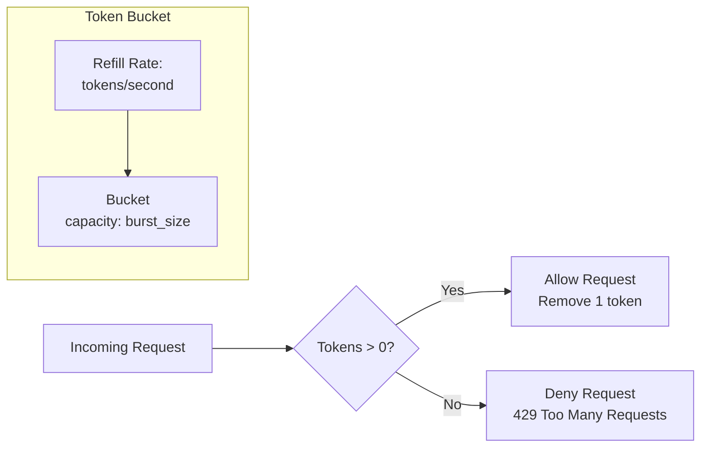
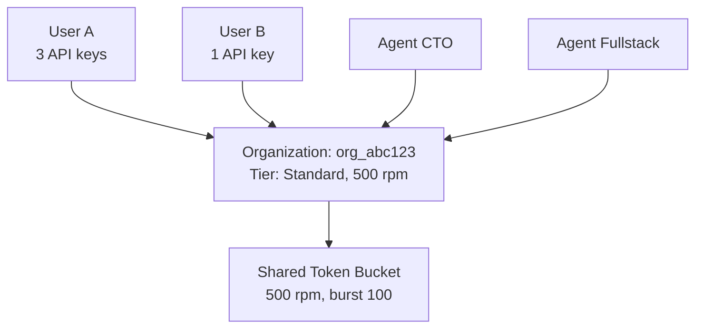

# Rate Limits

agent.ceo enforces rate limits to ensure fair resource allocation across organizations. Limits are applied per organization based on subscription tier using a TokenBucket algorithm.

## Rate Limits by Tier

| Tier | Requests per Minute | Burst Size | Provisioning Limit |
|------|--------------------:|----------:|-------------------:|
| **Free** | 100 | 20 | 5 rpm |
| **PAYG** | 300 | 50 | 5 rpm |
| **Standard** | 500 | 100 | 5 rpm |
| **Volume** | 1,000 | 200 | 5 rpm |

!!! note "Provisioning-Specific Limit"
    Organization provisioning endpoints (`POST /api/v1/organizations`) have a separate, stricter limit of 5 requests per minute regardless of tier. This prevents abuse of resource-intensive provisioning operations.

## TokenBucket Algorithm

Rate limiting uses the Token Bucket algorithm, which allows short bursts while enforcing average rate limits over time.

### How It Works



### Algorithm Parameters

| Parameter | Formula | Example (Standard) |
|-----------|---------|-------------------|
| `capacity` | burst_size | 100 tokens |
| `refill_rate` | rpm / 60 | 8.33 tokens/second |
| `tokens` | min(capacity, tokens + elapsed * refill_rate) | Refills continuously |

### Implementation

```python
from dataclasses import dataclass
from time import time

@dataclass
class TokenBucket:
    """TokenBucket rate limiter per organization."""
    capacity: float          # Maximum burst size
    refill_rate: float       # Tokens per second
    tokens: float            # Current token count
    last_refill: float       # Timestamp of last refill

    def consume(self, tokens: int = 1) -> bool:
        """Attempt to consume tokens. Returns True if allowed."""
        now = time()
        elapsed = now - self.last_refill
        self.tokens = min(
            self.capacity,
            self.tokens + elapsed * self.refill_rate
        )
        self.last_refill = now

        if self.tokens >= tokens:
            self.tokens -= tokens
            return True
        return False

    @property
    def retry_after(self) -> float:
        """Seconds until a token is available."""
        if self.tokens >= 1:
            return 0
        deficit = 1 - self.tokens
        return deficit / self.refill_rate
```

### Tier Configuration

```python
TIER_LIMITS = {
    "free": TokenBucket(capacity=20, refill_rate=100/60),
    "payg": TokenBucket(capacity=50, refill_rate=300/60),
    "standard": TokenBucket(capacity=100, refill_rate=500/60),
    "volume": TokenBucket(capacity=200, refill_rate=1000/60),
}

PROVISIONING_LIMIT = TokenBucket(capacity=5, refill_rate=5/60)
```

## Response Headers

Rate limit information is included in all API responses:

| Header | Description | Example |
|--------|-------------|---------|
| `X-RateLimit-Limit` | Maximum requests per minute for tier | `500` |
| `X-RateLimit-Remaining` | Remaining requests in current window | `347` |
| `X-RateLimit-Reset` | Unix timestamp when bucket refills to capacity | `1705312260` |
| `Retry-After` | Seconds to wait (only on 429 responses) | `12` |

### Example Response Headers

**Successful request**:

```http
HTTP/1.1 200 OK
X-RateLimit-Limit: 500
X-RateLimit-Remaining: 347
X-RateLimit-Reset: 1705312260
Content-Type: application/json
```

**Rate limited request**:

```http
HTTP/1.1 429 Too Many Requests
X-RateLimit-Limit: 500
X-RateLimit-Remaining: 0
X-RateLimit-Reset: 1705312260
Retry-After: 12
Content-Type: application/json

{
  "detail": {
    "code": "rate_limit_exceeded",
    "message": "Rate limit exceeded. Retry after 12 seconds.",
    "retry_after": 12,
    "limit": 500,
    "tier": "standard"
  }
}
```

## Rate Limit Scoping

Rate limits are scoped at the **organization** level, not per user or per API key:



All requests from users, API keys, and agents within an organization share the same rate limit bucket.

## Endpoint-Specific Limits

Some endpoints have additional per-endpoint limits independent of the org-level bucket:

| Endpoint | Limit | Reason |
|----------|-------|--------|
| `POST /api/v1/organizations` | 5 rpm | Resource-intensive provisioning |
| `POST /api/v1/agents` | 10 rpm | Prevents runaway agent creation |
| `POST /api/v1/billing/checkout` | 3 rpm | Prevents checkout abuse |
| `POST /api/v1/auth/mfa/verify` | 5 rpm | Brute-force protection |

## Handling Rate Limits

### Client-Side Best Practices

```python
import time
import requests
from requests.adapters import HTTPAdapter, Retry

class AgentCEOClient:
    """Client with automatic rate limit handling."""

    def __init__(self, base_url: str, token: str):
        self.base_url = base_url
        self.session = requests.Session()
        self.session.headers["Authorization"] = f"Bearer {token}"

        # Configure retries with backoff
        retry_strategy = Retry(
            total=3,
            status_forcelist=[429, 502, 503],
            backoff_factor=1,
            respect_retry_after_header=True
        )
        self.session.mount("https://", HTTPAdapter(max_retries=retry_strategy))

    def request(self, method: str, path: str, **kwargs):
        """Make a request with rate limit awareness."""
        response = self.session.request(method, f"{self.base_url}{path}", **kwargs)

        if response.status_code == 429:
            retry_after = int(response.headers.get("Retry-After", 10))
            time.sleep(retry_after)
            response = self.session.request(method, f"{self.base_url}{path}", **kwargs)

        return response
```

### Bash / cURL Example

```bash
#!/bin/bash
# Rate-limit aware request with retry

make_request() {
    local response
    local http_code

    response=$(curl -s -w "\n%{http_code}" \
        -H "Authorization: Bearer $TOKEN" \
        "https://api.agent.ceo/api/v1/agents")

    http_code=$(echo "$response" | tail -n1)
    body=$(echo "$response" | sed '$d')

    if [ "$http_code" = "429" ]; then
        retry_after=$(echo "$body" | jq -r '.detail.retry_after // 10')
        echo "Rate limited. Waiting ${retry_after}s..."
        sleep "$retry_after"
        make_request  # Retry
    else
        echo "$body"
    fi
}

make_request
```

## Monitoring Rate Limits

### Proactive Monitoring

Track the `X-RateLimit-Remaining` header to detect approaching limits:

```python
def check_rate_limit_health(response):
    """Warn when approaching rate limit."""
    remaining = int(response.headers.get("X-RateLimit-Remaining", 999))
    limit = int(response.headers.get("X-RateLimit-Limit", 999))

    utilization = 1 - (remaining / limit)
    if utilization > 0.8:
        logger.warning(f"Rate limit utilization at {utilization:.0%} ({remaining}/{limit} remaining)")
```

### Dashboard Metrics

The platform exposes rate limit metrics for monitoring:

| Metric | Description |
|--------|-------------|
| `ratelimit_requests_total` | Total requests by org and status |
| `ratelimit_rejected_total` | Rejected (429) requests by org |
| `ratelimit_bucket_tokens` | Current token count per org |
| `ratelimit_utilization_ratio` | Bucket utilization (0-1) per org |

## Upgrading Limits

If your organization consistently hits rate limits, consider:

1. **Upgrade tier**: Higher tiers have proportionally higher limits
2. **Optimize requests**: Batch operations where possible
3. **Cache responses**: Reduce redundant GET requests
4. **Contact sales**: Volume tier customers can request custom limits

```bash
# Check current tier and limits
curl https://api.agent.ceo/api/v1/organizations/org_abc123 \
  -H "Authorization: Bearer $TOKEN" | jq '{tier, rate_limit}'
```

**Response**:

```json
{
  "tier": "standard",
  "rate_limit": {
    "rpm": 500,
    "burst": 100,
    "provisioning_rpm": 5
  }
}
```

## Related Documentation

- [Gateway API](./gateway-api.md) - Endpoint reference
- [Authentication](./authentication.md) - Auth required for rate limit identity
- [Billing API](./billing-api.md) - Tier upgrades
- [Architecture](./architecture.md) - System overview
