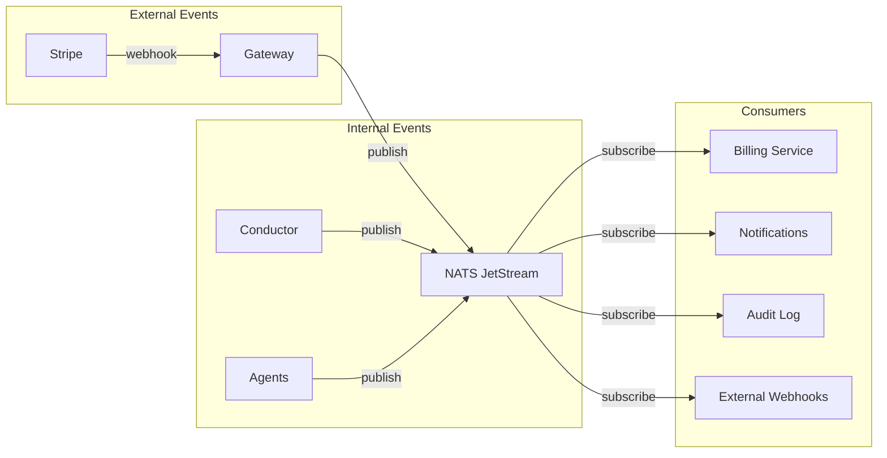

# Webhooks and Events

agent.ceo uses a dual event system: Stripe webhooks for billing events and NATS JetStream for internal platform events. Both systems provide at-least-once delivery guarantees.

## Event Architecture



## Stripe Webhooks

### Endpoint

```
POST /api/v1/billing/webhook
```

!!! warning "No Authentication Header Required"
    The Stripe webhook endpoint uses Stripe's signature verification instead of standard auth. The endpoint validates the `Stripe-Signature` header against the webhook secret.

### Signature Verification

```python
import stripe

def verify_stripe_webhook(payload: bytes, signature: str) -> dict:
    """Verify Stripe webhook signature and return event."""
    return stripe.Webhook.construct_event(
        payload,
        signature,
        endpoint_secret="whsec_..."
    )
```

### Handled Stripe Events

| Stripe Event | Platform Action |
|-------------|----------------|
| `checkout.session.completed` | Activate subscription, provision agents |
| `customer.subscription.created` | Record subscription start |
| `customer.subscription.updated` | Sync tier/agent count |
| `customer.subscription.deleted` | Downgrade to free, stop excess agents |
| `invoice.paid` | Record payment, clear warnings |
| `invoice.payment_failed` | Notify admin, start grace period |
| `customer.updated` | Sync customer metadata |

### Example: Stripe Webhook Payload

```json
{
  "id": "evt_1abc2def3ghi",
  "type": "checkout.session.completed",
  "data": {
    "object": {
      "id": "cs_live_abc123",
      "customer": "cus_abc123",
      "subscription": "sub_abc123",
      "metadata": {
        "org_id": "org_abc123",
        "tier": "standard",
        "agent_count": "5"
      }
    }
  }
}
```

## Internal Event System (NATS)

### Event Types

Platform events are published to NATS subjects for internal consumption.

#### Task Events

| Event Type | Subject | Trigger |
|-----------|---------|---------|
| `task.created` | `genbrain.tasks.{org_id}.created` | New task created |
| `task.assigned` | `genbrain.tasks.{org_id}.assigned` | Task assigned to agent |
| `task.completed` | `genbrain.tasks.{org_id}.completed` | Task marked complete |
| `task.verified` | `genbrain.tasks.{org_id}.verified` | Task verified by manager |
| `task.blocked` | `genbrain.tasks.{org_id}.blocked` | Task reported blocker |

#### Agent Events

| Event Type | Subject | Trigger |
|-----------|---------|---------|
| `agent.started` | `genbrain.agents.{org_id}.lifecycle` | Agent pod started |
| `agent.stopped` | `genbrain.agents.{org_id}.lifecycle` | Agent pod stopped |
| `agent.error` | `genbrain.agents.{org_id}.lifecycle` | Agent encountered error |
| `agent.snapshot` | `genbrain.agents.{org_id}.lifecycle` | Agent state snapshot taken |

#### Billing Events

| Event Type | Subject | Trigger |
|-----------|---------|---------|
| `billing.threshold_reached` | `genbrain.billing.{org_id}.alerts` | Usage at 80% of limit |
| `billing.limit_reached` | `genbrain.billing.{org_id}.alerts` | Usage at 100% |
| `billing.payment_failed` | `genbrain.billing.{org_id}.alerts` | Invoice payment failed |
| `billing.subscription_changed` | `genbrain.billing.{org_id}.changes` | Tier or plan changed |

### Event Envelope Format

All internal events follow a standard envelope:

```json
{
  "id": "evt_20260115_abc123",
  "type": "task.completed",
  "org_id": "org_abc123",
  "timestamp": "2026-01-15T10:30:00Z",
  "source": "conductor",
  "payload": {
    "task_id": "task_xyz789",
    "agent_id": "agent_cto",
    "title": "Implement user search endpoint",
    "completion_evidence": {
      "commit_sha": "a1b2c3d",
      "test_results": "14 passed, 0 failed"
    }
  },
  "metadata": {
    "correlation_id": "req_abc123",
    "retry_count": 0
  }
}
```

### Publishing Events

```python
import nats

async def publish_event(nc: nats.Client, event: dict):
    """Publish an event to NATS JetStream."""
    subject = f"genbrain.tasks.{event['org_id']}.{event['type'].split('.')[1]}"
    js = nc.jetstream()
    ack = await js.publish(
        subject,
        json.dumps(event).encode(),
        headers={"Nats-Msg-Id": event["id"]}  # Deduplication
    )
    return ack
```

### Subscribing to Events

```python
async def subscribe_to_task_events(nc: nats.Client, org_id: str):
    """Subscribe to all task events for an organization."""
    js = nc.jetstream()
    sub = await js.subscribe(
        f"genbrain.tasks.{org_id}.*",
        durable="task-handler-1",
        deliver_policy=nats.api.DeliverPolicy.NEW
    )
    async for msg in sub.messages:
        event = json.loads(msg.data)
        await handle_event(event)
        await msg.ack()
```

## Delivery Guarantees

### JetStream Delivery Semantics

| Guarantee | Mechanism |
|-----------|-----------|
| At-least-once delivery | Acknowledgment required; redelivery on timeout |
| Ordering | Per-subject FIFO within a stream |
| Deduplication | `Nats-Msg-Id` header (2-minute window) |
| Persistence | Messages stored on disk, configurable retention |
| Replay | Consumers can replay from any sequence number |

### Retry Configuration

```json
{
  "max_deliver": 5,
  "ack_wait": "30s",
  "backoff": ["1s", "5s", "30s", "120s", "300s"]
}
```

### Dead Letter Queue

Events that exceed `max_deliver` attempts are routed to a dead letter subject:

```
genbrain.dlq.{original_subject}
```

## External Webhook Delivery (Future)

!!! info "Coming Soon"
    External webhook delivery to customer-configured URLs is planned for Q2 2026.

Planned features:
- Customer-configured HTTPS endpoints
- HMAC-SHA256 signature verification
- Configurable event filtering
- Retry with exponential backoff
- Delivery logs and replay

### Planned Configuration

```json
{
  "url": "https://your-app.com/webhooks/agent-ceo",
  "events": ["task.completed", "agent.started", "billing.threshold_reached"],
  "secret": "whsec_your_signing_secret",
  "active": true
}
```

## Monitoring Events

### Health Check

```bash
# Check NATS stream health
curl https://api.agent.ceo/api/v1/events/health \
  -H "Authorization: Bearer $TOKEN"
```

**Response**:

```json
{
  "status": "healthy",
  "streams": {
    "TASKS": {"messages": 15230, "consumer_count": 4},
    "AGENTS": {"messages": 8412, "consumer_count": 3},
    "BILLING": {"messages": 342, "consumer_count": 2}
  },
  "dlq_depth": 0
}
```

## Best Practices

1. **Idempotency**: Always handle duplicate events gracefully using the event `id`
2. **Ordering**: Do not assume cross-subject ordering; use `correlation_id` to link related events
3. **Acknowledgment**: Ack only after successful processing; use negative ack (`nak`) for retryable failures
4. **Monitoring**: Alert on DLQ depth > 0 and consumer lag > 100 messages
5. **Backpressure**: Use pull-based consumers for high-throughput scenarios

## Related Documentation

- [NATS Protocol](./nats-protocol.md) - Messaging protocol details
- [Billing API](./billing-api.md) - Stripe integration
- [Gateway API](./gateway-api.md) - API endpoints
- [Architecture](./architecture.md) - System overview
