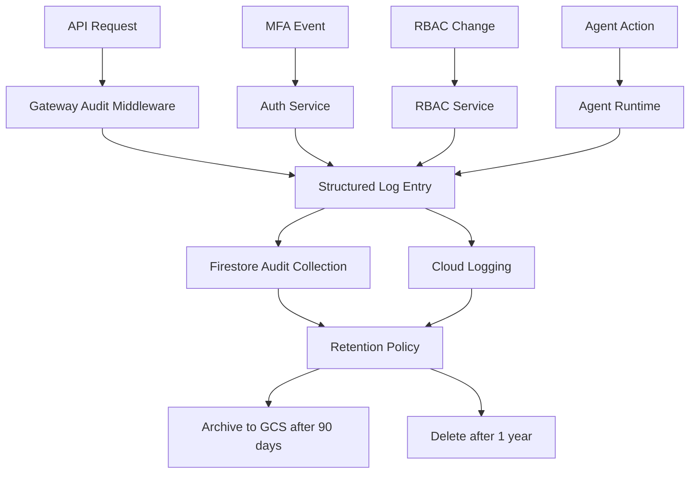
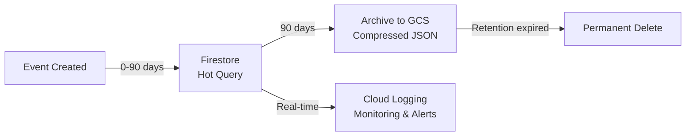

# Audit Logging

agent.ceo maintains comprehensive audit trails for all security-relevant operations. Audit logs are append-only, tamper-resistant, and retained according to data classification policies.

## Audit Architecture



## API Request Logging

The `gateway.audit` module captures every API request with a standardized event schema. This runs as middleware on all FastAPI routes.

### Audit Event Schema

| Field | Type | Description | Example |
|-------|------|-------------|---------|
| `event` | string | Event type identifier | `api.request` |
| `timestamp` | datetime | ISO 8601 with timezone | `2026-05-10T14:32:01.123Z` |
| `request_id` | string | Unique request trace ID | `req_7f3a2b1c` |
| `method` | string | HTTP method | `POST` |
| `path` | string | Request path (no query params) | `/api/v1/tasks` |
| `status` | integer | HTTP response status code | `201` |
| `client_ip` | string | Client IP (from X-Forwarded-For) | `203.0.113.42` |
| `auth_type` | string | Authentication method used | `firebase` or `api_key` |
| `auth_uid` | string | Authenticated user/key ID | `uid_abc123` |
| `org_id` | string | Organization context | `org_def456` |
| `duration_ms` | integer | Request processing time | `127` |
| `user_agent` | string | Client user-agent header | `agent-ceo-sdk/1.2.0` |
| `resource_type` | string | Affected resource type | `task` |
| `resource_id` | string | Affected resource ID | `task_789xyz` |
| `action` | string | CRUD action performed | `create` |

### Implementation

```python
import time
import uuid
from datetime import datetime, timezone
from fastapi import Request, Response
from conductor.src.audit import write_audit_event

async def audit_middleware(request: Request, call_next) -> Response:
    """Capture audit trail for every API request."""
    request_id = str(uuid.uuid4())[:12]
    start_time = time.monotonic()

    # Process request
    response = await call_next(request)

    # Build audit entry
    duration_ms = int((time.monotonic() - start_time) * 1000)

    event = {
        "event": "api.request",
        "timestamp": datetime.now(timezone.utc).isoformat(),
        "request_id": request_id,
        "method": request.method,
        "path": request.url.path,
        "status": response.status_code,
        "client_ip": request.headers.get("X-Forwarded-For", request.client.host),
        "auth_type": getattr(request.state, "auth_type", "none"),
        "auth_uid": getattr(request.state, "auth_uid", None),
        "org_id": getattr(request.state, "org_id", None),
        "duration_ms": duration_ms,
        "user_agent": request.headers.get("User-Agent", ""),
    }

    await write_audit_event(event)
    return response
```

## MFA Audit Events

All MFA lifecycle events are logged with additional context for security monitoring and anomaly detection.

### MFA Event Types

| Event | Trigger | Additional Fields |
|-------|---------|-------------------|
| `mfa_enrolled` | User enables TOTP 2FA | `method: totp`, `device_name` |
| `mfa_verify_success` | Correct TOTP code submitted | `method: totp`, `session_id` |
| `mfa_verify_failed` | Incorrect TOTP code submitted | `method: totp`, `attempt_count` |
| `mfa_revoked` | Admin or user disables MFA | `revoked_by`, `reason` |
| `mfa_backup_used` | Backup code consumed | `backup_code_index` |
| `mfa_backup_regenerated` | New backup codes generated | `previous_codes_invalidated: true` |

### MFA Event Schema

```json
{
  "event": "mfa_verify_failed",
  "timestamp": "2026-05-10T14:32:01.123Z",
  "request_id": "req_7f3a2b1c",
  "auth_uid": "uid_abc123",
  "org_id": "org_def456",
  "client_ip": "203.0.113.42",
  "method": "totp",
  "attempt_count": 3,
  "session_id": "sess_xyz789",
  "user_agent": "Mozilla/5.0..."
}
```

!!!danger "Failed MFA Alert Threshold"
    Three consecutive `mfa_verify_failed` events within 5 minutes trigger an automatic account lockout and alert to the organization admin. The lockout requires admin intervention to resolve.

## RBAC Change Events

All permission changes are logged for compliance and forensic purposes.

| Event | Trigger | Additional Fields |
|-------|---------|-------------------|
| `rbac_grant_created` | New access grant issued | `target_uid`, `level`, `granted_by` |
| `rbac_grant_revoked` | Access grant removed | `target_uid`, `previous_level`, `revoked_by` |
| `rbac_grant_modified` | Permission level changed | `target_uid`, `old_level`, `new_level` |
| `rbac_api_key_created` | New API key generated | `key_prefix`, `level`, `expires_at` |
| `rbac_api_key_revoked` | API key revoked | `key_prefix`, `revoked_by` |

## Agent Activity Events

Agent actions that modify state are logged for observability and debugging.

| Event | Trigger | Additional Fields |
|-------|---------|-------------------|
| `agent_deployed` | New agent pod started | `agent_role`, `template` |
| `agent_frozen` | Agent frozen by admin | `frozen_by`, `reason` |
| `agent_task_completed` | Agent marks task done | `task_id`, `evidence` |
| `agent_message_sent` | Agent sends NATS message | `target_agent`, `subject` |
| `agent_tool_invoked` | Agent calls a tool | `tool_name`, `duration_ms` |

## Firestore Audit Collections

Audit events are stored in Firestore for fast querying and real-time monitoring.

### Collection Structure

```
/orgs/{org_id}/audit_events/{event_id}
/orgs/{org_id}/audit_mfa/{event_id}
/orgs/{org_id}/audit_rbac/{event_id}
/orgs/{org_id}/audit_agents/{event_id}
/platform/audit_admin/{event_id}
```

### Querying Audit Logs

```python
from google.cloud import firestore

db = firestore.AsyncClient()

async def get_recent_audit_events(org_id: str, limit: int = 100):
    """Query recent audit events for an organization."""
    collection = db.collection(f"orgs/{org_id}/audit_events")
    query = collection.order_by(
        "timestamp", direction=firestore.Query.DESCENDING
    ).limit(limit)

    events = []
    async for doc in query.stream():
        events.append(doc.to_dict())
    return events

async def get_failed_mfa_attempts(org_id: str, uid: str, minutes: int = 30):
    """Check for recent failed MFA attempts."""
    from datetime import datetime, timedelta, timezone
    cutoff = datetime.now(timezone.utc) - timedelta(minutes=minutes)

    collection = db.collection(f"orgs/{org_id}/audit_mfa")
    query = (
        collection
        .where("auth_uid", "==", uid)
        .where("event", "==", "mfa_verify_failed")
        .where("timestamp", ">=", cutoff.isoformat())
    )

    count = 0
    async for _ in query.stream():
        count += 1
    return count
```

## API Access to Audit Logs

Organization admins can query audit logs via the API:

```bash
# List recent audit events
curl https://api.agent.ceo/api/v1/audit/events \
  -H "Authorization: Bearer $TOKEN" \
  -H "X-Org-Id: org_abc123" \
  -G -d "limit=50" -d "event_type=api.request"

# Filter by date range
curl https://api.agent.ceo/api/v1/audit/events \
  -H "Authorization: Bearer $TOKEN" \
  -H "X-Org-Id: org_abc123" \
  -G -d "start=2026-05-01T00:00:00Z" -d "end=2026-05-10T23:59:59Z"

# Get MFA events for a specific user
curl https://api.agent.ceo/api/v1/audit/mfa \
  -H "Authorization: Bearer $TOKEN" \
  -H "X-Org-Id: org_abc123" \
  -G -d "uid=uid_target_user"
```

!!!note "Audit Log Access"
    Only users with `admin` permission level can access audit logs. Read and write users cannot view audit data, even their own events.

## Retention Policy

Audit logs follow a tiered retention policy based on data sensitivity and compliance requirements.

| Data Classification | Hot Storage (Firestore) | Warm Storage (GCS) | Total Retention |
|-------------------|----------------------|-------------------|-----------------|
| API request logs | 90 days | 275 days | 1 year |
| MFA events | 90 days | 2+ years | 3 years |
| RBAC changes | 90 days | 2+ years | 3 years |
| Agent activity | 30 days | 60 days | 90 days |
| Platform admin | 90 days | Indefinite | Indefinite |

### Lifecycle Management



- **Hot tier**: Firestore — fast queries, real-time alerts, dashboard views
- **Warm tier**: GCS archive — compressed JSON, queryable via BigQuery
- **Deletion**: Automated via Cloud Scheduler, verified by compliance checks

### Immutability Guarantees

- Audit events are append-only — no update or delete operations are exposed
- Firestore security rules enforce write-once semantics on audit collections
- GCS archive uses Object Lock (retention policy) to prevent deletion
- Any attempt to modify audit data generates its own audit event

## Alerting

Critical audit events trigger real-time alerts:

| Condition | Alert Channel | Response |
|-----------|--------------|----------|
| 3+ failed MFA in 5 min | Org admin email + Slack | Auto-lockout |
| Admin grant to unknown UID | Org admin email | Manual review |
| API key used from new IP | Key owner email | Informational |
| Agent accessing restricted tool | Platform Slack | P2 investigation |
| Bulk data export (>1000 records) | Org admin notification | Informational |

## Related Pages

- [Security Overview](overview.md) — Defense-in-depth architecture
- [RBAC](rbac.md) — Permission changes that generate audit events
- [Compliance](compliance.md) — Retention requirements and certifications
- [Encryption](encryption.md) — How audit data is protected at rest
