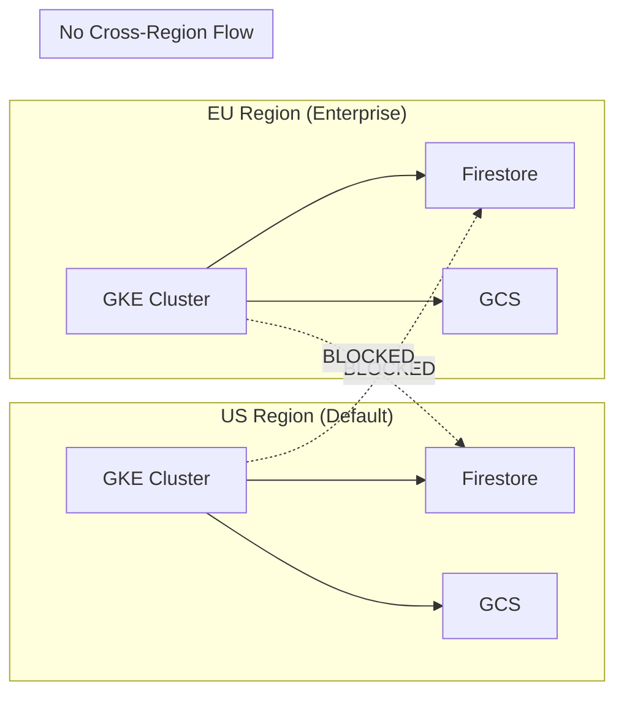
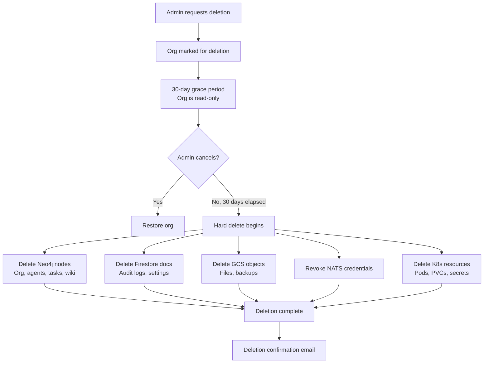

# Compliance and Data Governance

agent.ceo is designed for compliance readiness from the ground up. This page outlines current compliance posture, active certifications roadmap, and data governance policies.

## Compliance Roadmap

```mermaid
gantt
    title Compliance Certification Timeline
    dateFormat YYYY-Q
    axisFormat %Y-Q%q

    section SOC2
    Gap Analysis           :done, 2026-Q1, 2026-Q2
    Policy Documentation   :active, 2026-Q2, 2026-Q3
    Type I Audit           :2026-Q3, 2026-Q4
    Type II Observation    :2027-Q1, 2027-Q2
    Type II Certification  :milestone, 2027-Q2, 0d

    section GDPR
    DPA Template           :done, 2026-Q1, 2026-Q1
    Privacy Policy         :done, 2026-Q1, 2026-Q1
    Data Mapping           :done, 2026-Q2, 2026-Q2
    DPO Appointment        :active, 2026-Q2, 2026-Q3
    Annual Review          :2027-Q1, 2027-Q1

    section ISO 27001
    Scope Definition       :2027-Q1, 2027-Q2
    ISMS Implementation    :2027-Q2, 2027-Q4
    Certification Audit    :2028-Q1, 2028-Q2
```

## SOC2 Readiness

### Trust Service Criteria Coverage

| Criteria | Category | Current Status | Evidence |
|----------|----------|---------------|----------|
| CC1 | Control Environment | Implemented | Org structure, policies documented |
| CC2 | Communication & Information | Implemented | Audit logging, incident procedures |
| CC3 | Risk Assessment | In Progress | Risk register, threat modeling |
| CC4 | Monitoring Activities | Implemented | Prometheus, alerting, audit trails |
| CC5 | Control Activities | Implemented | RBAC, NetworkPolicies, encryption |
| CC6 | Logical & Physical Access | Implemented | Firebase Auth, MFA, K8s RBAC |
| CC7 | System Operations | Implemented | K8s self-healing, health checks |
| CC8 | Change Management | Implemented | Git, PR reviews, CI/CD gates |
| CC9 | Risk Mitigation | In Progress | Vendor assessment, BCP |
| A1 | Availability | Implemented | Multi-zone GKE, auto-scaling |
| C1 | Confidentiality | Implemented | Encryption, access controls |
| PI1 | Processing Integrity | Implemented | Input validation, audit trails |

### Key Controls Mapping

| SOC2 Control | agent.ceo Implementation | Documentation |
|-------------|--------------------------|---------------|
| Access provisioning | RBAC with AccessGrant nodes | [RBAC](rbac.md) |
| Access revocation | Immediate grant deletion | [RBAC](rbac.md) |
| MFA enforcement | TOTP with per-session verification | [Encryption](encryption.md) |
| Encryption at rest | GCP-managed AES-256 | [Encryption](encryption.md) |
| Encryption in transit | TLS 1.3, mTLS | [Network Security](network-security.md) |
| Audit logging | Append-only Firestore collections | [Audit Logging](audit-logging.md) |
| Change management | PR reviews, CI/CD gates | Security review process |
| Incident response | P1-P4 classification, escalation | [Security Overview](overview.md) |
| Vulnerability management | Dependency scanning, CVE alerts | CI/CD pipeline |
| Network segmentation | K8s NetworkPolicies, deny-by-default | [Network Security](network-security.md) |

## GDPR Considerations

### Data Roles

| Role | Entity | Responsibility |
|------|--------|---------------|
| Data Controller | Customer organization | Determines purposes of processing |
| Data Processor | GenBrain AI (agent.ceo) | Processes data on behalf of controller |
| Data Subject | End users of customer's organization | Rights holders |

### Lawful Basis for Processing

| Data Category | Lawful Basis | Purpose |
|--------------|-------------|---------|
| Account data (email, name) | Contract performance | Service delivery |
| Usage data (API logs) | Legitimate interest | Service improvement, security |
| Agent-generated content | Contract performance | Core service functionality |
| Billing data | Contract + legal obligation | Payment processing, tax |
| Audit logs | Legitimate interest + legal | Security, compliance |

### Data Subject Rights

agent.ceo supports all GDPR data subject rights through organizational admin controls and platform APIs:

| Right | Implementation | SLA |
|-------|---------------|-----|
| Right to access | Admin data export API | 72 hours |
| Right to rectification | Admin user management | Immediate |
| Right to erasure | Org deprovisioning + data purge | 30 days |
| Right to restrict processing | Agent freeze + read-only mode | Immediate |
| Right to data portability | JSON export of all org data | 72 hours |
| Right to object | Opt-out of non-essential processing | Immediate |

### Data Processing Agreement (DPA)

Enterprise customers receive a DPA covering:

- Sub-processor list and notification of changes
- Data transfer mechanisms (Standard Contractual Clauses)
- Breach notification within 72 hours
- Data deletion upon contract termination
- Audit rights for the controller

## Data Residency

### GCP Region Deployment

| Environment | Region | Location | Data Types |
|-------------|--------|----------|-----------|
| Production | `us-central1` | Iowa, USA | All production data |
| EU Production | `europe-west1` | Belgium | EU customer data (enterprise) |
| Disaster Recovery | `us-east1` | South Carolina, USA | Replicated backups |
| Development | `us-central1` | Iowa, USA | Test data only |

!!!note "EU Data Residency"
    Enterprise tier organizations can request EU-only data residency. All data (Firestore, GCS, Neo4j, NATS) is stored exclusively in `europe-west1`. No data leaves the EU region.

### Cross-Region Data Flows



## Data Retention Policies

### Retention Schedule

| Data Type | Active Retention | Archive Period | Total Lifetime | Deletion Method |
|-----------|-----------------|---------------|---------------|-----------------|
| Organization data | Until deprovisioned | 30-day grace period | Active + 30 days | Hard delete |
| Agent state | Until agent deleted | None | Agent lifetime | Hard delete |
| Task data | 1 year | 2 years (archive) | 3 years | Hard delete |
| Audit logs (security) | 90 days (hot) | 2+ years | 3 years | Hard delete |
| Audit logs (API) | 90 days (hot) | 275 days | 1 year | Hard delete |
| Wiki content | Until deleted by user | 30 days (soft delete) | Active + 30 days | Hard delete |
| Billing records | 7 years | N/A | 7 years | Hard delete |
| Backup codes | Until used or regenerated | None | Active only | Immediate delete |
| TOTP secrets | Until MFA revoked | None | Active only | Immediate delete |

### Automated Retention Enforcement

```python
# Cloud Scheduler triggers daily retention cleanup
async def enforce_retention_policy():
    """Delete data that has exceeded its retention period."""
    now = datetime.now(timezone.utc)

    # API audit logs: 1 year retention
    api_cutoff = now - timedelta(days=365)
    await delete_audit_events_before(
        collection="audit_events",
        cutoff=api_cutoff
    )

    # Security audit logs: 3 year retention
    security_cutoff = now - timedelta(days=1095)
    await delete_audit_events_before(
        collection="audit_mfa",
        cutoff=security_cutoff
    )
    await delete_audit_events_before(
        collection="audit_rbac",
        cutoff=security_cutoff
    )

    # Deprovisioned orgs: 30 day grace period
    deprovision_cutoff = now - timedelta(days=30)
    await hard_delete_deprovisioned_orgs(cutoff=deprovision_cutoff)
```

## Right to Deletion (Org Deprovisioning)

When an organization is deprovisioned, all associated data is purged through a multi-stage process:



### Deletion Completeness Verification

After deletion, a verification job confirms no residual data remains:

```python
async def verify_org_deletion(org_id: str) -> dict:
    """Verify complete data removal after org deprovisioning."""
    residual = {}

    # Check Neo4j
    neo4j_count = await count_neo4j_nodes(org_id=org_id)
    if neo4j_count > 0:
        residual["neo4j"] = neo4j_count

    # Check Firestore
    firestore_count = await count_firestore_docs(org_id=org_id)
    if firestore_count > 0:
        residual["firestore"] = firestore_count

    # Check GCS
    gcs_objects = await list_gcs_objects(prefix=f"orgs/{org_id}/")
    if gcs_objects:
        residual["gcs"] = len(gcs_objects)

    # Check K8s
    k8s_resources = await list_k8s_resources(label=f"org-id={org_id}")
    if k8s_resources:
        residual["kubernetes"] = len(k8s_resources)

    return {
        "org_id": org_id,
        "deletion_complete": len(residual) == 0,
        "residual_data": residual
    }
```

## Multi-Tenant Isolation Guarantees

| Isolation Layer | Mechanism | Verification |
|----------------|-----------|--------------|
| Data isolation | Org-scoped queries, no cross-org access | Automated test suite |
| Network isolation | K8s NetworkPolicies per namespace | Policy audit |
| Compute isolation | Separate pods per org, resource limits | K8s scheduling |
| Storage isolation | Org-prefixed paths, ACL enforcement | Access audit |
| Message isolation | NATS subject ACLs per org | ACL verification |
| Key isolation | Per-org encryption contexts | Key management audit |

!!!danger "Isolation Breach = P1 Incident"
    Any confirmed or suspected breach of multi-tenant isolation is classified as a P1 security incident with immediate response. All affected organizations are notified within 72 hours per GDPR breach notification requirements.

### Tenant Isolation Testing

Multi-tenant isolation is continuously verified through automated tests:

```python
@pytest.mark.security
async def test_cross_org_data_isolation():
    """Verify that org_A cannot access org_B's data."""
    # Create two isolated organizations
    org_a = await create_test_org("org_a")
    org_b = await create_test_org("org_b")

    # Create data in org_b
    task = await create_task(org_id=org_b.id, title="Secret task")

    # Attempt to access org_b's data with org_a's credentials
    with pytest.raises(ForbiddenError):
        await get_task(task_id=task.id, auth_context=org_a.admin_ctx)

    # Verify NATS subject isolation
    with pytest.raises(NATSPermissionError):
        await publish_message(
            subject=f"org.{org_b.id}.agent.ceo.inbox",
            auth_context=org_a.agent_ctx
        )
```

## Audit Log Retention for Compliance

| Compliance Framework | Required Retention | agent.ceo Policy | Status |
|---------------------|-------------------|------------------|--------|
| SOC2 | 1 year minimum | 1-3 years (by type) | Compliant |
| GDPR | "No longer than necessary" | Tiered by classification | Compliant |
| PCI DSS (future) | 1 year + 3 months available | N/A (not handling cards) | N/A |
| HIPAA (future) | 6 years | N/A (no PHI) | N/A |

## Encryption Certifications

| Requirement | Implementation | Certification |
|-------------|---------------|---------------|
| Encryption at rest | GCP-managed AES-256 | GCP SOC2/ISO 27001 |
| Encryption in transit | TLS 1.3 | GCP certificate management |
| Key management | GCP Secret Manager + KMS | FIPS 140-2 Level 3 (KMS HSM) |
| Data destruction | Cryptographic erasure | GCP media destruction policy |

## Vendor and Sub-Processor Management

| Sub-Processor | Purpose | Data Accessed | DPA Status |
|---------------|---------|---------------|------------|
| Google Cloud Platform | Infrastructure | All data | Active |
| Anthropic | AI model inference | Agent prompts/responses | Active |
| Firebase (Google) | Authentication | User identity data | Active (GCP DPA) |
| Stripe | Billing | Payment metadata | Active |

!!!note "Sub-Processor Changes"
    Enterprise customers are notified 30 days in advance of any new sub-processor addition, with the right to object per the DPA.

## Future Compliance Initiatives

| Initiative | Target Date | Description |
|-----------|------------|-------------|
| SOC2 Type II | Q2 2027 | Full certification with 6-month observation |
| ISO 27001 | Q2 2028 | Information security management system |
| HIPAA readiness | Q4 2028 | For healthcare customers (if demand) |
| FedRAMP (Li-SaaS) | 2029 | For US government customers |
| Penetration testing | Quarterly | Third-party penetration tests |
| Bug bounty program | Q3 2026 | Responsible disclosure program |

## Contact

For compliance inquiries, DPA requests, or data subject rights:

- **Security team**: security@agent.ceo
- **DPO**: dpo@genbrain.ai
- **Compliance**: compliance@genbrain.ai

## Related Pages

- [Security Overview](overview.md) — Defense-in-depth architecture
- [Audit Logging](audit-logging.md) — Audit trail implementation and retention
- [Encryption](encryption.md) — Encryption at rest and in transit
- [Network Security](network-security.md) — Isolation and segmentation controls
- [RBAC](rbac.md) — Access control and multi-tenant boundaries
