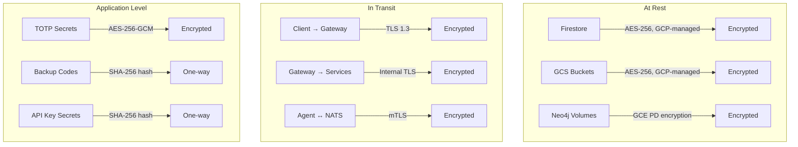
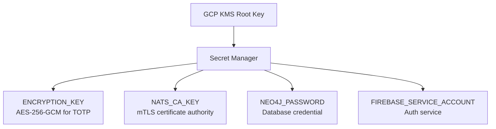

# Data Encryption

agent.ceo encrypts data at every stage of its lifecycle — at rest in storage, in transit between components, and at the application level for sensitive fields. No plaintext secrets are ever stored in Neo4j or application databases.

## Encryption Overview



## Encryption at Rest

### GCP-Managed Encryption

All data stored in GCP services is automatically encrypted at rest using Google-managed encryption keys. This provides AES-256 encryption without application-level key management overhead.

| Storage Service | Encryption Standard | Key Management | Rotation |
|----------------|--------------------|--------------------|----------|
| Firestore | AES-256 | GCP-managed (CMEK optional) | Automatic |
| Cloud Storage (GCS) | AES-256 | GCP-managed (CMEK optional) | Automatic |
| GCE Persistent Disks | AES-256 | GCP-managed | Automatic |
| Cloud SQL (if used) | AES-256 | GCP-managed (CMEK optional) | Automatic |

!!!note "CMEK Upgrade Path"
    Customer-Managed Encryption Keys (CMEK) are available for enterprise tier organizations that require control over their encryption keys via Cloud KMS. Contact support to enable.

### Neo4j Data Storage

Neo4j runs on GKE with encrypted persistent volumes. The underlying GCE persistent disks provide transparent encryption:

```yaml
# PersistentVolumeClaim for Neo4j
apiVersion: v1
kind: PersistentVolumeClaim
metadata:
  name: neo4j-data
  namespace: agents
spec:
  accessModes:
    - ReadWriteOnce
  resources:
    requests:
      storage: 50Gi
  storageClassName: premium-rwo  # Uses encrypted PDs by default
```

!!!danger "No Secrets in Neo4j"
    Neo4j is used for graph data (organizations, agents, tasks, wiki, access grants). Cryptographic secrets (API keys, TOTP secrets, credentials) are NEVER stored in Neo4j. They reside only in Firestore (hashed) or GCP Secret Manager (encrypted).

## Encryption in Transit

### External Connections (TLS 1.3)

All external-facing endpoints enforce TLS 1.3 with modern cipher suites. HTTP connections are rejected (not redirected) to prevent accidental plaintext transmission.

| Endpoint | Protocol | Certificate | Min TLS Version |
|----------|----------|-------------|-----------------|
| `api.agent.ceo` | HTTPS | GCP-managed cert | TLS 1.3 |
| `app.agent.ceo` | HTTPS | GCP-managed cert | TLS 1.3 |
| `nats.agent.ceo` | TLS | GCP-managed cert | TLS 1.3 |

### TLS Configuration

```yaml
# GKE Ingress TLS configuration
apiVersion: networking.k8s.io/v1
kind: Ingress
metadata:
  name: api-ingress
  annotations:
    networking.gke.io/managed-certificates: api-cert
    kubernetes.io/ingress.class: gce
    # Enforce HTTPS only
    kubernetes.io/ingress.allow-http: "false"
spec:
  rules:
    - host: api.agent.ceo
      http:
        paths:
          - path: /*
            pathType: ImplementationSpecific
            backend:
              service:
                name: gateway
                port:
                  number: 8080
  tls:
    - hosts:
        - api.agent.ceo
```

### Internal Service Communication

Internal services communicate over cluster-internal networks with TLS:

| Communication Path | Encryption | Authentication |
|-------------------|-----------|----------------|
| Gateway → NATS | mTLS | Client certificate |
| Agent → NATS | mTLS | Per-agent credentials |
| Gateway → Neo4j | TLS | Username + password |
| Gateway → Firestore | TLS | Service account |
| Agent → Agent (via NATS) | mTLS (end-to-end) | NATS user ACL |

### NATS mTLS Configuration

```yaml
# NATS server TLS configuration (nats.conf)
tls {
  cert_file: "/etc/nats/certs/tls.crt"
  key_file: "/etc/nats/certs/tls.key"
  ca_file: "/etc/nats/certs/ca.crt"
  verify: true           # Require client certificates
  timeout: 5             # TLS handshake timeout (seconds)
  cipher_suites: [
    "TLS_AES_256_GCM_SHA384",
    "TLS_CHACHA20_POLY1305_SHA256",
    "TLS_AES_128_GCM_SHA256"
  ]
  curve_preferences: [
    "X25519",
    "CurveP384"
  ]
}
```

## Application-Level Encryption

Certain sensitive fields require application-level encryption beyond infrastructure-level protections. These are encrypted/hashed by the application before storage.

### TOTP Secret Encryption (AES-256-GCM)

TOTP secrets for MFA enrollment are encrypted with AES-256-GCM using a key stored in GCP Secret Manager.

```python
import os
from cryptography.hazmat.primitives.ciphers.aead import AESGCM

# ENCRYPTION_KEY loaded from GCP Secret Manager at startup
ENCRYPTION_KEY = os.environ["ENCRYPTION_KEY"]  # 32 bytes, base64-encoded

def encrypt_totp_secret(plaintext_secret: str) -> bytes:
    """Encrypt a TOTP secret before storing in Firestore."""
    key = base64.b64decode(ENCRYPTION_KEY)
    aesgcm = AESGCM(key)
    nonce = os.urandom(12)  # 96-bit nonce, unique per encryption
    ciphertext = aesgcm.encrypt(
        nonce,
        plaintext_secret.encode("utf-8"),
        None  # No additional authenticated data
    )
    # Store nonce + ciphertext together
    return nonce + ciphertext

def decrypt_totp_secret(encrypted_data: bytes) -> str:
    """Decrypt a TOTP secret for verification."""
    key = base64.b64decode(ENCRYPTION_KEY)
    aesgcm = AESGCM(key)
    nonce = encrypted_data[:12]
    ciphertext = encrypted_data[12:]
    plaintext = aesgcm.decrypt(nonce, ciphertext, None)
    return plaintext.decode("utf-8")
```

### Key Properties

| Property | Value | Rationale |
|----------|-------|-----------|
| Algorithm | AES-256-GCM | Authenticated encryption (confidentiality + integrity) |
| Key size | 256 bits | Maximum AES key length |
| Nonce size | 96 bits | GCM standard, unique per operation |
| Key storage | GCP Secret Manager | Hardware-backed, audited access |
| Key rotation | Manual (quarterly) | Requires re-encryption of active secrets |

### Backup Code Hashing

Backup codes are one-way hashed before storage. They can be verified but never retrieved.

```python
import hashlib
import secrets

def generate_backup_codes(count: int = 10) -> tuple[list[str], list[str]]:
    """Generate backup codes and their hashes.
    
    Returns:
        (plaintext_codes, hashed_codes)
        - plaintext_codes: shown to user once, never stored
        - hashed_codes: stored in Firestore
    """
    plaintext_codes = []
    hashed_codes = []

    for _ in range(count):
        # 8-character alphanumeric codes
        code = secrets.token_hex(4).upper()  # e.g., "A3F7B2C1"
        plaintext_codes.append(code)
        hashed_codes.append(hash_backup_code(code))

    return plaintext_codes, hashed_codes

def hash_backup_code(code: str) -> str:
    """SHA-256 hash a backup code for storage."""
    return hashlib.sha256(code.encode("utf-8")).hexdigest()

def verify_backup_code(submitted_code: str, stored_hashes: list[str]) -> int | None:
    """Verify a backup code against stored hashes.
    
    Returns the index of the matched code, or None if no match.
    """
    submitted_hash = hash_backup_code(submitted_code.strip().upper())
    for i, stored_hash in enumerate(stored_hashes):
        if secrets.compare_digest(submitted_hash, stored_hash):
            return i
    return None
```

!!!warning "One-Time Use"
    Each backup code can only be used once. After successful verification, the corresponding hash is removed from storage and an `mfa_backup_used` audit event is logged.

### API Key Hashing

API keys are hashed similarly to backup codes. The full key is shown to the user exactly once at creation time.

```python
import secrets
import hashlib

def create_api_key(org_id: str, level: int) -> tuple[str, str]:
    """Generate a new API key.
    
    Returns:
        (full_key, key_hash)
        - full_key: "aceo_" + 40 hex chars, shown once to user
        - key_hash: SHA-256 hash, stored for lookup
    """
    raw = secrets.token_hex(20)
    full_key = f"aceo_{raw}"
    key_hash = hashlib.sha256(full_key.encode("utf-8")).hexdigest()
    # Store: key_hash, key_prefix (first 8 chars), org_id, level
    return full_key, key_hash
```

## Key Management

### Key Hierarchy



### Key Rotation Policy

| Key | Rotation Frequency | Procedure | Downtime |
|-----|-------------------|-----------|----------|
| ENCRYPTION_KEY | Quarterly | Re-encrypt active TOTP secrets | Zero (dual-read) |
| NATS TLS certs | Annual | Rotate via cert-manager | Zero (graceful) |
| GCP-managed keys | Automatic | Transparent by GCP | Zero |
| API keys | User-initiated | Revoke old, issue new | Momentary |
| Neo4j password | Quarterly | Secret Manager update + restart | ~30s |

### ENCRYPTION_KEY Rotation Procedure

```python
async def rotate_encryption_key(old_key: str, new_key: str):
    """Rotate the TOTP encryption key with zero downtime.
    
    Strategy: dual-read during migration window.
    1. Deploy with both old and new keys
    2. Re-encrypt all active TOTP secrets with new key
    3. Remove old key from configuration
    """
    active_mfa_users = await get_all_mfa_enrolled_users()

    for user in active_mfa_users:
        # Decrypt with old key
        plaintext = decrypt_totp_secret(user.encrypted_totp, key=old_key)
        # Re-encrypt with new key
        new_ciphertext = encrypt_totp_secret(plaintext, key=new_key)
        # Atomic update
        await update_user_totp_secret(user.uid, new_ciphertext)

    # After all users migrated, remove old key from Secret Manager
    await disable_secret_version(old_key_version)
```

## Data Classification

| Classification | Examples | Encryption Level | Storage |
|---------------|----------|-----------------|---------|
| Critical | TOTP secrets, encryption keys | AES-256-GCM + Secret Manager | Secret Manager / Firestore (encrypted field) |
| Sensitive | User emails, org names | GCP-managed at rest + TLS | Firestore |
| Internal | Task content, wiki pages | GCP-managed at rest + TLS | Neo4j / Firestore |
| Public | Documentation, pricing | TLS in transit | GCS / CDN |

## Security Controls Summary

| Control | Implementation | Verified By |
|---------|---------------|-------------|
| No plaintext secrets in code | Pre-commit secret scanner | CI/CD pipeline |
| No secrets in Neo4j | Code review policy | Security review |
| Encryption key in Secret Manager | Infrastructure as Code | DevOps audit |
| TLS 1.3 minimum | Ingress configuration | SSL Labs scan |
| mTLS for NATS | NATS server config | Connection test |
| Backup codes hashed | Unit tests | CI/CD pipeline |
| TOTP secrets encrypted | Integration tests | CI/CD pipeline |
| Constant-time comparison | `secrets.compare_digest` | Code review |

## Related Pages

- [Security Overview](overview.md) — Defense-in-depth architecture
- [Network Security](network-security.md) — TLS termination and mTLS details
- [Audit Logging](audit-logging.md) — Key access and rotation events
- [Compliance](compliance.md) — Encryption certification requirements
