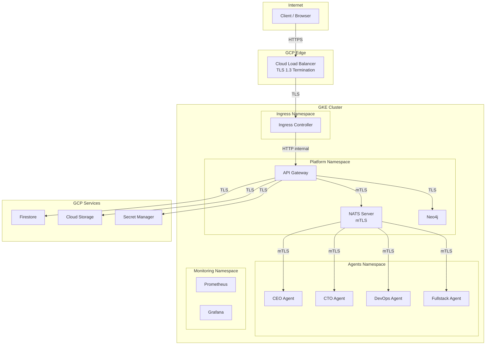
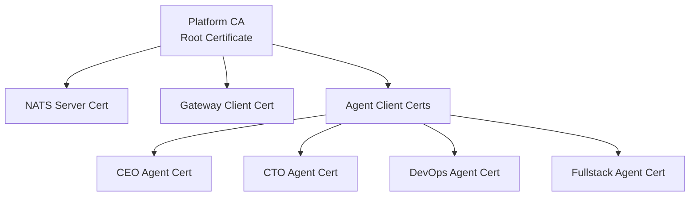
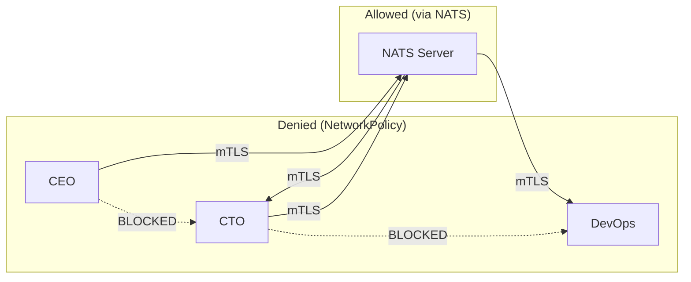

# Network Security

agent.ceo deploys on Google Kubernetes Engine (GKE) with a deny-by-default network posture. All traffic — ingress, egress, and east-west — is explicitly controlled through Kubernetes NetworkPolicies, service mesh rules, and NATS ACLs.

## Network Architecture



## Kubernetes NetworkPolicies

### Default Deny Policy

All namespaces start with a deny-all policy. Traffic is only permitted through explicit allow rules.

```yaml
# Default deny all ingress and egress in agents namespace
apiVersion: networking.k8s.io/v1
kind: NetworkPolicy
metadata:
  name: default-deny-all
  namespace: agents
spec:
  podSelector: {}  # Applies to all pods
  policyTypes:
    - Ingress
    - Egress
```

### Agent Pod Policies

Agent pods can only communicate with NATS and specific platform services. They cannot reach the internet, other namespaces, or each other directly.

```yaml
# Allow agent pods to connect to NATS only
apiVersion: networking.k8s.io/v1
kind: NetworkPolicy
metadata:
  name: agent-to-nats
  namespace: agents
spec:
  podSelector:
    matchLabels:
      app.kubernetes.io/component: agent
  policyTypes:
    - Egress
  egress:
    # Allow connection to NATS server
    - to:
        - namespaceSelector:
            matchLabels:
              name: platform
          podSelector:
            matchLabels:
              app: nats
      ports:
        - protocol: TCP
          port: 4222
    # Allow DNS resolution
    - to:
        - namespaceSelector:
            matchLabels:
              name: kube-system
          podSelector:
            matchLabels:
              k8s-app: kube-dns
      ports:
        - protocol: UDP
          port: 53
        - protocol: TCP
          port: 53
```

!!!danger "No Internet Access for Agents"
    Agent pods have NO direct internet access. All external communication (API calls, web fetches) must route through the platform's egress proxy, which enforces URL allowlisting and blocks private IP ranges.

### Policy Summary Table

| Source | Destination | Port | Protocol | Policy |
|--------|-------------|------|----------|--------|
| Agent pods | NATS server | 4222 | TCP/mTLS | Allow |
| Agent pods | kube-dns | 53 | UDP/TCP | Allow |
| Agent pods | Internet | * | * | **Deny** |
| Agent pods | Agent pods | * | * | **Deny** |
| Agent pods | Neo4j | * | * | **Deny** |
| Gateway | NATS | 4222 | TCP/mTLS | Allow |
| Gateway | Neo4j | 7687 | TCP/TLS | Allow |
| Gateway | Firestore | 443 | TCP/TLS | Allow |
| Gateway | Secret Manager | 443 | TCP/TLS | Allow |
| Ingress | Gateway | 8080 | TCP/HTTP | Allow |
| Prometheus | All pods | 9090 | TCP/HTTP | Allow (metrics only) |
| External | Ingress | 443 | TCP/TLS | Allow |
| External | Any other | * | * | **Deny** |

## NATS mTLS

All NATS connections require mutual TLS authentication. Each component presents a client certificate signed by the platform CA.

### Certificate Hierarchy



### Certificate Provisioning

Certificates are provisioned automatically during agent deployment using cert-manager:

```yaml
# Certificate for an agent pod
apiVersion: cert-manager.io/v1
kind: Certificate
metadata:
  name: agent-cto-tls
  namespace: agents
spec:
  secretName: agent-cto-tls
  issuerRef:
    name: platform-ca-issuer
    kind: ClusterIssuer
  commonName: "cto.agents.agent.ceo"
  dnsNames:
    - "cto.agents.svc.cluster.local"
  duration: 720h    # 30 days
  renewBefore: 168h # Renew 7 days before expiry
  privateKey:
    algorithm: ECDSA
    size: 256
```

### NATS Connection Configuration

```python
import nats

async def connect_nats(agent_id: str, org_id: str) -> nats.Client:
    """Establish authenticated NATS connection with mTLS."""
    nc = await nats.connect(
        servers=["nats://nats.platform.svc.cluster.local:4222"],
        tls=nats.TLSConfig(
            cert_file=f"/etc/nats/certs/{agent_id}/tls.crt",
            key_file=f"/etc/nats/certs/{agent_id}/tls.key",
            ca_file="/etc/nats/certs/ca.crt",
        ),
        user=agent_id,
        password=get_nats_credential(agent_id),
        name=f"{org_id}.{agent_id}",
        max_reconnect_attempts=10,
        reconnect_time_wait=2,
    )
    return nc
```

## Ingress TLS Termination

External TLS is terminated at the GCP Cloud Load Balancer with Google-managed certificates. This provides:

- Automatic certificate provisioning and renewal
- TLS 1.3 with modern cipher suites
- DDoS protection at the edge
- SSL/TLS offloading (internal traffic uses separate TLS)

### Ingress Configuration

```yaml
apiVersion: networking.k8s.io/v1
kind: Ingress
metadata:
  name: platform-ingress
  namespace: platform
  annotations:
    networking.gke.io/managed-certificates: platform-cert
    kubernetes.io/ingress.class: gce
    kubernetes.io/ingress.allow-http: "false"
    # Security headers
    nginx.ingress.kubernetes.io/configuration-snippet: |
      more_set_headers "Strict-Transport-Security: max-age=31536000; includeSubDomains";
      more_set_headers "X-Content-Type-Options: nosniff";
      more_set_headers "X-Frame-Options: DENY";
      more_set_headers "X-XSS-Protection: 1; mode=block";
      more_set_headers "Content-Security-Policy: default-src 'self'";
spec:
  tls:
    - hosts:
        - api.agent.ceo
        - app.agent.ceo
  rules:
    - host: api.agent.ceo
      http:
        paths:
          - path: /api/v1/*
            pathType: ImplementationSpecific
            backend:
              service:
                name: gateway
                port:
                  number: 8080
    - host: app.agent.ceo
      http:
        paths:
          - path: /*
            pathType: ImplementationSpecific
            backend:
              service:
                name: webapp
                port:
                  number: 3000
```

## Pod-to-Pod Communication Restrictions

### Agent Isolation

Agent pods are isolated from each other at the network level. They cannot establish direct TCP connections — all inter-agent communication flows through NATS.



This ensures:

- All agent communication is authenticated and logged
- Subject-based ACLs are enforced on every message
- No agent can bypass NATS to directly access another agent's data
- Network-level containment if an agent process is compromised

### Platform Service Isolation

Platform services (Gateway, NATS, Neo4j) are in a separate namespace with their own NetworkPolicies:

| Service | Accepts From | Rejects From |
|---------|-------------|-------------|
| NATS | Gateway, Agent pods | Internet, Monitoring |
| Neo4j | Gateway only | Agent pods, Internet |
| Gateway | Ingress controller | Agent pods, Direct internet |
| Firestore | Gateway (via GCP VPC) | All cluster pods |

## Egress Filtering

### SSRF Protection

The egress proxy validates all outbound URLs against an allowlist and rejects requests to private IP ranges:

```python
import ipaddress
import re
from urllib.parse import urlparse

# Allowed URL patterns for agent egress
EGRESS_ALLOWLIST = [
    re.compile(r"^https://api\.github\.com/"),
    re.compile(r"^https://.*\.googleapis\.com/"),
    re.compile(r"^https://registry\.npmjs\.org/"),
    re.compile(r"^https://pypi\.org/"),
]

# Private IP ranges that are always blocked
PRIVATE_RANGES = [
    ipaddress.ip_network("10.0.0.0/8"),
    ipaddress.ip_network("172.16.0.0/12"),
    ipaddress.ip_network("192.168.0.0/16"),
    ipaddress.ip_network("169.254.0.0/16"),  # Link-local
    ipaddress.ip_network("127.0.0.0/8"),     # Loopback
    ipaddress.ip_network("100.64.0.0/10"),   # Shared address space
]

def validate_egress_url(url: str) -> bool:
    """Validate URL against allowlist and reject private IPs."""
    parsed = urlparse(url)

    # Must be HTTPS
    if parsed.scheme != "https":
        return False

    # Resolve hostname and check for private IPs
    try:
        resolved_ip = ipaddress.ip_address(socket.gethostbyname(parsed.hostname))
        for private_range in PRIVATE_RANGES:
            if resolved_ip in private_range:
                return False
    except (socket.gaierror, ValueError):
        return False

    # Check against allowlist
    for pattern in EGRESS_ALLOWLIST:
        if pattern.match(url):
            return True

    return False
```

!!!warning "DNS Rebinding Protection"
    The SSRF protection resolves hostnames at validation time AND at connection time to prevent DNS rebinding attacks where a hostname initially resolves to a public IP but is re-resolved to a private IP during the actual connection.

### Egress Policy Enforcement Layers

| Layer | Control | Bypass Possible |
|-------|---------|-----------------|
| NetworkPolicy | Block all egress except NATS + DNS | No (kernel-level) |
| Egress Proxy | URL allowlist + IP validation | No (only egress path) |
| Application | `validate_egress_url()` before requests | Defense in depth |

## Monitoring and Alerting

Network security events are monitored and alerted:

| Event | Detection | Alert |
|-------|-----------|-------|
| Blocked egress attempt | NetworkPolicy deny log | Info (high volume = P3) |
| SSRF attempt detected | Egress proxy log | P2 alert |
| mTLS handshake failure | NATS server log | P3 alert |
| Certificate near expiry | cert-manager metric | P3 alert (7 days) |
| Unusual traffic volume | Prometheus metric | P3 alert |
| Cross-namespace traffic | NetworkPolicy deny log | P2 alert |

## Security Hardening Checklist

- [x] Default deny NetworkPolicies in all namespaces
- [x] mTLS for all NATS connections
- [x] TLS 1.3 minimum on external endpoints
- [x] No direct internet access from agent pods
- [x] SSRF protection with private IP rejection
- [x] DNS rebinding protection
- [x] Agent-to-agent direct communication blocked
- [x] Security headers on all HTTP responses
- [x] Certificate auto-rotation via cert-manager
- [x] Network policy audit logging enabled

## Related Pages

- [Security Overview](overview.md) — Defense-in-depth architecture
- [Encryption](encryption.md) — TLS and mTLS certificate details
- [RBAC](rbac.md) — NATS subject ACL enforcement
- [Compliance](compliance.md) — Network isolation guarantees
