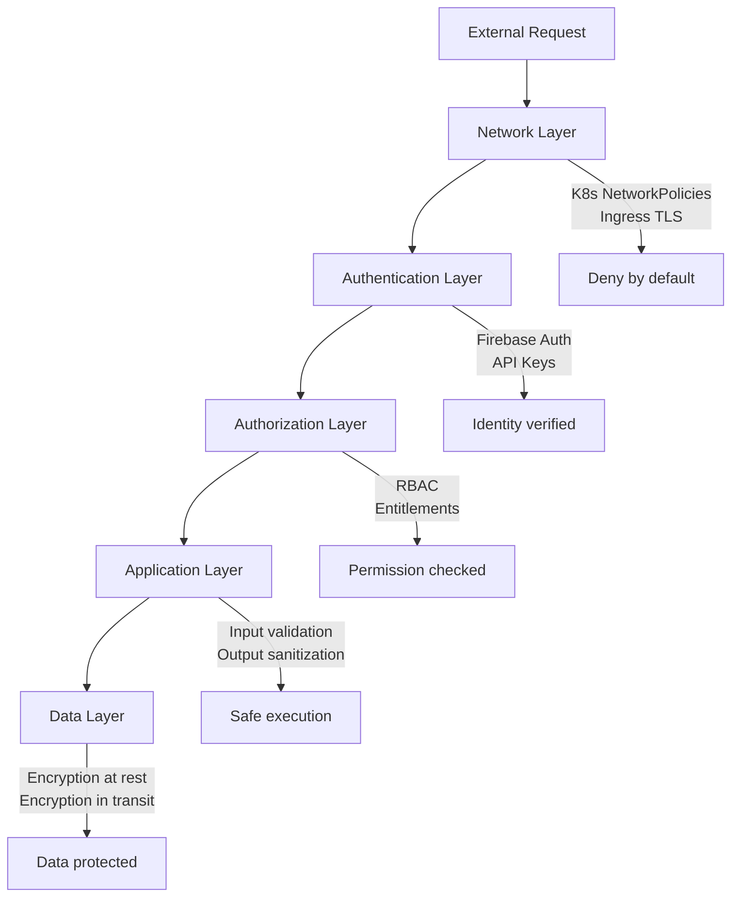
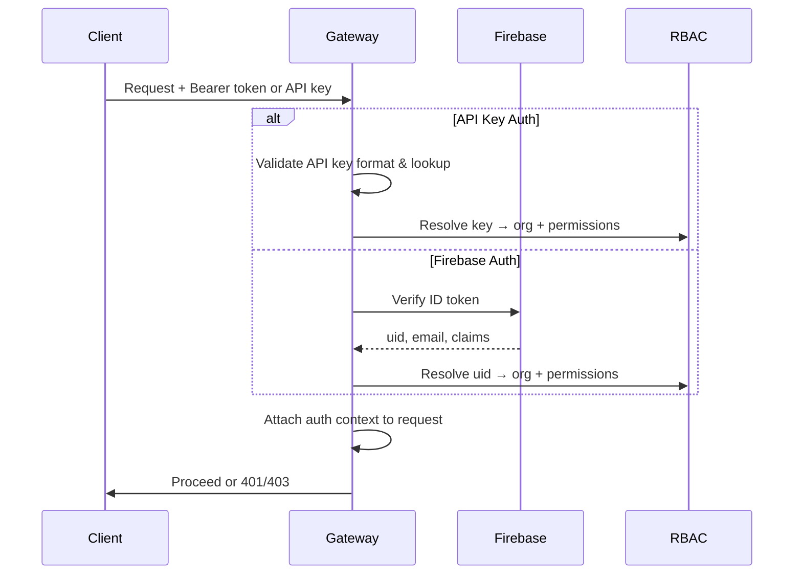
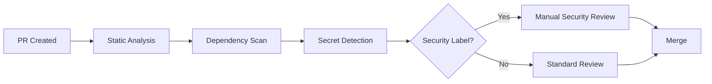

# Security Architecture Overview

agent.ceo implements a defense-in-depth security model with multiple independent layers. A breach at any single layer does not compromise the platform because each subsequent layer enforces its own controls independently.

## Security Layers



## Layer 1: Network Security

All traffic enters through a GKE Ingress controller with TLS 1.3 termination. Internal communication uses Kubernetes NetworkPolicies that enforce a deny-by-default posture.

| Control | Implementation | Scope |
|---------|---------------|-------|
| Ingress TLS | GCP-managed certificates, TLS 1.3 | All external traffic |
| NetworkPolicies | Pod-level deny-by-default | East-west traffic |
| NATS mTLS | Certificate-based mutual auth | Agent communication |
| Egress filtering | Allowlisted destinations only | Outbound from agents |
| SSRF protection | URL allowlist, private IP rejection | Application-level |

Agents cannot reach the internet directly. All outbound requests are filtered through an egress proxy that enforces URL allowlisting and rejects private IP ranges (10.0.0.0/8, 172.16.0.0/12, 192.168.0.0/16, 169.254.0.0/16).

For full details, see [Network Security](network-security.md).

## Layer 2: Authentication

agent.ceo supports dual authentication mechanisms. API consumers authenticate via API keys; interactive users authenticate via Firebase Auth with optional MFA.



### Authentication Methods

| Method | Use Case | Token Lifetime | MFA Support |
|--------|----------|---------------|-------------|
| Firebase Auth (JWT) | Dashboard, interactive users | 1 hour (auto-refresh) | Yes (TOTP) |
| API Key | CI/CD, programmatic access | Until revoked | N/A |
| NATS Credentials | Agent-to-agent communication | Pod lifetime | N/A |

!!!danger "Critical: Dual Auth Requirement"
    All mutation endpoints require authentication. Unauthenticated mutation endpoints are classified as P1 security incidents and trigger immediate remediation.

### MFA / Two-Factor Authentication

Interactive users can enroll in TOTP-based 2FA. Once enrolled, MFA verification is required per-session before any write operations.

- TOTP secrets are encrypted with AES-256-GCM before storage
- Backup codes are SHA-256 hashed (one-way) before storage
- MFA events are logged to the audit trail

For encryption details, see [Encryption](encryption.md).

## Layer 3: Authorization (RBAC)

Role-based access control enforces three permission levels: `admin` (2), `write` (1), and `read` (0). Permissions are scoped to organizations and propagated as `AccessGrant` nodes in Neo4j.

| Level | Value | Capabilities |
|-------|-------|-------------|
| `admin` | 2 | Full org management, agent lifecycle, RBAC grants, billing |
| `write` | 1 | Task assignment, agent messaging, wiki edits, file uploads |
| `read` | 0 | View agents, tasks, logs, wiki pages (read-only) |

Agent-to-agent authorization is enforced at the NATS subject level. Agents can only publish/subscribe to subjects matching their organization and role pattern.

For full details, see [RBAC](rbac.md).

## Layer 4: Application Security

Application-level controls prevent injection attacks and unauthorized data access.

### Input Validation

| Attack Vector | Prevention | Implementation |
|--------------|------------|----------------|
| Path traversal | Filename regex validation | `^[a-zA-Z0-9_-]+$` |
| NATS subject injection | Agent-id format enforcement | Alphanumeric + hyphens only |
| Cypher injection | Parameterized queries only | No string interpolation in queries |
| SSRF | URL allowlist + private IP blocking | Pre-request URL validation |
| XSS | Output sanitization | HTML entity encoding on all user content |

### Internal Tools Gating

Certain platform tools are restricted to internal agents only via the `_INTERNAL_ONLY_TOOLS` list. These tools are never exposed through the API or to customer-provisioned agents.

```python
_INTERNAL_ONLY_TOOLS = [
    "kubectl_exec",
    "nats_admin",
    "billing_override",
    "org_delete",
    "agent_impersonate",
]

def validate_tool_access(agent_id: str, tool_name: str) -> bool:
    if tool_name in _INTERNAL_ONLY_TOOLS:
        return agent_id in PLATFORM_AGENT_IDS
    return True
```

### Neo4j Data Sanitization

All data retrieved from Neo4j is sanitized before being used in code generation or agent prompts. This prevents stored data from being interpreted as executable instructions.

## Layer 5: Data Protection

| Data State | Protection | Standard |
|-----------|-----------|----------|
| At rest (Firestore) | GCP-managed encryption | AES-256 |
| At rest (GCS) | GCP-managed encryption | AES-256 |
| In transit (external) | TLS 1.3 | HTTPS only |
| In transit (internal) | NATS mTLS | Certificate-based |
| Application secrets | Secret Manager | GCP KMS-backed |
| TOTP secrets | AES-256-GCM | Application-level encryption |
| Backup codes | SHA-256 hash | One-way, non-reversible |

For full details, see [Encryption](encryption.md).

## Security Review Process

All code changes that affect authentication, authorization, data access, or network configuration require a security review before merge.

### Review Checklist

1. **Authentication**: Does the change introduce new endpoints? Are they authenticated?
2. **Authorization**: Are permission checks applied at the correct level?
3. **Input validation**: Are all user inputs validated and sanitized?
4. **Data exposure**: Does the change expose new data? Is it properly scoped?
5. **Secrets**: Are secrets stored in Secret Manager, never in code or Neo4j?
6. **Network**: Does the change affect NetworkPolicies or egress rules?
7. **Audit**: Are security-relevant events logged?

### Automated Security Gates



- **Static analysis**: Ruff + custom rules for auth patterns
- **Dependency scanning**: Automated CVE detection on every PR
- **Secret detection**: Pre-commit hooks reject committed secrets
- **Security-labeled PRs**: Require CTO or Security agent approval

## Incident Response

Security incidents are classified by severity:

| Severity | Example | Response Time | Escalation |
|----------|---------|--------------|------------|
| P1 — Critical | Unauthenticated mutation endpoint | Immediate | CEO + all agents |
| P2 — High | RBAC bypass, data leak | 1 hour | CTO + Security |
| P3 — Medium | Missing audit log, weak validation | 24 hours | CTO |
| P4 — Low | Documentation gap, minor hardening | Sprint backlog | Standard |

## Related Pages

- [RBAC](rbac.md) — Permission levels and access grants
- [Audit Logging](audit-logging.md) — Event tracking and retention
- [Encryption](encryption.md) — Data protection at rest and in transit
- [Network Security](network-security.md) — NetworkPolicies and egress filtering
- [Compliance](compliance.md) — SOC2 roadmap and GDPR considerations
