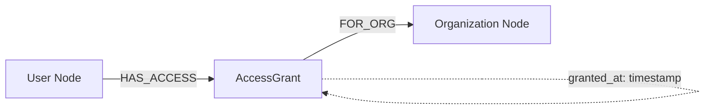
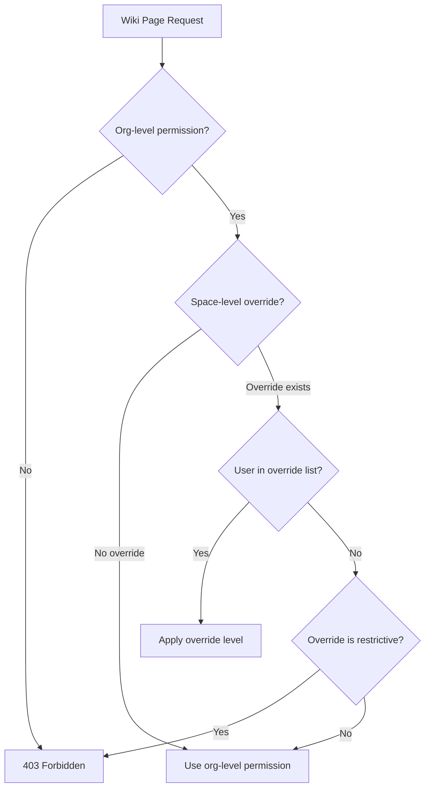

# Role-Based Access Control (RBAC)

agent.ceo enforces role-based access control at every layer — API gateway, NATS messaging, Neo4j wiki, and file operations. Permissions are org-scoped, meaning a user's access in one organization never leaks to another.

## Permission Levels

Three numeric permission levels determine what actions a principal (user or agent) can perform:

| Level | Name | Value | Description |
|-------|------|-------|-------------|
| Admin | `admin` | 2 | Full organizational control — manage users, agents, billing, RBAC |
| Write | `write` | 1 | Create and modify resources — tasks, agents, wiki pages, files |
| Read | `read` | 0 | View-only access — observe agents, read tasks, browse wiki |

Permission checks use numeric comparison: a principal with level `N` can perform any action requiring level `<= N`.

```python
from enum import IntEnum

class PermissionLevel(IntEnum):
    READ = 0
    WRITE = 1
    ADMIN = 2

def check_permission(user_level: int, required_level: int) -> bool:
    """Returns True if user has sufficient permissions."""
    return user_level >= required_level
```

## Access Grant Model (Neo4j)

Permissions are stored as `AccessGrant` nodes in Neo4j, linking a principal to an organization with a specific permission level.



### AccessGrant Node Schema

| Property | Type | Description |
|----------|------|-------------|
| `id` | string | Unique grant identifier |
| `principal_id` | string | User UID or agent ID |
| `principal_type` | string | `user` or `agent` |
| `org_id` | string | Target organization ID |
| `level` | integer | Permission level (0, 1, 2) |
| `granted_by` | string | UID of the granting admin |
| `granted_at` | datetime | ISO 8601 timestamp |
| `expires_at` | datetime | Optional expiration (null = permanent) |

### Creating an Access Grant

```cypher
// Parameterized query — never interpolate user input
CREATE (ag:AccessGrant {
    id: $grant_id,
    principal_id: $principal_id,
    principal_type: $principal_type,
    org_id: $org_id,
    level: $level,
    granted_by: $granting_uid,
    granted_at: datetime()
})
WITH ag
MATCH (u {id: $principal_id})
MATCH (o:Organization {id: $org_id})
CREATE (u)-[:HAS_ACCESS]->(ag)-[:FOR_ORG]->(o)
RETURN ag
```

!!!danger "Cypher Injection Prevention"
    All Neo4j queries MUST use parameterized variables (`$variable`). String interpolation into Cypher queries is a P1 security violation. The query layer rejects any query containing string concatenation with user input.

## API Endpoint Authorization

Every API endpoint declares its required permission level. The gateway middleware enforces this before the route handler executes.

### Endpoint Permission Matrix

| Endpoint Pattern | Method | Required Level | Description |
|-----------------|--------|---------------|-------------|
| `/api/v1/organizations` | GET | read | List user's organizations |
| `/api/v1/organizations` | POST | admin | Create new organization |
| `/api/v1/organizations/{id}` | DELETE | admin | Delete organization |
| `/api/v1/agents` | GET | read | List agents in org |
| `/api/v1/agents` | POST | write | Deploy new agent |
| `/api/v1/agents/{id}/freeze` | POST | admin | Freeze agent |
| `/api/v1/tasks` | GET | read | List tasks |
| `/api/v1/tasks` | POST | write | Create/assign task |
| `/api/v1/tasks/{id}/verify` | POST | admin | Verify task completion |
| `/api/v1/wiki/pages` | GET | read | Read wiki pages |
| `/api/v1/wiki/pages` | POST | write | Create/edit wiki pages |
| `/api/v1/rbac/grants` | GET | admin | List access grants |
| `/api/v1/rbac/grants` | POST | admin | Create access grant |
| `/api/v1/rbac/grants/{id}` | DELETE | admin | Revoke access grant |
| `/api/v1/billing` | GET | admin | View billing details |
| `/api/v1/mfa/enroll` | POST | write | Enroll in MFA |

### Gateway Middleware

```python
from fastapi import Request, HTTPException
from conductor.src.auth import resolve_auth_context
from conductor.src.rbac import get_permission_level

async def rbac_middleware(request: Request, required_level: int):
    """Enforce RBAC on every request."""
    auth_ctx = await resolve_auth_context(request)
    if not auth_ctx:
        raise HTTPException(status_code=401, detail="Authentication required")

    org_id = request.path_params.get("org_id") or request.headers.get("X-Org-Id")
    if not org_id:
        raise HTTPException(status_code=400, detail="Organization context required")

    user_level = await get_permission_level(auth_ctx.uid, org_id)
    if user_level < required_level:
        raise HTTPException(status_code=403, detail="Insufficient permissions")

    request.state.auth = auth_ctx
    request.state.org_id = org_id
    request.state.permission_level = user_level
```

## Wiki Space Permissions

Wiki spaces inherit organization-level RBAC but support additional space-level overrides for fine-grained access control.

| Space Type | Default Access | Override Allowed |
|-----------|---------------|-----------------|
| `public` | All org members (read) | Yes — restrict to specific roles |
| `team` | Write-level members | Yes — grant read to specific users |
| `private` | Creator only | Yes — share with specific users |
| `system` | Platform agents only | No — hardcoded |



## Organization-Scoped Data Isolation

All data queries are scoped to the authenticated user's organization. This is enforced at multiple levels:

1. **API Gateway** — Injects `org_id` into every downstream request
2. **Database queries** — All Cypher queries include `org_id` filter
3. **NATS subjects** — Subject prefix `org.{org_id}.` enforced by ACL
4. **File storage** — GCS bucket paths prefixed with `orgs/{org_id}/`

!!!warning "Multi-Tenancy Guarantee"
    A user authenticated in Organization A can NEVER access data belonging to Organization B, even if they craft malicious requests. The org_id is derived from the authentication token, not from request parameters.

### Query Scoping Example

```python
async def get_tasks(org_id: str, user_level: int) -> list:
    """All queries are parameterized and org-scoped."""
    query = """
        MATCH (t:Task)-[:BELONGS_TO]->(o:Organization {id: $org_id})
        RETURN t
        ORDER BY t.created_at DESC
    """
    # org_id comes from auth context, never from user input
    return await neo4j_session.run(query, org_id=org_id)
```

## Agent-to-Agent Authorization

Agents authenticate to NATS using per-pod credentials provisioned at deploy time. Each agent's NATS user is restricted to subjects matching its organization and role.

### NATS Subject ACL

```
# Agent: cto in org_abc123
# Allowed subjects:
publish:   org.abc123.agent.cto.>
subscribe: org.abc123.agent.cto.inbox
subscribe: org.abc123.broadcast.>
subscribe: org.abc123.task.>

# Denied:
publish:   org.def456.*          # Different org
publish:   org.abc123.agent.ceo.* # Different agent's namespace
subscribe: org.abc123.admin.*    # Admin-only subjects
```

### Agent Identity Validation

```python
import re

AGENT_ID_PATTERN = re.compile(r'^[a-zA-Z0-9_-]+$')

def validate_agent_id(agent_id: str) -> bool:
    """Prevent subject injection via malformed agent IDs."""
    if not agent_id or len(agent_id) > 64:
        return False
    return bool(AGENT_ID_PATTERN.match(agent_id))

def build_nats_subject(org_id: str, agent_id: str, suffix: str) -> str:
    """Safely construct NATS subject with validated components."""
    if not validate_agent_id(agent_id):
        raise ValueError(f"Invalid agent_id: {agent_id}")
    if not AGENT_ID_PATTERN.match(org_id):
        raise ValueError(f"Invalid org_id: {org_id}")
    # suffix is from a controlled enum, not user input
    return f"org.{org_id}.agent.{agent_id}.{suffix}"
```

## Permission Inheritance

When a new agent is deployed within an organization, it automatically receives `write`-level access scoped to its own organization. This allows agents to:

- Create and update tasks
- Publish messages to their designated subjects
- Read and write wiki pages in non-restricted spaces

Agents never receive `admin`-level access. Administrative actions (freeze, delete, RBAC changes) require a human user with admin permissions.

| Principal Type | Default Level | Can Be Elevated | Maximum Level |
|---------------|--------------|-----------------|---------------|
| Org creator | admin | N/A (already max) | admin |
| Invited user | read | Yes, by admin | admin |
| Deployed agent | write | No | write |
| API key | Configured at creation | Yes, by admin | admin |

## Revoking Access

Access grants can be revoked immediately by any admin in the organization:

```bash
# Revoke a specific access grant
curl -X DELETE https://api.agent.ceo/api/v1/rbac/grants/{grant_id} \
  -H "Authorization: Bearer $TOKEN" \
  -H "X-Org-Id: org_abc123"
```

Revocation is immediate — the next API request from the revoked principal will fail with 403. For NATS connections, credential revocation triggers a forced disconnect within 30 seconds.

## Related Pages

- [Security Overview](overview.md) — Defense-in-depth architecture
- [Audit Logging](audit-logging.md) — Track permission changes
- [Network Security](network-security.md) — NATS subject ACL enforcement
- [Compliance](compliance.md) — Multi-tenant isolation guarantees
