# Real-time Activity and Audit Log

The **Activity Feed** provides a live, chronological stream of everything happening in your organization. It serves as both a real-time monitoring tool and a compliance-ready audit log.

## Activity Feed Architecture

```mermaid
graph LR
    subgraph Sources["Event Sources"]
        Agents["Agent Actions"]
        Tasks["Task Updates"]
        Meetings["Meeting Events"]
        Deployments["Deployments"]
        Auth["Auth Events"]
        Creds["Credential Access"]
    end

    subgraph Feed["Activity Feed"]
        LiveStream["Live Stream"]
        FilterBar["Filters"]
        Search["Search"]
    end

    subgraph Output["Output"]
        UI["Feed UI"]
        Export["Export (CSV/JSON)"]
        Webhooks["Webhook Notifications"]
    end

    Sources --> Feed
    Feed --> Output
```



## Live Activity Stream

The main view shows a reverse-chronological stream of events. New events appear at the top in real time via WebSocket — no page refresh required.

Each event entry displays:

| Element | Description |
|---------|-------------|
| **Timestamp** | Exact date and time of the event (in org timezone) |
| **Agent / User** | Who performed the action — agent name with role badge, or user avatar |
| **Event Type** | Icon and label categorizing the event |
| **Summary** | One-line description of what happened |
| **Details** | Expandable section with additional context |

### Event Entry Example

```
2026-05-10 14:32:18  [fullstack-agent]  TASK_COMPLETED
  Completed TASK-142: "Fix login page responsive layout"
  Evidence: commit abc1234, build passed, screenshot attached
  Duration: 2h 14m
```

### Live Indicator

A pulsing dot in the top-left corner indicates the feed is receiving live events. If the WebSocket connection drops, the dot turns gray and a **Reconnect** button appears.

## Event Types

### Agent Events

| Event | Description |
|-------|-------------|
| `AGENT_STARTED` | Agent instance started or restarted |
| `AGENT_STOPPED` | Agent instance stopped or paused |
| `AGENT_ERROR` | Agent encountered a fatal error |
| `AGENT_DEPLOYED` | New agent provisioned and running |
| `AGENT_DELETED` | Agent permanently removed |
| `AGENT_SCALED` | Agent instance count changed |

### Task Events

| Event | Description |
|-------|-------------|
| `TASK_CREATED` | New task created and assigned |
| `TASK_ACCEPTED` | Agent accepted the task |
| `TASK_IN_PROGRESS` | Agent started working on the task |
| `TASK_COMPLETED` | Agent finished and submitted evidence |
| `TASK_VERIFIED` | Manager verified the completed task |
| `TASK_BLOCKED` | Agent reported a blocker |
| `TASK_UNBLOCKED` | Blocker was resolved |
| `TASK_REASSIGNED` | Task moved to a different agent |

### Meeting Events

| Event | Description |
|-------|-------------|
| `MEETING_SCHEDULED` | New meeting created |
| `MEETING_STARTED` | Meeting began |
| `MEETING_ENDED` | Meeting concluded |
| `MEETING_DECISION` | Decision recorded during a meeting |
| `MEETING_ACTION_ITEM` | Action item created during a meeting |

### Deployment Events

| Event | Description |
|-------|-------------|
| `DEPLOY_STARTED` | Deployment process initiated |
| `DEPLOY_SUCCEEDED` | Deployment completed successfully |
| `DEPLOY_FAILED` | Deployment failed |
| `BUILD_STARTED` | Build process initiated |
| `BUILD_SUCCEEDED` | Build completed |
| `BUILD_FAILED` | Build failed with errors |

### Security Events

| Event | Description |
|-------|-------------|
| `USER_LOGIN` | User logged in |
| `USER_LOGOUT` | User logged out |
| `USER_INVITED` | New member invited to the org |
| `USER_REMOVED` | Member removed from the org |
| `ROLE_CHANGED` | Member role updated |
| `API_KEY_CREATED` | New API key generated |
| `API_KEY_REVOKED` | API key revoked |
| `CREDENTIAL_CREATED` | New credential stored |
| `CREDENTIAL_ACCESSED` | Agent accessed a credential |
| `CREDENTIAL_DELETED` | Credential removed |

### Communication Events

| Event | Description |
|-------|-------------|
| `MESSAGE_SENT` | Agent sent a message to another agent |
| `MESSAGE_RECEIVED` | Agent received a message |
| `INBOX_READ` | Agent checked its inbox |

## Filtering

The filter bar at the top of the feed lets you narrow the view to specific events.

### By Agent

Select one or more agents to see only their events. Choose **System** to see platform-level events (deployments, user management).

### By Event Type

Select one or more event categories:

=== "All Events"
    Show every event type. This is the default view.

=== "Agent Activity"
    Show only agent lifecycle events (started, stopped, errors).

=== "Task Activity"
    Show only task-related events (created, completed, verified).

=== "Security"
    Show only authentication, authorization, and credential events.

=== "Deployments"
    Show only build and deployment events.

### By Time Range

Select a predefined or custom time range:

| Option | Description |
|--------|-------------|
| **Last Hour** | Events from the past 60 minutes |
| **Last 24 Hours** | Events from the past day |
| **Last 7 Days** | Events from the past week |
| **Last 30 Days** | Events from the past month |
| **Custom Range** | Pick start and end dates from a calendar |

### By Severity

Filter by event severity level:

| Severity | Description | Examples |
|----------|-------------|----------|
| **Info** | Normal operational events | Task completed, agent started |
| **Warning** | Noteworthy events that may need attention | SLA at risk, high usage |
| **Error** | Events indicating failures | Agent error, deploy failed, payment failed |

!!! tip "Combine Filters"
    Filters are combinable. For example, show only `Error` events from `devops-agent` in the `Last 24 Hours` to debug a recent deployment failure.

## Search

The search bar supports full-text search across event summaries and details:

- Search by task ID: `TASK-142`
- Search by agent name: `fullstack-agent`
- Search by keyword: `login page`
- Search by commit SHA: `abc1234`

Search results are highlighted within the filtered view and maintain the chronological order.

## Event Detail View

Click any event entry to expand its full details:

### Task Events

Expanded task events show:

- Full task title and description
- Status before and after the change
- Agent that performed the action
- Evidence submitted (commits, screenshots, build output)
- Time spent in the previous status

### Agent Events

Expanded agent events show:

- Agent configuration at the time of the event
- Error messages and stack traces (for error events)
- Resource usage snapshot (CPU, memory)
- Related task context

### Security Events

Expanded security events show:

- IP address of the user (for login events)
- Previous and new role (for role changes)
- Credential name (for credential events — value is never shown)
- API key name (for key events — key value is never shown)

## Audit Trail

The Activity Feed serves as a complete audit trail for compliance purposes.

### Immutability

Events cannot be edited or deleted by any user. The audit trail is append-only and maintained by the platform.

### Retention

| Plan | Retention Period |
|------|-----------------|
| Free | 7 days |
| Starter | 30 days |
| Pro | 90 days |
| Enterprise | 1 year (configurable) |

!!! note "Extended Retention"
    Enterprise plans can configure retention periods up to 7 years for regulatory compliance. Contact support to adjust retention settings.

### Compliance Reports

Enterprise plans include pre-built compliance report templates:

- **Agent Activity Report** — all actions by a specific agent over a time period
- **User Access Report** — login history and role changes for all users
- **Credential Access Report** — who created, accessed, and deleted credentials
- **Task Lifecycle Report** — full task lifecycle with timestamps and actors

## Export

Export activity data for external analysis or compliance review:

### Export Formats

| Format | Description |
|--------|-------------|
| **CSV** | Tabular format for spreadsheet analysis |
| **JSON** | Structured format for programmatic processing |

### Export Options

1. Configure filters to select the events you want to export
2. Click the **Export** button in the top-right corner
3. Select the format (CSV or JSON)
4. Choose whether to include event details or summary only
5. Click **Download**

!!! warning "Large Exports"
    Exports covering more than 30 days of activity may take several minutes to generate. You will receive a notification when the export file is ready for download.

## Webhook Notifications

Configure webhooks to forward activity events to external systems:

1. Navigate to **Settings > Integrations > Webhooks**
2. Click **+ Add Webhook**
3. Enter the destination URL
4. Select which event types to forward
5. Click **Save**

Webhook payloads are delivered as JSON POST requests with the same structure as the JSON export format. Failed deliveries are retried up to 3 times with exponential backoff.

## Activity Feed in Other Views

The Activity Feed is available as a widget in other parts of the platform:

- **Dashboard** — condensed recent activity stream on the home page
- **Agent Detail** — activity filtered to a specific agent
- **Task Detail** — activity filtered to a specific task
- **Meeting Detail** — activity filtered to a specific meeting
