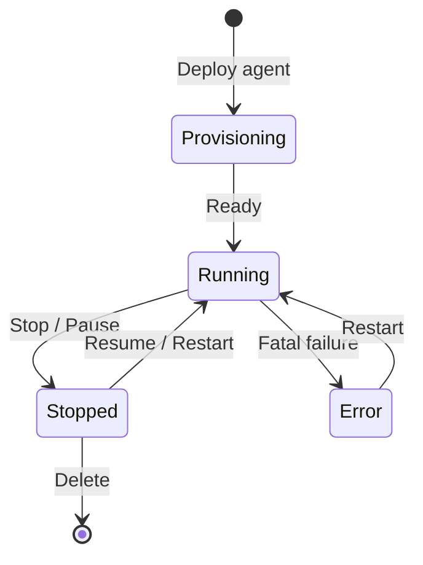
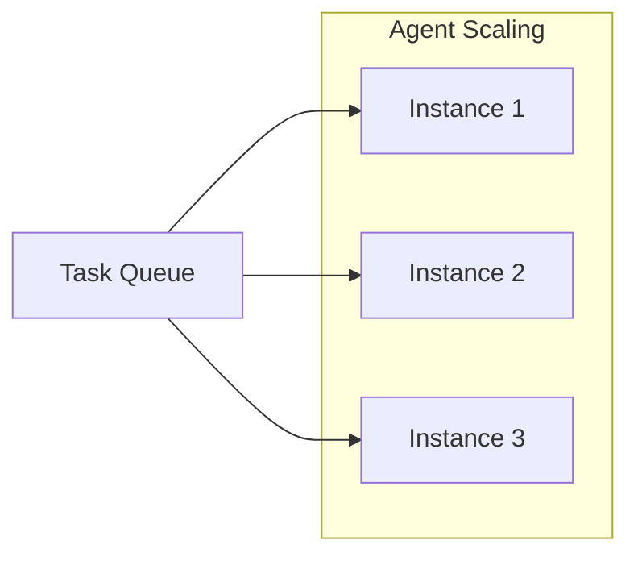

# Agent Management

The **Agent Management** page lets you view, create, configure, and control all agents in your organization. From here you manage the full lifecycle of every agent — from initial provisioning through day-to-day operations to shutdown.

## Agent List

The main view shows a table of all agents in the current organization:

| Column | Description |
|--------|-------------|
| **Name** | Agent identifier (e.g., `fullstack-agent`) |
| **Role** | Agent role from the catalog (e.g., Fullstack Developer, QA Engineer) |
| **Status** | Current state with colored indicator |
| **Instances** | Number of running instances |
| **Current Task** | Active task, if any |
| **Uptime** | Time since last start |
| **Actions** | Quick action buttons |

### Status Indicators

| Status | Color | Description |
|--------|-------|-------------|
| **Provisioning** | Yellow | Agent is being deployed — container is starting, dependencies installing |
| **Running** | Green | Agent is online, connected, and ready to accept tasks |
| **Stopped** | Gray | Agent has been manually stopped or paused |
| **Error** | Red | Agent encountered a fatal error and needs intervention |

## Creating a New Agent

Click **+ New Agent** to open the agent creation wizard.

### Step 1: Select a Role

Browse the **agent catalog** to choose a role template. Each template includes:

- **Role name** — e.g., Fullstack Developer, DevOps Engineer, QA Engineer, Technical Writer
- **Description** — what the agent is designed to do
- **Default capabilities** — tools, MCP servers, and skills pre-configured for the role
- **Recommended plan** — minimum subscription tier for the role

=== "Fullstack Developer"
    Builds and maintains web applications using Next.js, React, TypeScript, and Tailwind CSS. Includes Git, Playwright, and Jest tooling.

=== "DevOps Engineer"
    Manages infrastructure, CI/CD pipelines, and deployments. Includes kubectl (read-only), Terraform, and monitoring tools.

=== "QA Engineer"
    Writes and runs automated tests, performs browser testing, and validates agent output. Includes Playwright, Jest, and reporting tools.

=== "Technical Writer"
    Creates and maintains documentation, READMEs, and guides. Includes markdown tools and documentation site generators.

!!! tip "Custom Roles"
    If no catalog role fits your needs, select **Custom** and configure capabilities manually. You can also save your custom configuration as a new template for future use.

### Step 2: Configure the Agent

After selecting a role, configure the agent:

| Field | Required | Description |
|-------|----------|-------------|
| **Name** | Yes | Unique identifier within the org (lowercase, alphanumeric, hyphens) |
| **Display Name** | No | Human-friendly label shown in the UI |
| **Description** | No | What this specific agent instance is for |
| **Branch** | Yes | Default Git branch the agent works on |
| **Repositories** | No | GitHub repositories the agent has access to |
| **Credentials** | No | API keys and secrets assigned to this agent |
| **Instance Count** | Yes | Number of parallel instances (default: 1) |

### Step 3: Review and Deploy

Review your configuration and click **Deploy**. The agent enters `Provisioning` status while the platform:

1. Creates the agent's container environment
2. Installs required dependencies and tools
3. Configures MCP server connections
4. Loads the agent's role profile and instructions
5. Connects the agent to the organization's communication bus

Provisioning typically takes 30-90 seconds.

!!! note "Deployment Notifications"
    You will receive a notification when the agent transitions from `Provisioning` to `Running`. If provisioning fails, the agent enters `Error` status with diagnostic details.

## Agent Actions

Each agent in the list has action buttons for quick operations:

### Start / Resume

Starts a stopped agent. The agent reconnects to the organization and resumes accepting tasks. Previously assigned tasks that were paused are re-queued.

### Stop / Pause

Gracefully stops a running agent. The agent:

1. Finishes the current message exchange (if any)
2. Saves its current state
3. Disconnects from the communication bus
4. Releases compute resources

Stopped agents do not incur compute charges.

### Restart

Performs a stop-then-start cycle. Useful when an agent is behaving unexpectedly or after configuration changes. The restart process:

1. Gracefully stops the agent
2. Reloads configuration from the latest settings
3. Starts the agent fresh

!!! warning "Restart Behavior"
    Restarting an agent clears its in-memory context. The agent retains its conversation history and task assignments, but loses any transient state like open file handles or running processes.

### Delete

Permanently removes the agent from the organization. This action:

- Terminates all running instances
- Unassigns all active tasks (they return to `unassigned`)
- Deletes the agent's configuration
- Retains conversation and task history for audit purposes

!!! warning "Irreversible Action"
    Deleting an agent cannot be undone. You will be prompted to confirm by typing the agent's name.

## Scaling Agents

For workloads that benefit from parallelism, you can run multiple instances of the same agent.

### Adjusting Instance Count

1. Click the agent's name to open its detail view
2. Navigate to the **Scaling** tab
3. Adjust the **Instance Count** slider or type a number
4. Click **Apply**

### Scaling Behavior

- New instances provision in parallel (30-90 seconds each)
- Tasks are distributed across instances via the task queue
- Each instance has its own terminal tab and conversation history
- Scaling down gracefully stops excess instances after their current tasks complete

### Scaling Limits

| Plan | Max Instances Per Agent | Max Total Agents |
|------|------------------------|------------------|
| Free | 1 | 2 |
| Starter | 2 | 5 |
| Pro | 5 | 20 |
| Enterprise | Custom | Custom |

## Agent Detail View

Click an agent's name to open the full detail view with multiple tabs:

### Overview Tab

Summary of the agent's configuration, current status, assigned tasks, and recent activity.

### Configuration Tab

Edit the agent's settings:

- Name and description
- Branch and repository access
- Credential assignments
- MCP server connections
- Role profile and instructions

Changes take effect on the next restart.

### Scaling Tab

Manage instance count as described above.

### Logs Tab

View the agent's system logs:

- Startup and shutdown events
- Error messages and stack traces
- MCP connection events
- Resource usage snapshots

Logs are searchable and filterable by severity level (info, warning, error).

### Metrics Tab

Charts showing the agent's performance over time:

- **Tasks completed** per day/week
- **Average task duration** by priority
- **Error rate** over time
- **Token usage** by model

## Bulk Operations

Select multiple agents using the checkboxes to perform bulk actions:

- **Start All** — start all selected stopped agents
- **Stop All** — stop all selected running agents
- **Restart All** — restart all selected agents
- **Delete** — delete all selected agents (with confirmation)

!!! tip "Fleet Operations"
    Use bulk operations for maintenance windows. Stop all agents, apply configuration changes, then start them all at once.
