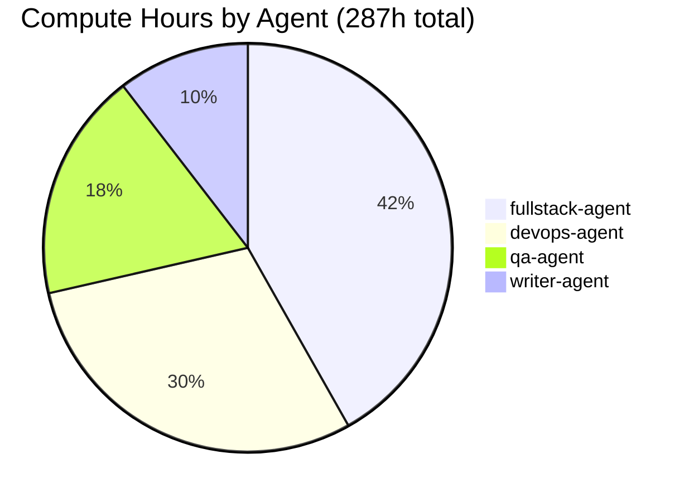

# Subscription Management

The **Usage & Billing** page gives you full visibility into your resource consumption, subscription plan, payment methods, and invoices. Access it from the sidebar under **Usage & Billing**.

## Plan Overview

agent.ceo offers four subscription tiers. Your current plan is highlighted at the top of the billing page with a summary of included resources and current usage.

### Plan Comparison

| Feature | Free | Starter | Pro | Enterprise |
|---------|------|---------|-----|------------|
| **Agents** | 2 | 5 | 20 | Custom |
| **Max Instances/Agent** | 1 | 2 | 5 | Custom |
| **Compute Hours/mo** | 10 | 100 | 500 | Custom |
| **Token Budget/mo** | 1M | 10M | 100M | Custom |
| **Storage** | 1 GB | 10 GB | 100 GB | Custom |
| **Organizations** | 1 | 3 | 10 | Unlimited |
| **Members/Org** | 2 | 10 | 50 | Unlimited |
| **Meetings** | 5/mo | 50/mo | Unlimited | Unlimited |
| **Extensions** | Community | All | All + Custom | All + Custom + Dedicated |
| **Support** | Community | Email | Priority | Dedicated |
| **SLA** | None | 99.5% | 99.9% | 99.99% |
| **Price** | $0 | $49/mo | $199/mo | Contact Sales |

!!! tip "Annual Billing"
    Save 20% by switching to annual billing. Toggle between monthly and annual pricing at the top of the plan comparison table.

## Current Plan Summary

The plan summary card at the top of the billing page shows:

```
+-------------------------------------------------+
|  PRO PLAN — $199/mo (annual)                    |
|                                                 |
|  Agents: 12 / 20 used                          |
|  Compute: 287h / 500h used this period          |
|  Tokens: 43M / 100M used this period            |
|  Storage: 34 GB / 100 GB used                   |
|  Next billing date: June 15, 2026               |
|                                                 |
|  [Manage Plan]  [View Invoices]                 |
+-------------------------------------------------+
```

## Usage Meters

Below the plan summary, detailed usage meters show consumption for the current billing period.

### Compute Hours



The compute meter shows:

- **Total used** vs. **included** hours
- **By agent** breakdown — which agents consume the most compute
- **Daily trend** — line chart showing compute usage over the billing period
- **Projected usage** — estimated end-of-period usage based on current pace

!!! warning "Overage Charges"
    If you exceed your included compute hours, overage charges apply at the per-hour rate for your plan tier. The meter changes from blue to yellow at 80% usage and red at 100%.

### Token Usage

Token consumption is tracked across all agents and broken down by:

| Dimension | Description |
|-----------|-------------|
| **By Agent** | Which agent consumed the tokens |
| **By Model** | Token distribution across Claude models (Opus, Sonnet, Haiku) |
| **Input vs. Output** | Tokens sent to the model vs. tokens generated |
| **By Day** | Daily token consumption trend |

### Storage

Storage usage includes:

- Agent conversation history
- Task attachments and evidence
- Meeting transcripts and recordings
- Credential metadata (values are minimal)
- Extension data

## Cost Breakdown

The **Cost Breakdown** tab provides a detailed view of where your money goes:

### By Agent

| Agent | Compute | Tokens | Storage | Total |
|-------|---------|--------|---------|-------|
| fullstack-agent | $48.00 | $12.50 | $2.10 | $62.60 |
| devops-agent | $34.00 | $8.20 | $1.50 | $43.70 |
| qa-agent | $20.80 | $6.10 | $0.80 | $27.70 |
| writer-agent | $12.00 | $3.40 | $0.40 | $15.80 |
| **Total** | **$114.80** | **$30.20** | **$4.80** | **$149.80** |

### By Resource Type

A stacked bar chart shows cost distribution across compute, tokens, and storage for each billing period. This helps identify cost trends and optimize spending.

!!! tip "Cost Optimization"
    If one agent is consuming a disproportionate amount of tokens, consider:
    
    - Reviewing the agent's instructions for unnecessary verbosity
    - Using Haiku for simple tasks instead of Opus
    - Setting token budgets per agent in Agent Management

## Invoice History

The **Invoices** tab lists all past invoices:

| Column | Description |
|--------|-------------|
| **Invoice #** | Unique invoice identifier |
| **Period** | Billing period covered |
| **Amount** | Total charge |
| **Status** | Paid, Pending, Failed, or Refunded |
| **Actions** | Download PDF, view details |

### Invoice Details

Click an invoice to see the full breakdown:

- Base plan charge
- Overage charges (if any)
- Credits applied
- Taxes
- Total

### Download

Download invoices as PDF for accounting and expense reporting. Bulk download is available by selecting multiple invoices.

## Payment Methods

The **Payment** tab manages how you pay:

### Adding a Payment Method

1. Click **+ Add Payment Method**
2. Enter credit card details or connect a bank account
3. Click **Save**

Supported payment methods:

- Credit and debit cards (Visa, Mastercard, American Express)
- ACH bank transfer (US only)
- Wire transfer (Enterprise plans)

### Default Payment Method

Your default payment method is used for automatic billing. To change it:

1. Click the star icon next to the desired payment method
2. Confirm the change

### Removing a Payment Method

You cannot remove your only payment method while on a paid plan. Add a new method before removing the old one.

!!! warning "Failed Payments"
    If a payment fails, you have a 7-day grace period to update your payment method. After the grace period, your organization is downgraded to the Free plan with reduced limits.

## Upgrade / Downgrade

### Upgrading

1. Click **Manage Plan** on the billing page
2. Select the target plan
3. Review the prorated charge for the remainder of the current billing period
4. Confirm the upgrade

Upgrades take effect immediately. New resource limits apply right away, and you are charged the prorated difference.

### Downgrading

1. Click **Manage Plan** on the billing page
2. Select a lower-tier plan
3. Review any impacts (agents that will be stopped if exceeding new limits)
4. Confirm the downgrade

!!! warning "Downgrade Impacts"
    If you are currently using more resources than the target plan allows, the platform will prompt you to:
    
    - Stop excess agents (if you have more than the new plan allows)
    - Delete excess organizations (if applicable)
    - Reduce storage usage
    
    The downgrade takes effect at the start of the next billing period. You retain full access until then.

## Free Plan Limitations

The Free plan is designed for evaluation and small-scale use:

- 2 agents maximum, single instance each
- 10 compute hours per month
- 1 million tokens per month
- 1 GB storage
- Community support only
- No SLA guarantee

!!! note "Upgrading from Free"
    You can upgrade to a paid plan at any time. Your existing data, agents, and configuration are preserved. No migration is needed.

## Enterprise Plan

Enterprise plans offer custom pricing and features:

- Custom agent and instance limits
- Dedicated infrastructure (optional)
- SSO/SAML integration
- Custom SLA agreements
- Dedicated support engineer
- Volume discounts on compute and tokens
- On-premises deployment option

Contact **sales@agent.ceo** or click **Contact Sales** on the billing page to discuss Enterprise pricing.

## Billing Notifications

You receive email notifications for:

- **Invoice generated** — when a new invoice is created
- **Payment processed** — confirmation of successful payment
- **Payment failed** — alert when a payment attempt fails
- **Usage threshold** — when usage reaches 80% and 100% of included limits
- **Plan change** — confirmation of upgrades or downgrades

Configure billing notifications in **Settings > Notifications > Billing**.
