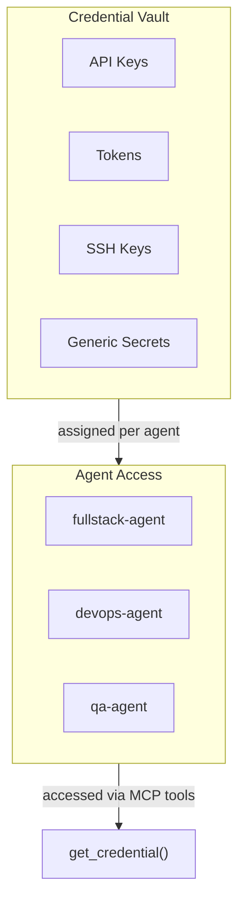
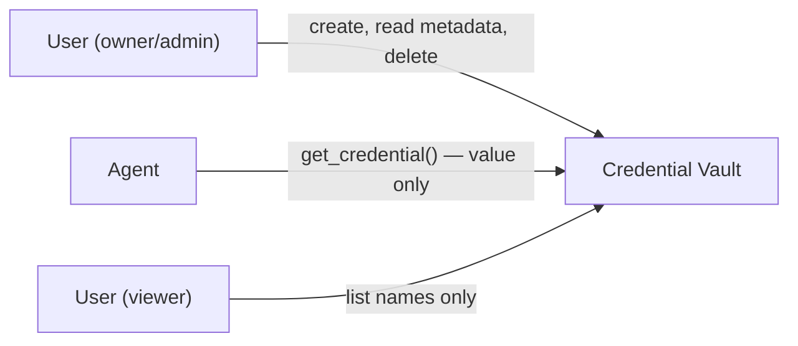

# Managing Credentials and Secrets

The **Credentials** page provides a secure vault for storing API keys, tokens, SSH keys, and other secrets that your agents need to interact with external services. Credentials are encrypted at rest and never displayed in plain text after creation.

## Credentials Overview



## Credential List

The main view shows all credentials stored in the current organization:

| Column | Description |
|--------|-------------|
| **Name** | Human-readable identifier for the credential |
| **Type** | Credential type (API Key, Token, SSH Key, Generic Secret) |
| **Assigned To** | Which agents have access to this credential |
| **Created** | When the credential was first stored |
| **Last Used** | When an agent last retrieved this credential |
| **Actions** | Edit, reassign, or delete |

!!! note "Value Hidden"
    Credential values are never shown in the list view. After creation, you cannot view the stored value — only replace it with a new one.

## Credential Types

### API Key

For authenticating with external APIs such as GitHub, OpenAI, Anthropic, or any service that uses API key authentication.

| Field | Required | Description |
|-------|----------|-------------|
| **Name** | Yes | Descriptive name (e.g., `github-api-key`, `openai-production`) |
| **Key Value** | Yes | The API key string |
| **Service** | No | Which service this key is for (helps with organization) |
| **Expiry Date** | No | When the key expires (triggers renewal reminders) |

### Token

For OAuth tokens, bearer tokens, or session tokens that authenticate agent actions.

| Field | Required | Description |
|-------|----------|-------------|
| **Name** | Yes | Descriptive name (e.g., `slack-bot-token`) |
| **Token Value** | Yes | The token string |
| **Token Type** | No | Bearer, OAuth, or custom |
| **Refresh Token** | No | For OAuth flows that support token refresh |
| **Expiry Date** | No | Token expiration date |

### SSH Key

For Git repository access, server authentication, or any SSH-based integration.

| Field | Required | Description |
|-------|----------|-------------|
| **Name** | Yes | Descriptive name (e.g., `github-deploy-key`) |
| **Private Key** | Yes | The private key content (PEM format) |
| **Public Key** | No | Corresponding public key (auto-derived if not provided) |
| **Passphrase** | No | Key passphrase, if encrypted |

!!! tip "Generating SSH Keys"
    Agents can generate SSH keys programmatically using the `generate_ssh_key` MCP tool. The generated key pair is automatically stored as a credential. You can then add the public key to your Git hosting provider.

### Generic Secret

For any secret that does not fit the other categories — database passwords, webhook secrets, encryption keys, etc.

| Field | Required | Description |
|-------|----------|-------------|
| **Name** | Yes | Descriptive name (e.g., `database-password`) |
| **Secret Value** | Yes | The secret string |
| **Description** | No | What this secret is used for |

## Creating a Credential

1. Click **+ Add Credential** in the top-right corner
2. Select the credential **type** from the dropdown
3. Fill in the required fields
4. Assign the credential to one or more agents (optional — can be done later)
5. Click **Save**

### Assignment During Creation

You can immediately assign the credential to agents during creation:

- Select agents from the **Assign To** multi-select dropdown
- Only agents in the current organization appear in the list
- You can assign to all agents by clicking **Select All**

!!! warning "Minimum Privilege"
    Only assign credentials to agents that actually need them. If a credential is compromised, limiting its scope reduces the blast radius.

## Per-Agent Credential Assignment

After creating a credential, you can manage which agents have access:

### From the Credentials Page

1. Click the credential row to open its detail panel
2. Navigate to the **Assignments** tab
3. Add or remove agents using the toggle switches
4. Click **Save**

### From Agent Management

1. Open the agent's detail view in **Agent Management**
2. Navigate to the **Configuration** tab
3. Under **Credentials**, add or remove credentials from the agent's access list
4. Click **Save** — changes take effect on next agent restart

## How Agents Access Credentials

Agents retrieve credentials at runtime through MCP tools:

```
Agent calls: get_credential("github-api-key")
Platform checks: Is this agent assigned to "github-api-key"?
  Yes → Returns the decrypted value
  No  → Returns an access denied error
```

The credential value is delivered to the agent's in-memory context and is never written to disk or logged.

!!! warning "Credential Logging"
    The platform automatically redacts credential values from agent logs and conversation history. If an agent inadvertently outputs a credential value in a message, the platform replaces it with `[REDACTED]`.

## Security Model

### Encryption at Rest

All credential values are encrypted using AES-256-GCM before being stored. Encryption keys are managed by the platform's key management service and are never exposed to users or agents.

### Access Control



| Role | Can Create | Can View Value | Can Assign | Can Delete |
|------|-----------|---------------|-----------|-----------|
| **Owner** | Yes | No (after creation) | Yes | Yes |
| **Admin** | Yes | No (after creation) | Yes | Yes |
| **Member** | Yes | No (after creation) | Own agents only | Own credentials only |
| **Viewer** | No | No | No | No |

### Audit Trail

Every credential access is logged in the **Activity Feed**:

- **Created** — who created the credential and when
- **Accessed** — which agent retrieved the credential and when
- **Modified** — who updated the credential assignment
- **Deleted** — who removed the credential

## Updating a Credential

Since stored values cannot be viewed, updating a credential means replacing its value:

1. Click the credential to open its detail panel
2. Click **Update Value**
3. Enter the new value
4. Click **Save**

The old value is immediately overwritten. Agents will receive the new value on their next `get_credential()` call — no restart required.

## Deleting a Credential

1. Click the credential's delete button (trash icon)
2. Confirm the deletion in the dialog

!!! warning "Deletion Impact"
    Deleting a credential that is actively used by agents will cause those agents to receive errors when they next try to access it. Verify no agents depend on the credential before deleting.

## Credential Expiry and Rotation

For credentials with an expiry date set:

- **30 days before expiry** — a yellow warning badge appears on the credential
- **7 days before expiry** — an email notification is sent to org admins
- **On expiry** — a red badge appears and the credential is flagged in the Activity Feed

### Rotation Best Practices

1. Create the new credential with a temporary name (e.g., `github-api-key-new`)
2. Assign it to the same agents as the old credential
3. Verify agents can access the new credential
4. Delete the old credential
5. Rename the new credential to the original name

## Integration with Agent MCP Tools

Agents interact with credentials through these MCP tools:

| Tool | Description |
|------|-------------|
| `get_credential(name)` | Retrieve a credential value by name |
| `list_credentials()` | List credential names assigned to the agent (values not included) |
| `store_credential(name, value, type)` | Store a new credential (agent must have permission) |
| `delete_credential(name)` | Delete a credential (agent must have permission) |
| `generate_ssh_key(name)` | Generate and store a new SSH key pair |
| `configure_ssh_for_repo(repo, key_name)` | Configure SSH access for a repository using a stored key |
| `setup_github_repo_access(repo)` | Set up full GitHub access for a repository |

!!! note "Agent Permissions"
    By default, agents can only read credentials assigned to them. The `store_credential` and `delete_credential` tools require explicit permission grants configured in the agent's role profile.
