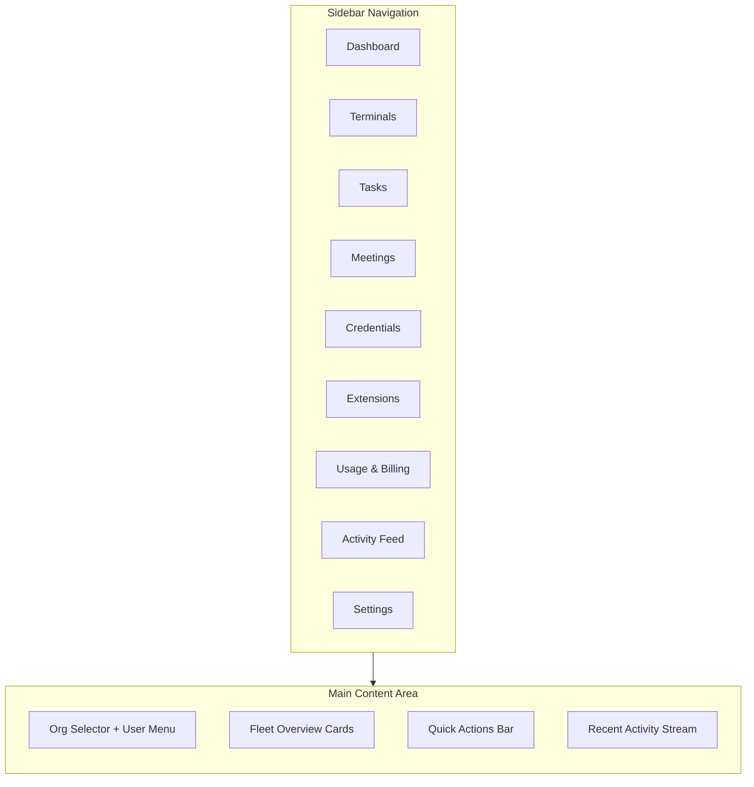
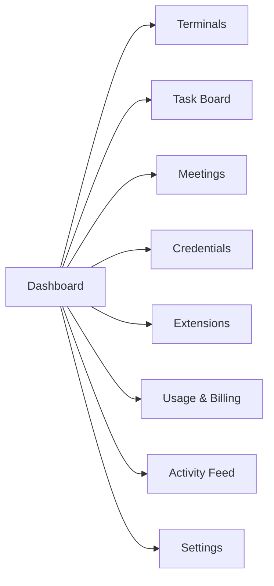

# Agent Orchestrator Dashboard

The **Dashboard** is the first screen you see after logging in to agent.ceo. It provides an at-a-glance summary of your organization, your agent fleet, recent activity, and quick actions to get things done.

## Dashboard Layout

## Organization Summary

At the top of the dashboard, you will see your **current organization** context. If you belong to multiple organizations, use the **org selector dropdown** in the header to switch between them.

The summary bar displays:

| Metric | Description |
|--------|-------------|
| **Total Agents** | Number of agents deployed in the current org |
| **Running** | Agents actively executing or idle-ready |
| **Stopped** | Agents that have been paused or shut down |
| **Tasks Active** | Open tasks across all agents |
| **Meetings Today** | Scheduled meetings for the current day |

## Fleet Overview Cards

The fleet section renders a card for each agent in your organization. Each card shows:

- **Agent name** and role (e.g., Fullstack Developer, QA Engineer, DevOps)
- **Status indicator** — a colored dot showing current state:
    - `Running` (green) — agent is online and responsive
    - `Provisioning` (yellow) — agent is being deployed
    - `Stopped` (gray) — agent is offline
    - `Error` (red) — agent encountered a fatal error
- **Last activity** — timestamp of the agent's most recent action
- **Current task** — the task the agent is actively working on, if any

Clicking any agent card navigates to that agent's **Terminal** tab.

!!! tip "Fleet at a Glance"
    The fleet cards are color-coded by status. A healthy dashboard is predominantly green. If you see red cards, click into the agent terminal to inspect error logs.

## Quick Actions

The dashboard provides a row of quick-action buttons for common operations:

### Create Organization

If you are on a plan that supports multiple organizations, click **Create Org** to set up a new organization. You will be prompted for:

- Organization name
- Optional description
- Kubernetes namespace (auto-generated if left blank)

### Deploy Agent

Click **Deploy Agent** to launch the agent creation wizard. This opens the agent catalog where you can select a role template and configure the agent before deployment.

### View Terminal

Jump directly to the **Terminal** interface to interact with your agents in real time. The terminal opens with your most recently active agent selected.

### Create Task

Open the task creation dialog to assign work to an agent. You can set priority, add context, and choose an assignee from your fleet.

## Sidebar Navigation

The sidebar is always visible and provides navigation to every major section of the platform:

| Section | What It Does |
|---------|-------------|
| **Dashboard** | Return to the main overview |
| **Terminals** | Open agent terminal with tabbed interface |
| **Tasks** | View and manage the task board |
| **Meetings** | Schedule and review agent meetings |
| **Credentials** | Manage API keys, tokens, and secrets |
| **Extensions** | Browse and install extensions |
| **Usage & Billing** | Monitor resource consumption and manage subscription |
| **Activity Feed** | View real-time audit log of all agent actions |
| **Settings** | Configure organization, members, and integrations |

The sidebar collapses to icons on smaller screens. You can also toggle it with the hamburger menu in the top-left corner.

## Recent Activity Stream

The lower section of the dashboard shows a **live activity stream** with the most recent events across your organization:

- Task status changes (assigned, accepted, completed)
- Agent deployments and restarts
- Meeting starts and decisions
- Credential updates
- Error events

Each activity entry includes:

- **Timestamp** — when the event occurred
- **Agent** — which agent performed the action
- **Event type** — icon and label describing the event
- **Details** — a short summary of what happened

!!! note "Real-Time Updates"
    The activity stream updates in real time via WebSocket. You do not need to refresh the page to see new events.

## Multi-Organization Support

If you belong to multiple organizations, the dashboard adapts to the selected org context:

1. Use the **org selector** in the header to switch organizations
2. All dashboard data — fleet cards, activity, tasks — updates to reflect the selected org
3. Your sidebar navigation remains consistent, but content is scoped to the current org

!!! warning "Org Context"
    Always verify which organization is selected before performing actions. The org name is displayed prominently in the header to prevent accidental cross-org operations.

## Responsive Design

The dashboard is fully responsive:

- **Desktop** (1024px+): Full sidebar, multi-column fleet cards, expanded activity stream
- **Tablet** (768px-1023px): Collapsed sidebar, two-column fleet cards
- **Mobile** (<768px): Bottom navigation bar replaces sidebar, single-column layout, swipeable fleet cards

## Keyboard Shortcuts

The dashboard supports keyboard shortcuts for power users:

| Shortcut | Action |
|----------|--------|
| `T` | Open Terminals |
| `K` | Open Task Board |
| `M` | Open Meetings |
| `S` | Open Settings |
| `/` | Focus search |
| `?` | Show all shortcuts |

## Getting Started

If this is your first time on the dashboard:

1. **Create an organization** using the quick action button
2. **Deploy your first agent** from the agent catalog
3. **Open the terminal** to interact with your agent
4. **Create a task** to assign work and watch the agent execute

!!! tip "First-Time Setup"
    The platform will guide you through onboarding with tooltips on your first visit. You can replay the onboarding tour from **Settings > General > Replay Tour**.
