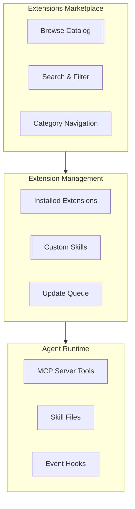

# Extensions and Plugins Marketplace

The **Extensions** page is the marketplace for adding capabilities to your agents. Browse available extensions, install them per organization, create custom skills, and manage your installed extensions.

## Marketplace Overview



## Browsing Extensions

The marketplace displays extensions as cards in a grid layout. Each card shows:

| Element | Description |
|---------|-------------|
| **Icon** | Extension logo or category icon |
| **Name** | Extension identifier |
| **Publisher** | Who created the extension (agent.ceo, community, or your org) |
| **Description** | One-line summary of what the extension does |
| **Category** | Developer Tools, Integrations, Monitoring, etc. |
| **Rating** | Community rating (1-5 stars) |
| **Installs** | Number of organizations using this extension |
| **Status** | Available, Installed, or Update Available |

Click any card to view the extension's full detail page.

## Extension Categories

### Developer Tools

Extensions that enhance agent development capabilities:

| Extension | Description |
|-----------|-------------|
| **Git Advanced** | Extended Git operations — rebase, cherry-pick, bisect, stash management |
| **Code Reviewer** | Automated code review with style checking and security scanning |
| **Database Tools** | PostgreSQL, MySQL, and MongoDB query tools |
| **Docker Tools** | Container management — build, run, inspect, log viewing |
| **Test Runner Pro** | Enhanced test execution with parallel runs, coverage reporting, flaky test detection |

### Integrations

Extensions connecting agents to external services:

| Extension | Description |
|-----------|-------------|
| **Slack Bot** | Two-way Slack integration for agent communication |
| **Jira Sync** | Synchronize tasks between agent.ceo and Jira |
| **Linear Sync** | Synchronize tasks with Linear project management |
| **PagerDuty** | Alert routing and incident management |
| **Datadog** | Metrics export and dashboard integration |
| **Sentry** | Error tracking and alerting |
| **Notion Sync** | Read and write Notion pages and databases |

### Monitoring

Extensions for observability and performance tracking:

| Extension | Description |
|-----------|-------------|
| **Agent Metrics** | Detailed performance metrics per agent — response times, error rates, throughput |
| **Cost Analyzer** | Token usage analysis and optimization recommendations |
| **SLA Dashboard** | Enhanced SLA tracking with trend analysis and forecasting |
| **Health Checks** | Periodic agent health validation with automatic restart on failure |

### Communication

Extensions for enhanced agent-to-agent and agent-to-human communication:

| Extension | Description |
|-----------|-------------|
| **Email Gateway** | Send and receive emails through agents |
| **Webhook Manager** | Configure inbound and outbound webhooks |
| **Notification Router** | Advanced notification routing with rules and escalation policies |

### Security

Extensions for security-focused workflows:

| Extension | Description |
|-----------|-------------|
| **Secret Scanner** | Scan repositories for accidentally committed secrets |
| **Dependency Audit** | Check for vulnerable dependencies in project files |
| **Access Reviewer** | Periodic review of credential assignments and permissions |

## Installing Extensions

### From the Marketplace

1. Browse or search for the desired extension
2. Click the extension card to view details
3. Review the extension's permissions and requirements
4. Click **Install**
5. Configure extension-specific settings (if any)
6. Click **Activate**

### Installation Scope

Extensions are installed per organization. All agents in the organization can access the extension's tools and capabilities once installed.

!!! note "Agent-Level Control"
    After installing an extension at the org level, you can disable it for specific agents in **Agent Management > Configuration > Extensions**.

### Permissions Review

Before installation, the extension detail page lists the permissions it requires:

```
Extension: Git Advanced
Permissions requested:
  - Read/write access to agent repositories
  - Execute Git commands
  - Access agent terminal

[Install]  [Cancel]
```

!!! warning "Permission Review"
    Always review the requested permissions before installing. Extensions with broad permissions (terminal access, credential access) should be evaluated carefully.

## Installed Extensions

The **Installed** tab shows all extensions currently active in your organization:

| Column | Description |
|--------|-------------|
| **Name** | Extension identifier |
| **Version** | Currently installed version |
| **Status** | Active, Disabled, or Update Available |
| **Installed By** | User who installed the extension |
| **Installed On** | Date of installation |
| **Actions** | Configure, Disable, Uninstall |

### Configuring an Extension

Click **Configure** to adjust extension-specific settings. Settings vary by extension but common options include:

- Notification preferences
- Default behaviors
- Connection credentials for third-party integrations
- Feature toggles

### Disabling an Extension

Disable an extension without uninstalling it:

1. Click **Disable** next to the extension
2. The extension is deactivated — agents can no longer use its tools
3. Configuration is preserved for re-enablement

### Uninstalling an Extension

Remove an extension completely:

1. Click **Uninstall** next to the extension
2. Confirm the removal
3. All extension data and configuration is deleted

!!! tip "Disable Before Uninstalling"
    If you are unsure whether you still need an extension, disable it first. This preserves your configuration in case you want to re-enable it later.

## Extension Updates

When a new version of an installed extension is available:

- An **Update Available** badge appears on the extension card
- A notification is sent to org admins
- The **Updates** tab shows all pending updates

### Applying Updates

1. Navigate to the **Updates** tab
2. Review the changelog for each available update
3. Click **Update** for individual extensions, or **Update All** for batch updates
4. Extensions are updated without downtime — agents automatically receive the new version

## Custom Skills

Create your own skills and extensions for your organization.

### What Are Skills?

Skills are reusable, packaged procedures that teach agents how to perform specific tasks. They are defined as SKILL.md files with:

- **Trigger conditions** — when the skill should activate
- **Instructions** — step-by-step procedure for the agent to follow
- **Constraints** — guardrails and limitations

### Creating a Custom Skill

1. Navigate to the **Custom** tab in Extensions
2. Click **+ Create Skill**
3. Fill in the skill definition:

| Field | Required | Description |
|-------|----------|-------------|
| **Name** | Yes | Unique skill identifier |
| **Description** | Yes | What the skill does and when it should trigger |
| **Trigger** | Yes | Conditions that activate the skill |
| **Body** | Yes | Step-by-step instructions |
| **Category** | No | Organizational category |

4. Click **Save Draft** to test, or **Publish** to make it available

### Skill Visibility

| Visibility | Description |
|------------|-------------|
| **Private** | Only available in the creating organization |
| **Organization** | Available to all organizations you own |
| **Community** | Published to the public marketplace for all users |

!!! tip "Quality Review"
    Before publishing a skill to the community marketplace, use the skill grader to evaluate its triggering accuracy, clarity, and safety.

### Managing Custom Skills

The **Custom** tab lists all skills created by your organization:

| Column | Description |
|--------|-------------|
| **Name** | Skill identifier |
| **Status** | Draft, Published, or Deprecated |
| **Used By** | Number of agents or orgs using the skill |
| **Last Updated** | When the skill was last modified |
| **Actions** | Edit, Publish, Deprecate, Delete |

## Skill Catalog

The **Skill Catalog** provides a searchable directory of all available skills — both marketplace and custom.

### Search and Filter

- **Keyword search** — search by name, description, or capability
- **Category filter** — narrow by category (Developer Tools, Integrations, etc.)
- **Publisher filter** — show only official, community, or organization skills
- **Sort by** — relevance, popularity, rating, or newest

### Skill Detail Page

Each skill's detail page shows:

- **Full description** — what the skill does, when it triggers, example use cases
- **Instructions preview** — the procedure the agent follows (read-only)
- **Requirements** — any dependencies or prerequisites
- **Reviews** — community ratings and comments
- **Install button** — add the skill to your organization

## Extension Development

For organizations that need to build more complex extensions beyond skills:

### Extension SDK

The agent.ceo Extension SDK provides:

- MCP server scaffolding for custom tool creation
- Event hook registration for reactive extensions
- API client libraries for platform integration
- Testing utilities for extension validation

### Extension Structure

```
my-extension/
  manifest.json       # Extension metadata and permissions
  src/
    index.ts          # Entry point
    tools/            # MCP tool definitions
    hooks/            # Event handlers
  tests/
    extension.test.ts # Extension tests
  README.md           # Documentation
```

### Publishing

1. Build and test your extension locally
2. Submit to the marketplace review queue
3. The agent.ceo team reviews for security and quality
4. Approved extensions appear in the marketplace within 48 hours

!!! note "Enterprise Extensions"
    Enterprise plan organizations can deploy private extensions without marketplace review. These extensions are only visible within the organization.
