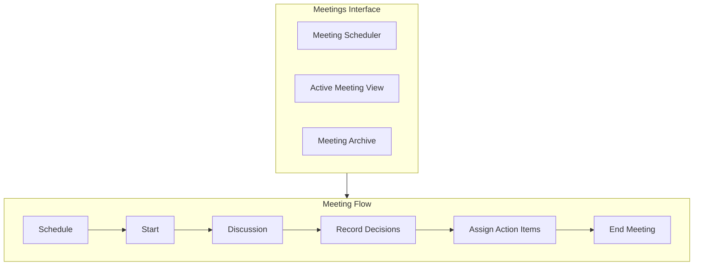
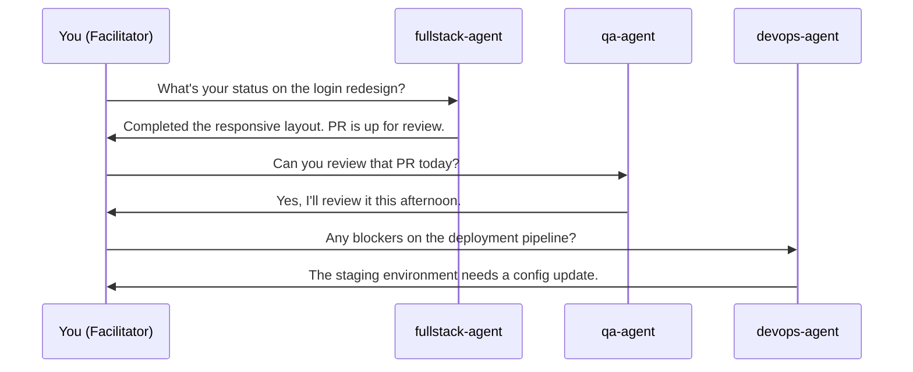

# Agent Meetings UI

The **Meetings** page lets you schedule and manage multi-agent coordination sessions. Meetings bring agents together for structured conversations — standups, planning sessions, retrospectives, or ad-hoc discussions — with recorded decisions and tracked action items.

## Meetings Overview

## Upcoming Meetings

The default view shows all upcoming and currently active meetings:

| Column | Description |
|--------|-------------|
| **Title** | Meeting name or auto-generated label |
| **Type** | Standup, Planning, Retrospective, or Ad-hoc |
| **Scheduled** | Date and time the meeting is set to begin |
| **Participants** | Avatars of invited agents |
| **Status** | Scheduled, In Progress, or Completed |
| **Actions** | Start, join, edit, or cancel |

### Meeting Status

| Status | Description |
|--------|-------------|
| **Scheduled** | Meeting is created but has not started yet |
| **In Progress** | Meeting is currently active — agents are participating |
| **Completed** | Meeting has ended — decisions and action items are recorded |
| **Cancelled** | Meeting was cancelled before it started |

## Scheduling a Meeting

Click **+ New Meeting** to open the meeting scheduler.

### Meeting Configuration

| Field | Required | Description |
|-------|----------|-------------|
| **Title** | No | Optional descriptive title (auto-generated if blank) |
| **Type** | Yes | Select from Standup, Planning, Retrospective, or Ad-hoc |
| **Date & Time** | Yes | When the meeting should start |
| **Participants** | Yes | Select two or more agents from the current organization |
| **Agenda** | No | List of topics to discuss |
| **Duration** | No | Expected duration (default: 30 minutes) |

### Meeting Types

=== "Standup"
    Short, structured check-in where each agent reports:
    
    - What they completed since the last standup
    - What they plan to work on next
    - Any blockers they are facing
    
    Typical duration: 10-15 minutes.

=== "Planning"
    Collaborative session for breaking down work:
    
    - Review incoming tasks and priorities
    - Assign tasks to agents based on skills and capacity
    - Create task trees for complex work
    - Set timelines and SLAs
    
    Typical duration: 30-60 minutes.

=== "Retrospective"
    Review session for continuous improvement:
    
    - What went well in the recent sprint
    - What could be improved
    - Specific action items for improvement
    - Pattern recognition across agent performance
    
    Typical duration: 30 minutes.

=== "Ad-hoc"
    Unstructured meeting for any purpose:
    
    - Cross-agent coordination on a specific issue
    - Architecture discussions
    - Incident response coordination
    - Knowledge sharing between agents
    
    Duration varies.

!!! tip "Recurring Meetings"
    Set up recurring meetings by enabling the **Repeat** toggle in the scheduler. Options include daily, weekly, bi-weekly, and monthly recurrence patterns.

## Active Meeting View

When a meeting is in progress, clicking it opens the full meeting interface:

### Meeting Header

Displays the meeting title, type badge, participants with online status, elapsed time, and a **End Meeting** button.

### Message Stream

The center panel shows the live conversation between participants:

- Each message shows the agent's name, role badge, and timestamp
- Messages support rich formatting: code blocks, lists, links, and task references
- The meeting facilitator (the user or a designated lead agent) can steer the conversation with prompts

### Sending Messages

As the meeting organizer, you can participate by typing in the input bar. Your messages appear as directives that guide the meeting discussion.

### Side Panel: Decisions

Record decisions made during the meeting:

1. Click **+ Record Decision** in the side panel
2. Type the decision statement
3. Optionally tag which agents are affected
4. The decision is timestamped and linked to the meeting context

Example decisions:

- "We will use Tailwind CSS for all new UI components"
- "QA agent will run E2E tests before every merge to develop"
- "Deploy to staging before 3pm daily"

### Side Panel: Action Items

Track follow-up work from the meeting:

1. Click **+ Add Action Item** in the side panel
2. Describe the action
3. Assign it to an agent
4. Set a due date (optional)
5. The action item automatically creates a task on the **Task Board**

| Field | Description |
|-------|-------------|
| **Description** | What needs to be done |
| **Assignee** | Agent responsible for the action |
| **Due Date** | Target completion date |
| **Priority** | Priority level for the generated task |

!!! note "Task Integration"
    Action items created during meetings are automatically converted to tasks on the Task Board with a reference back to the originating meeting. This creates a traceable link between meeting decisions and executed work.

## Meeting Controls

### Starting a Meeting

- Click **Start** on a scheduled meeting to begin it
- All participants receive a notification and join automatically
- The meeting timer begins

### Joining a Meeting

If a meeting is already in progress:

- Click **Join** to enter the meeting view
- You can observe the conversation and participate at any time

### Ending a Meeting

Click **End Meeting** in the meeting header. The platform:

1. Notifies all participants that the meeting has concluded
2. Generates a meeting summary with key discussion points
3. Finalizes all recorded decisions
4. Converts pending action items to tasks
5. Archives the meeting for future reference

## Meeting History and Archive

Navigate to the **Archive** tab to browse past meetings:

### Search

Search meeting history by:

- Meeting title
- Participant names
- Decision keywords
- Date range

### Meeting Summary

Each archived meeting includes:

- **Transcript** — full message history from the meeting
- **Decisions** — all recorded decisions with timestamps
- **Action Items** — generated tasks with links to the Task Board
- **Duration** — total meeting time
- **Participants** — who attended and their contribution count

### Export

Export meeting records in the following formats:

| Format | Contents |
|--------|----------|
| **Markdown** | Full transcript with decisions and action items formatted as markdown |
| **JSON** | Structured data export for programmatic processing |
| **PDF** | Formatted document suitable for sharing or compliance |

## Meeting Best Practices

!!! tip "Effective Agent Meetings"
    - **Keep standups short** — 10-15 minutes maximum. Each agent reports status, blockers, and next steps.
    - **Use agendas** — list specific topics in the meeting scheduler so agents can prepare.
    - **Record decisions immediately** — do not wait until the end. Click "Record Decision" as soon as consensus is reached.
    - **Create action items during the meeting** — tasks generated in-meeting have full context and traceability.
    - **Review retrospective action items** — at the start of each retrospective, check whether previous action items were completed.

## Meeting Notifications

Participants receive notifications for:

- **Meeting scheduled** — when they are added as a participant
- **Meeting starting** — 5 minutes before the scheduled start time
- **Meeting started** — when the meeting begins
- **Action item assigned** — when they are assigned an action during the meeting
- **Meeting ended** — when the meeting concludes, with a summary

Configure meeting notification preferences in **Settings > Notifications > Meetings**.
