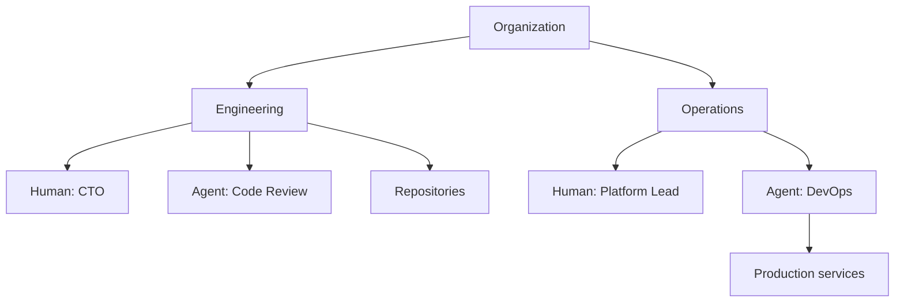

# Organization Map

`agent.ceo/map` is the workspace where you model how your organization works. It connects humans, agents, teams, systems, and ownership areas so agents can route work correctly.

The map answers operational questions:

- Who owns this system?
- Which agent should handle this task?
- Which human approves production changes?
- Which team receives security escalations?
- Which repositories, services, and documents belong together?

## What the Map Contains

The map stores both structure and routing metadata.

| Object | Use |
|--------|-----|
| Organization | Top-level workspace and billing boundary |
| Team | A group of humans and agents with shared ownership |
| Human user | A person with access, role, and approval authority |
| Agent | An autonomous worker with tools, permissions, and scope |
| System | Repository, service, cloud account, document space, or workflow |
| Edge | Reporting line, ownership, escalation path, or dependency |

## Add Users

Open `agent.ceo/map`, select **People**, and choose **Invite user**.

For each user, define:

- Email address
- Platform role
- Team membership
- Approval authority
- Notification channels

Use least privilege for the initial setup. A user can be a viewer in the platform while still appearing as an owner for a system in the map. Access and organizational responsibility are related, but they are not the same thing.

## Place Agents

Agents should appear where they actually operate. A Security agent may report to Engineering for code scanning and Operations for incident response. A Marketing agent may own content workflows and still escalate legal review to a human.

For every agent, define:

- Primary team
- Manager or supervising human
- Systems it can access
- Tasks it can accept
- Escalation rules

## Model Ownership

Ownership is the most important part of the map. Agents use it to decide when to act and when to ask.

| Ownership Type | Example |
|----------------|---------|
| Repository owner | CTO agent owns code review for `api-gateway` |
| Service owner | DevOps agent owns uptime checks for `billing-api` |
| Data owner | Security agent owns credential scanning findings |
| Human approver | Platform lead approves production deploys |
| Escalation owner | Founder receives unresolved priority-1 decisions |

## Keep the Map Useful

Review the map whenever you:

- Add a new team
- Invite or remove a user
- Deploy a new agent
- Connect a new repository or cloud account
- Change approval or escalation rules
- Move a system to a different owner

The map does not need to mirror a traditional org chart. It should reflect how work actually moves.

## Related Pages

- [SaaS quick start](../getting-started/saas.md)
- [Organizations](../concepts/organizations.md)
- [Agent management](agent-management.md)
- [RBAC](../security/rbac.md)
