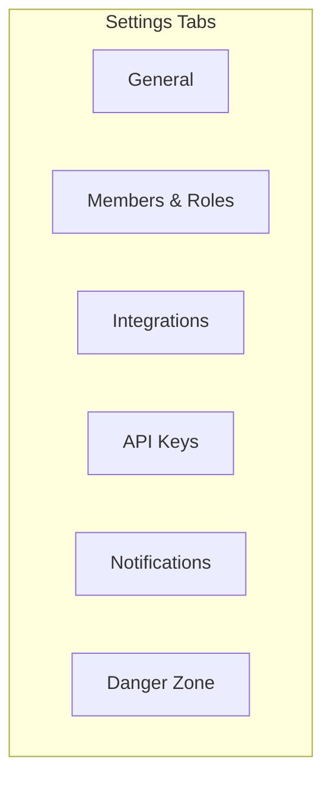
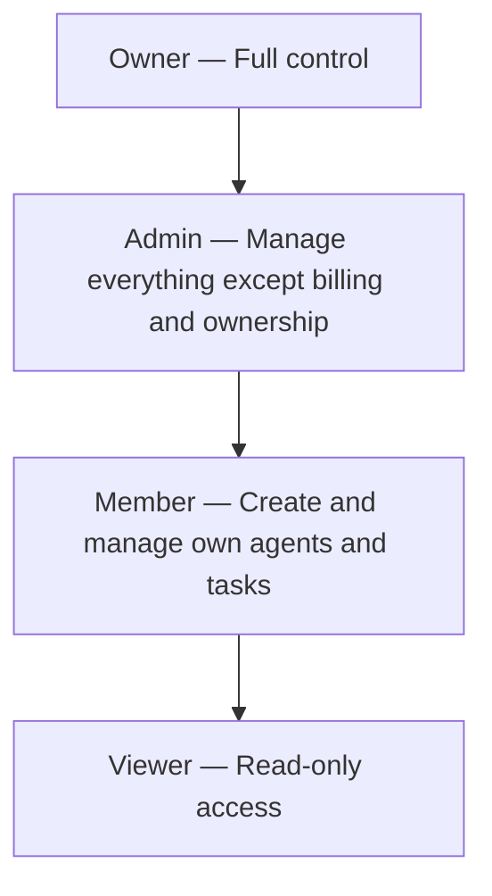

# Organization Settings

The **Settings** page is where you configure your organization's profile, manage team members, connect integrations, generate API keys, and access administrative controls. Navigate to it from the sidebar under **Settings**.

## Settings Layout

## General Settings

The **General** tab manages your organization's identity and basic configuration.

### Organization Profile

| Field | Description |
|-------|-------------|
| **Organization Name** | Display name shown across the platform |
| **Description** | Optional description of the organization's purpose |
| **Slug** | URL-safe identifier used in links (auto-generated from name) |
| **Avatar** | Organization logo or icon |

### Kubernetes Namespace

Each organization is provisioned with a Kubernetes namespace that isolates its agent workloads:

| Field | Description |
|-------|-------------|
| **Namespace** | The K8s namespace assigned to this org (read-only after creation) |
| **Cluster Region** | Where the organization's agents run |
| **Resource Quotas** | CPU, memory, and storage limits based on your plan |

!!! note "Namespace Management"
    The Kubernetes namespace is auto-generated when the organization is created. It cannot be changed after creation. If you need a different namespace, create a new organization.

### Preferences

| Setting | Description | Default |
|---------|-------------|---------|
| **Default Agent Branch** | Git branch new agents default to | `main` |
| **Timezone** | Organization timezone for scheduling and logs | UTC |
| **Language** | UI language preference | English |
| **Theme** | Light, dark, or system | System |

## Members & Roles

The **Members** tab manages who has access to your organization and what they can do.

### Member List

| Column | Description |
|--------|-------------|
| **Name** | Member's display name |
| **Email** | Email address associated with the account |
| **Role** | Permission level (Owner, Admin, Member, Viewer) |
| **Joined** | When they joined the organization |
| **Last Active** | Most recent activity |
| **Actions** | Change role, remove |

### RBAC Roles

| Permission | Owner | Admin | Member | Viewer |
|-----------|-------|-------|--------|--------|
| View dashboard and activity | Yes | Yes | Yes | Yes |
| Interact with agent terminals | Yes | Yes | Yes | No |
| Create and manage agents | Yes | Yes | Yes (own) | No |
| Create and assign tasks | Yes | Yes | Yes | No |
| Manage credentials | Yes | Yes | Yes (own) | No |
| Schedule meetings | Yes | Yes | Yes | No |
| Invite members | Yes | Yes | No | No |
| Change member roles | Yes | Yes | No | No |
| Manage integrations | Yes | Yes | No | No |
| Manage API keys | Yes | Yes | No | No |
| View billing | Yes | Yes | No | No |
| Change plan / payment | Yes | No | No | No |
| Transfer ownership | Yes | No | No | No |
| Delete organization | Yes | No | No | No |

### Inviting Members

1. Click **+ Invite Member**
2. Enter the invitee's email address
3. Select a role (Admin, Member, or Viewer)
4. Click **Send Invitation**

The invitee receives an email with a link to join the organization. Pending invitations appear in a separate table with options to resend or revoke.

!!! tip "Bulk Invitations"
    Enter multiple email addresses separated by commas to send batch invitations with the same role.

### Changing Roles

1. Click the role dropdown next to a member's name
2. Select the new role
3. Confirm the change

!!! warning "Owner Transfer"
    There must always be at least one Owner. To transfer ownership, assign the Owner role to another member first — you will be demoted to Admin.

### Removing Members

1. Click the **Remove** button next to a member's name
2. Confirm the removal

Removed members immediately lose access. Their past activity remains in the audit log.

## Integrations

The **Integrations** tab connects your organization with external services.

### GitHub

Connect your GitHub account or organization to enable:

- Repository access for agents
- Automatic branch management
- Pull request creation and review
- Webhook-triggered task creation

**Setup:**

1. Click **Connect GitHub**
2. Authorize the agent.ceo GitHub App
3. Select which repositories to grant access to
4. Configure default branch permissions

| Setting | Description |
|---------|-------------|
| **Connected Account** | GitHub user or organization |
| **Repositories** | List of accessible repos (can be refined per agent) |
| **Default Permissions** | Read, write, or admin access for agents |
| **Webhook Events** | Which GitHub events trigger notifications |

### Slack

Integrate with Slack to receive notifications and interact with agents from Slack channels:

- Agent status updates posted to a channel
- Task completion notifications
- Direct message interface to agents via Slack bot

**Setup:**

1. Click **Connect Slack**
2. Authorize the agent.ceo Slack App
3. Select a default notification channel
4. Configure which events generate Slack messages

### Google Calendar

Sync agent meetings with Google Calendar:

- Meeting schedules appear as calendar events
- Calendar invites are sent to participants
- Two-way sync keeps meeting times consistent

**Setup:**

1. Click **Connect Google Calendar**
2. Authorize the agent.ceo Google Calendar integration
3. Select which calendar to use for meeting events

!!! note "Integration Permissions"
    Only Owners and Admins can manage integrations. Members and Viewers see which integrations are connected but cannot modify settings.

## API Keys

The **API Keys** tab lets you generate keys for programmatic access to the agent.ceo API.

### Creating an API Key

1. Click **+ Generate API Key**
2. Enter a descriptive name (e.g., `ci-cd-pipeline`, `monitoring-dashboard`)
3. Select the key's permission scope:
    - **Read Only** — can query data but not modify anything
    - **Read/Write** — full API access
    - **Admin** — includes organization management endpoints
4. Set an optional expiry date
5. Click **Generate**

!!! warning "Copy Immediately"
    The API key is displayed only once after generation. Copy it immediately and store it securely. If you lose it, you must generate a new key.

### Managing API Keys

| Column | Description |
|--------|-------------|
| **Name** | Descriptive label for the key |
| **Scope** | Permission level |
| **Created** | When the key was generated |
| **Last Used** | Most recent API call using this key |
| **Expires** | Expiry date (or "Never") |
| **Actions** | Revoke |

### Revoking a Key

Click **Revoke** next to a key to immediately invalidate it. Any API calls using the revoked key will return `401 Unauthorized`.

## Notifications

The **Notifications** tab configures how and when you receive notifications:

### Channels

| Channel | Description |
|---------|-------------|
| **In-App** | Notifications in the agent.ceo bell icon |
| **Email** | Sent to your registered email address |
| **Slack** | Posted to your connected Slack channel (requires integration) |
| **Push** | Browser push notifications (requires permission) |

### Event Categories

Configure notification preferences per event category:

| Category | Events |
|----------|--------|
| **Agents** | Status changes, errors, restarts |
| **Tasks** | Created, assigned, completed, verified, blocked |
| **Meetings** | Scheduled, starting, ended |
| **Billing** | Invoices, payment status, usage thresholds |
| **Security** | Login attempts, API key usage, credential access |

For each category, toggle which channels should receive notifications.

## Danger Zone

The **Danger Zone** section contains destructive operations that require extra confirmation.

### Delete Organization

Permanently deletes the organization and all associated data:

- All agents are terminated
- All tasks, meetings, and conversation history are deleted
- All credentials are destroyed
- All member access is revoked
- Billing is cancelled

**To delete:**

1. Click **Delete Organization** in the Danger Zone
2. Read the impact summary
3. Type the organization name to confirm
4. Click **Permanently Delete**

!!! warning "Irreversible"
    Organization deletion cannot be undone. All data is permanently destroyed after a 30-day retention period. During the retention period, contact support to request recovery.

### Leave Organization

Members (non-owners) can leave an organization:

1. Click **Leave Organization**
2. Confirm departure
3. You immediately lose access

If you are the only member, you cannot leave — you must delete the organization instead.
