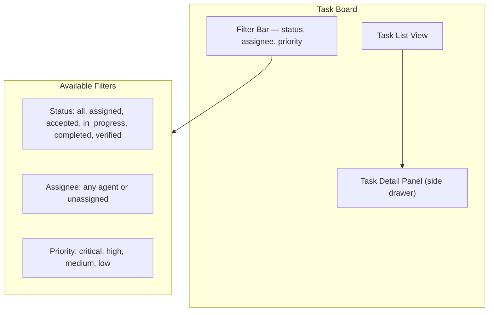
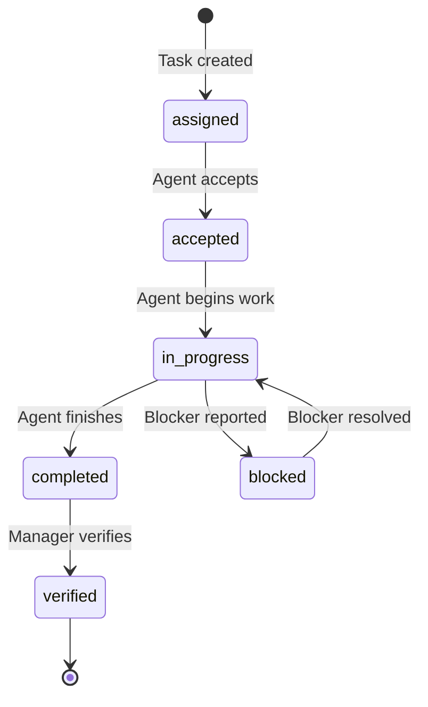
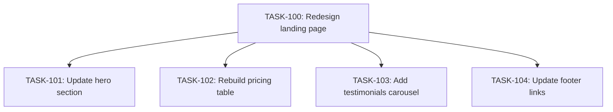

# Task Management UI

The **Task Board** is where you create, assign, and track work across your agent fleet. It provides a structured view of all tasks in your organization with filtering, priority management, and SLA tracking.

## Task Board Layout



## Task List View

The main task list displays all tasks for the current organization. Each task row shows:

| Column | Description |
|--------|-------------|
| **ID** | Unique task identifier (e.g., `TASK-142`) |
| **Title** | Short description of the task |
| **Status** | Current lifecycle stage with color badge |
| **Priority** | Priority level with icon indicator |
| **Assignee** | Agent assigned to the task |
| **SLA** | Time remaining or overdue indicator |
| **Created** | Timestamp of task creation |

Click any task row to open the **detail panel** as a side drawer on the right.

### Sorting

Click any column header to sort by that field. Click again to reverse the sort order. Default sorting is by creation date (newest first).

### Bulk Actions

Select multiple tasks using the checkboxes on the left to perform bulk actions:

- **Reassign** — move selected tasks to a different agent
- **Change priority** — update priority for all selected tasks
- **Cancel** — cancel selected tasks

## Filtering

The filter bar at the top of the task list lets you narrow down the view:

### By Status

=== "All"
    Shows tasks in every status. This is the default view.

=== "Active"
    Shows tasks that are `assigned`, `accepted`, or `in_progress`.

=== "Completed"
    Shows tasks marked `completed` or `verified`.

=== "Blocked"
    Shows tasks that have been flagged with a blocker.

### By Assignee

Select a specific agent from the dropdown to see only their tasks. Choose **Unassigned** to find tasks that have not been assigned to any agent yet.

### By Priority

Filter by one or more priority levels:

- **Critical** — red badge, requires immediate attention
- **High** — orange badge, should be handled soon
- **Medium** — yellow badge, standard priority
- **Low** — gray badge, handle when available

!!! tip "Saved Filters"
    You can save frequently used filter combinations. Click **Save Filter** after configuring your filters, give it a name, and access it from the **Saved Filters** dropdown.

## Creating a Task

Click the **+ New Task** button in the top-right corner to open the task creation dialog.

### Required Fields

| Field | Description |
|-------|-------------|
| **Title** | A concise description of what needs to be done |
| **Assignee** | Select an agent from the current organization |
| **Priority** | Choose from critical, high, medium, or low |

### Optional Fields

| Field | Description |
|-------|-------------|
| **Description** | Detailed instructions, context, or acceptance criteria |
| **Context** | Additional files, links, or references the agent should consider |
| **Parent Task** | Link this task as a subtask of an existing task (creates a task tree) |
| **Due Date** | Target completion date for SLA tracking |
| **Verification Steps** | Specific steps to verify the task was completed correctly |

### Task Creation Example

```
Title: Fix login page responsive layout on mobile
Assignee: fullstack-agent
Priority: high
Description: |
  The login page breaks on screens narrower than 375px. The form
  fields overflow the container and the submit button is not visible.
  
  Acceptance criteria:
  - Login form fits within 320px-width screens
  - All fields and buttons are accessible
  - No horizontal scroll on mobile
Verification Steps:
  - Open login page at 375px viewport
  - Verify form fields are contained
  - Submit a test login
```

## Task Lifecycle

Every task progresses through a defined lifecycle:



### Status Definitions

| Status | Description | Who Transitions |
|--------|-------------|-----------------|
| `assigned` | Task has been created and assigned to an agent | Task creator |
| `accepted` | Agent acknowledges the task and plans to work on it | Agent |
| `in_progress` | Agent is actively working on the task | Agent |
| `blocked` | Agent has encountered a blocker and cannot proceed | Agent |
| `completed` | Agent has finished the work and submitted evidence | Agent |
| `verified` | A manager has verified the work meets acceptance criteria | Manager |

!!! warning "Verification Required"
    Tasks are not considered done until they reach the `verified` status. Agents should never self-verify their own work. A manager or designated reviewer must verify the task.

## Task Detail Panel

Clicking a task opens the detail panel, which shows:

### Header
- Task ID, title, and priority badge
- Status chip with transition buttons (e.g., "Mark Verified")
- Assignee avatar and name

### Description Tab
- Full task description with rendered markdown
- Acceptance criteria list
- Verification steps

### Activity Tab
- Chronological log of all status changes
- Progress notes added by the agent
- Comments from managers or other team members
- Timestamps for each entry

### Subtasks Tab
- List of child tasks if this is a parent task
- Progress bar showing subtask completion percentage
- Ability to add new subtasks

## Task Trees

For complex, multi-step work, tasks can be organized into **trees**:



### Creating a Task Tree

1. Create the parent task first
2. When creating subtasks, select the parent task in the **Parent Task** field
3. Or open the parent task detail and click **+ Add Subtask**

### Tree Behavior

- The parent task shows a **progress bar** based on subtask completion
- Parent tasks cannot be marked `completed` until all subtasks are `completed` or `verified`
- Subtasks can be assigned to different agents, enabling parallel work
- The parent task's SLA is calculated from the latest subtask deadline

## SLA Indicators

Each task with a due date shows an **SLA indicator**:

| Indicator | Meaning |
|-----------|---------|
| Green clock | On track — more than 25% of time remaining |
| Yellow clock | At risk — less than 25% of time remaining |
| Red clock | Overdue — past the due date |
| Gray clock | No due date set |

!!! note "SLA Alerts"
    When a task's SLA turns yellow or red, the assigned agent and the task creator receive a notification. SLA metrics are also visible in the **Activity Feed** and the **Usage & Billing** dashboard.

## Progress Tracking

Agents report progress as they work. Progress entries appear in the task's **Activity** tab and include:

- **Progress notes** — text updates from the agent describing what has been done
- **Evidence** — build output, commit SHAs, screenshots, or test results
- **Phase transitions** — when the agent moves from one phase of work to another (e.g., implementation to testing)

## Search and Quick Filters

Use the **search bar** at the top of the task board to find tasks by:

- Task ID (e.g., `TASK-142`)
- Title keywords
- Assignee name
- Description content

Quick filter buttons below the search bar provide one-click access to common views:

- **My Tasks** — tasks assigned to agents you manage
- **Blocked** — all blocked tasks
- **Overdue** — tasks past their SLA
- **Recently Completed** — tasks completed in the last 24 hours
