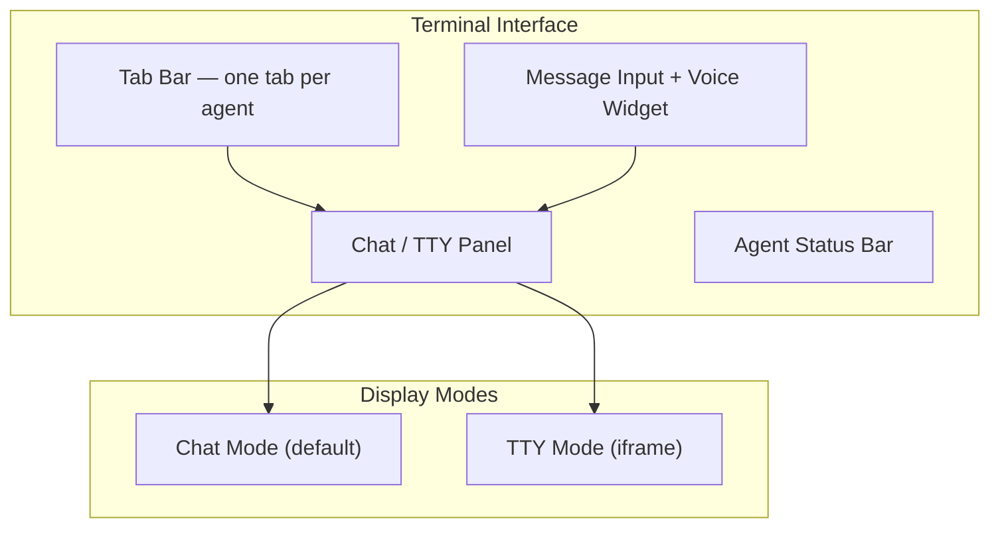

# Agent Terminal Interface

The **Terminal** is the primary interface for communicating with your AI agents. It provides a tabbed, real-time environment where you can chat with agents, observe their work, and issue commands.

## Terminal Architecture



## Chat Mode (Default)

Chat mode is the default terminal experience. It presents a conversational interface similar to a messaging application:

- **Messages** are displayed chronologically with timestamps
- **Agent responses** appear with the agent's name and role badge
- **Your messages** appear right-aligned with your user avatar
- **Rich content** — agents can render code blocks, tables, lists, and links in their responses
- **Task references** — when an agent references a task, it appears as a clickable chip linking to the task board

### Sending Messages

Type your message in the input bar at the bottom and press **Enter** to send. You can:

- Send plain text instructions
- Paste code snippets (wrapped in triple backticks automatically)
- Reference tasks with `#task-id`
- Mention other agents with `@agent-name`

!!! tip "Multi-Line Input"
    Press `Shift+Enter` to add a new line without sending. Press `Enter` to send the complete message.

### Message History

Scroll up to view previous messages in the conversation. The terminal loads history progressively — older messages load as you scroll up. Message history persists across sessions.

## TTY Mode (Iframe)

For agents that expose a traditional terminal (ttyd), you can switch to **TTY mode**:

1. Click the **mode toggle** in the top-right corner of the terminal panel
2. Select **TTY** from the dropdown
3. The panel switches to an embedded iframe showing the agent's raw terminal output

TTY mode is useful for:

- Watching build logs in real time
- Observing file system operations
- Debugging agent behavior at the shell level

!!! note "TTY Availability"
    TTY mode is only available for agents that have ttyd configured. If the agent does not support TTY, the toggle will be disabled.

### Terminal URL Modes

The terminal URL changes based on the active mode:

| Mode | URL Pattern | Description |
|------|-------------|-------------|
| Chat | `/terminal?agent=<name>&mode=chat` | Conversational interface |
| TTY | `/terminal?agent=<name>&mode=ttyd` | Embedded shell terminal |

You can share these URLs to deep-link others directly to a specific agent and mode.

## Tab Management

The terminal supports multiple simultaneous agent connections via tabs.

### Opening Tabs

- Click the **+** button at the end of the tab bar to open a new agent connection
- Select an agent from the dropdown list (filtered by current organization)
- The new tab opens and connects to the selected agent

### Tab Actions

Each tab shows the agent's name and a status dot. Right-click a tab for additional options:

| Action | Description |
|--------|-------------|
| **Pin** | Lock the tab in place — pinned tabs move to the left and cannot be closed accidentally |
| **Unpin** | Remove the pin from a tab |
| **Close** | Disconnect from the agent and remove the tab |
| **Close Others** | Close all tabs except the selected one |

### Drag to Reorder

Drag tabs left or right to reorder them. Pinned tabs always stay in the leftmost positions and can only be reordered among other pinned tabs.

### Tab Persistence

Your tab layout persists across browser sessions. When you return to the terminal, your previously open tabs are restored with their pinned state and order intact.

!!! warning "Connection Limits"
    There is no hard limit on open tabs, but each tab maintains an active WebSocket connection. If you experience performance issues, close tabs for agents you are not actively monitoring.

## Org-Filtered View

The terminal respects your current organization context:

- Only agents belonging to the selected organization appear in the **+** connection dropdown
- Switching organizations in the header org selector updates the available agents
- Tabs for agents in other organizations are preserved but marked as **(other org)** and will not receive live updates until you switch back

## Voice Widget

The terminal includes a **voice widget** for hands-free interaction:

1. Click the **microphone icon** in the input bar
2. Speak your message — it is transcribed in real time
3. The transcription appears in the input field
4. Press **Enter** or click **Send** to deliver the message

Voice features:

- **Real-time transcription** — see your words as you speak
- **Auto-punctuation** — the transcriber adds periods, commas, and question marks
- **Language detection** — supports English by default with configurable language settings
- **Push-to-talk** — hold the microphone button to speak, release to stop

!!! tip "Voice Shortcuts"
    Press and hold `Space` (when the input field is not focused) to activate push-to-talk. Release to stop recording.

## Agent Status Bar

The bottom of the terminal panel shows the agent's current status:

```
[Running] fullstack-agent | Task: TASK-142 — Fix login page responsive layout | Uptime: 4h 23m
```

Status bar elements:

| Element | Description |
|---------|-------------|
| **Status** | Current agent state (Running, Stopped, Error) |
| **Agent Name** | The connected agent's identifier |
| **Current Task** | The task the agent is working on, if any |
| **Uptime** | How long the agent has been running continuously |

## Terminal Notifications

You can configure notifications for terminal events:

- **Agent response** — get notified when an agent sends a message (useful if you switch tabs)
- **Task completion** — notification when the agent completes its current task
- **Error** — immediate notification if the agent encounters an error

Configure notifications in **Settings > Notifications > Terminal**.

## Keyboard Shortcuts

| Shortcut | Action |
|----------|--------|
| `Ctrl+Tab` | Switch to next tab |
| `Ctrl+Shift+Tab` | Switch to previous tab |
| `Ctrl+W` | Close current tab |
| `Ctrl+N` | Open new tab (+) |
| `Ctrl+1-9` | Jump to tab by position |
| `Escape` | Cancel voice recording |

## Troubleshooting

### Agent Not Responding

If an agent tab shows "Connected" but the agent is not responding to messages:

1. Check the agent status in the status bar — it may be **Stopped**
2. Navigate to **Agent Management** and verify the agent is running
3. Try closing and reopening the tab
4. If the agent is stuck, use the **Restart** action from Agent Management

### Connection Lost

If the WebSocket connection drops:

- The tab header shows a yellow **reconnecting** indicator
- The terminal automatically attempts to reconnect every 5 seconds
- If reconnection fails after 30 seconds, a **Reconnect** button appears
- Click it to manually re-establish the connection

### TTY Mode Blank Screen

If TTY mode shows a blank iframe:

1. Verify the agent has ttyd support enabled
2. Check that your browser allows iframes from the agent's domain
3. Try refreshing the tab with `Ctrl+Shift+R`
